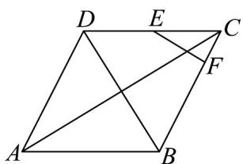

## 题型06 平面向量的夹角

【典例1】在菱形ABCD中， $\overline{AB} \cdot \overline{AD} = \frac{1}{2} AB^{2}$ ，点E,F满足 $\overline{DC} = 2DE$ ， $\overline{BC} = 3FC$ ，则（）
A. $\angle BAD = 60^{\circ}$ B. EF//BD
C. $\overline{EF} = \frac{1}{2} AB - \frac{1}{3} AD$ D. $EF \cdot AC = \frac{1}{6} AB^{2}$

【答案】AC

【分析】根据数量积的定义结合 $AB \cdot AD = \frac{1}{2} AB^2$ 可判断 $A$ ；由题意判断出 $E, F$ 的位置，利用反证的思想可判

断 $^{B}$ ；根据向量线性运算可判断 $^{C}$ ；根据数量积的运算律可判断 $^{D}$ .

【详解】对于 $^{A}$ ，在菱形ABCD中，由 $AB \cdot AD = |AB||AD| \cos \angle BAD = AB^{2} \cos \angle BAD = \frac{1}{2} AB^{2}$

得 $\cos\angle BAD=\frac{1}{2}$ ，所以 $\angle BAD=60^{\circ}$ ，故 A 正确；

对于 $^{B}$ ，由 $\overline{DC}=2\overline{DE}$ 得E是CD的中点，由 $\overline{BC}=3FC$ ，知F是BC上靠近点C的三等分点，

若 $EF // BD$ ，则 $F$ 为 $BC$ 的中点，与 $F$ 是 $BC$ 的三等分点矛盾，故 ${}^{\mathrm{B}}$ 错误；

对于 $^{C}$ ， $EF = EC + CF = \frac{1}{2} DC - \frac{1}{3} BC = \frac{1}{2} AB - \frac{1}{3} AD$ ，故 $^{C}$ 正确；

对于 D， $EF \cdot AC = \left( \frac{1}{2} AB - \frac{1}{3} AD \right) \cdot (AB + AD)$

$$
= \frac {1}{2} A B ^ {2} - \frac {1}{3} A D ^ {2} + \frac {1}{6} A B \cdot A D = \frac {1}{2} A B ^ {2} - \frac {1}{3} A B ^ {2} + \frac {1}{6} \times \frac {1}{2} A B ^ {2} = \frac {1}{4} A B ^ {2}, \text {故} ^ {\mathrm{D}} \text {错误},
$$

故选；AC

【典例2】已知平面向量 $\left|a\right|=\sqrt{2},\left|b\right|=2$ ，且 $\left(2a-3b\right)\mathrm{g}\left(2a+b\right)=4$ .

(1)求 $\left|2a-b\right|$ 的值；

(2)求向量 a 与 a - 2b 夹角的余弦值.

【答案】(1) $2 \sqrt{5}$

(2) $\frac{3\sqrt{13}}{13}$

【分析】（1）根据题中条件化简得到 $a \square b = -2$ ，结合先平方再开方计算向量的模；

(2) 先计算 $a\cdot(a-2b)=6$ ， $\left|a-2b\right|=\sqrt{26}$ ，最后根据 $\cos a,a-2b=\frac{a\cdot(a-2b)}{\left|a\right|\left|a-2b\right|}$ 计算即可.

【详解】（1）由 $\left(2a - 3b\right)\cdot \left(2a + b\right) = 4$ 整理得 $4a^{\Gamma_2}$ $4a\mathfrak{g}b - 3b^{\Gamma_2} = 4$ ，又 $|a| = \sqrt{2},|b| = 2$

代入得 $4 \times 2 - 4a\cdot b - 3 \times 4 = 4$ ，解得 $a\cdot b = -2$

则 $\left|2a-b\right|=\sqrt{\left(2a-b\right)^{2}}=\sqrt{4a^{2}-4a\cdot b+b^{2}}=\sqrt{4\times2-4\times(-2)+4}=2\sqrt{5}$

(2) 因为 $a \cdot (a - 2b) = a^{2} - 2a \cdot b = 2 - 2 \times (-2) = 6$

又 $\left|a - 2b\right| = \sqrt{\left(a - 2b\right)^2} = \sqrt{a^2 - 4a \cdot b + 4b^2} = \sqrt{2 - 4 \times (-2) + 4 \times 4} = \sqrt{26}$

所以 $\cos a, a - 2b = \frac{a \cdot (a - 2b)}{|a| |a - 2b|} = \frac{6}{\sqrt{2} \times \sqrt{26}} = \frac{3\sqrt{13}}{13}$ .

## 方法技巧

求夹角，用数量积，由 $a > b = |a| * b|\cos q$ 得 $\cos q = \frac{a * b}{|a| * b|} = \frac{x_1x_2 + y_1y_2}{\sqrt{x_1^2 + y_1^2}\sqrt{x_2^2 + y_2^2}}$ ，进而求得向量 $a,b$ 的夹角.

![[高中/课堂同步/题库/人教A版高中数学同步讲义(2026)/02_必修第二册/第六章 平面向量及其应用/讲义/第六章_平面向量及其应用_高效培优讲义_/题型06_平面向量的夹角_sec_29/questions/Q00065742.md]]
![[高中/课堂同步/题库/人教A版高中数学同步讲义(2026)/02_必修第二册/第六章 平面向量及其应用/讲义/第六章_平面向量及其应用_高效培优讲义_/题型06_平面向量的夹角_sec_29/questions/Q00065743.md]]
![[高中/课堂同步/题库/人教A版高中数学同步讲义(2026)/02_必修第二册/第六章 平面向量及其应用/讲义/第六章_平面向量及其应用_高效培优讲义_/题型06_平面向量的夹角_sec_29/questions/Q00065744.md]]
