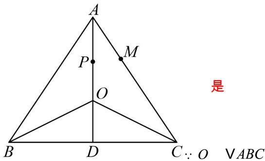

## 题型09 平面向量的垂直问题

【典例1】在 $\bigvee ABC$ 中， $\overrightarrow{AB} = a, \overrightarrow{AC} = b, |a| = |a - b| = 2$ ，且满足 $\left(\frac{\overrightarrow{a}}{|a|} + \frac{\overrightarrow{b}}{|b|}\right) \cdot (\overrightarrow{a - b}) = 0$ ，其中 $\overrightarrow{AC} = 3AM, O$ 是 $\forall ABC$ 外接圆的圆心，则 $\overrightarrow{AM} \cdot \overrightarrow{AO} = \underline{\hspace{2cm}}$ .

【答案】 $\frac{2}{3}$

【分析】设 $\overrightarrow{AP} = \frac{a}{|a|} +\frac{b}{|b|}$ ，由向量定义可知， $P$ 在 $\angle BAC$ 的角平分线上，结合条件可得 $\vee ABC$ 是边长为2的

等边三角形，再由向量数量积的定义计算即可。

【详解】设 $\overrightarrow{AP}=\frac{a}{|a|}+\frac{b}{|b|}$ ，则 P 在 $\angle BAC$ 的角平分线上，

$$
\because \left(\frac {\vec {a}}{| a |} + \frac {\vec {b}}{| b |}\right) \cdot (\vec {a} - \vec {b}) = A P \cdot C B = 0
$$

$$
\therefore A P \perp C B \text {, 即} A P \perp B C
$$

又 AP 为角平分线，所以 AB = AC ，

$$
\therefore | a | = | b | = | a - b | = 2
$$

即 $\forall ABC$ 是边长为 $2$ 的等边三角形，设 $D$ 为 $BC$ 中点，

是 外接圆的圆心，

∴ O 在 $\angle BAC$ 的角平分线上，且 $AO = \frac{2}{3} AD = \frac{2}{3} \sqrt{2^{2} - 1^{2}} = \frac{2\sqrt{3}}{3}$

$\left|AM\right| = \frac{1}{3}\left|AC\right| = \frac{2}{3}, \angle OAM = \frac{1}{2} \angle BAC = 30^{\circ}$

$\therefore \overrightarrow{AM} \cdot \overrightarrow{AO} = |\overrightarrow{AM}| \cdot |\overrightarrow{AO}| \cos 30^{\circ} = \frac{2}{3} \times \frac{2\sqrt{3}}{3} \times \frac{\sqrt{3}}{2} = \frac{2}{3}$

故答案为： $\frac{2}{3}$

【典例2】已知向量 $a, b$ 满足： $\left|a\right| = 2, \left|b\right| = 1, (a + b) \perp (2a - 5b)$ ，则 $\left\langle a, b \right\rangle = (\quad)$ A. $\frac{\pi}{6}$ B. $\frac{\pi}{3}$ C. $\frac{\pi}{2}$ D. $\frac{2\pi}{3}$

【答案】B

【分析】根据向量垂直的数量积表示求出 $a \cdot b$ ，再由平面向量的夹角公式求解即可。

【详解】 $\left(a + b\right)\bot \left(2a - 5b\right)$

则 $\left(a + b\right)\cdot \left(2a - 5b\right) = 2a^2 -5b^2 -3a\cdot b = 2|a|^2 -5|b|^2 -3a\cdot b = 0$

即 $8-5-3a\cdot b=0$ ，解得 $a\cdot b=1$ ，

所以 $\cos\left\langle\vec{a},\vec{b}\right\rangle=\frac{\vec{a}\cdot\vec{b}}{\left|\vec{a}\right|\cdot\left|\vec{b}\right|}=\frac{1}{2\times1}=\frac{1}{2}$

又 $\left\langle a,b\right\rangle \in [0,\pi ]$ ，所以 $\left\langle \vec{a},\vec{b}\right\rangle = \frac{\pi}{3}.$

故选：B

## 方法技巧

$a \perp b \Leftrightarrow a \cdot b = 0 \Leftrightarrow x_{1}x_{2} + y_{1}y_{2} = 0$

![[高中/课堂同步/题库/人教A版高中数学同步讲义(2026)/02_必修第二册/第六章 平面向量及其应用/讲义/第六章_平面向量及其应用_高效培优讲义_/题型09_平面向量的垂直问题_sec_32/questions/Q00065751.md]]
![[高中/课堂同步/题库/人教A版高中数学同步讲义(2026)/02_必修第二册/第六章 平面向量及其应用/讲义/第六章_平面向量及其应用_高效培优讲义_/题型09_平面向量的垂直问题_sec_32/questions/Q00065752.md]]
![[高中/课堂同步/题库/人教A版高中数学同步讲义(2026)/02_必修第二册/第六章 平面向量及其应用/讲义/第六章_平面向量及其应用_高效培优讲义_/题型09_平面向量的垂直问题_sec_32/questions/Q00065753.md]]
