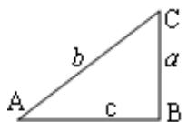
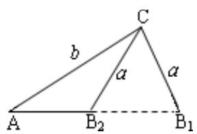
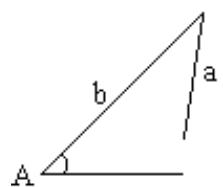

## 题型12 三角形解的个数

【典例1】在VABC中， $AB = 2,AC = \sqrt{2},B = 30^{\circ}$ ，则 $A = (\quad)$ A. $105^{\circ}$ 或 $15^{\circ}$ B. $135^{\circ}$ 或 $45^{\circ}$ C. $120^{\circ}$ 或 $30^{\circ}$ D. $105^{\circ}$

【答案】A

【分析】根据正弦定理求出角 C 的度数，再根据三角形内角和定理求出角 A 的度数·

【详解】在VABC中，根据正弦定理得 $\frac{AB}{\sin C}=\frac{AC}{\sin B}$ ，即 $\frac{2}{\sin C}=\frac{\sqrt{2}}{\sin30^{\circ}}$

所以 $\sin C = \frac{\sqrt{2}}{2}$ ，又 $0^{\circ} < C < 180^{\circ}$ ，所以 $C = 45^{\circ}$ 或 $135^{\circ}$ ，

当 $C = 45^{\circ}$ 时， $B + C = 75^{\circ} < 180^{\circ}$ ，符合题意，

当 $C=135^{\circ}$ 时， $B+C=165^{\circ}<180^{\circ}$ ，符合题意；

所以 C 的两个解均成立.

根据三角形内角和定理 $A + B + C = 180^{\circ}$

所以 $A = 15^{\circ}$ 或 $105^{\circ}$ .

故选：A

【典例2】在 $\vee ABC$ 中，角 $A$ 、 $B$ 、 $C$ 所对的边分别为 $a$ 、 $b$ 、 $c$ ， $A = \frac{\pi}{4}$ ， $a = 2\sqrt{2}$ ，若满足条件的三角形有

且只有一个，则边 $c$ 的长可以是（ ）A.1 B. $2\sqrt{2}$ C. $3\sqrt{2}$ D.4

【答案】ABD

【分析】根据不同条件下三角形的解的个数分析判断即得·

【详解】在 $\forall ABC$ 中，当已知边 $a, c$ 和锐角 $A$ ，判断三角形的个数时，若 $a < c$ ，有且只有一个解；当 $c \sin A < a < c$ 时，有两个解；当 $a = c \sin A$ 时，有且只有一个解；当 $a < c \sin A$ 时，无解。因为 $c \sin A = c \sin \frac{\pi}{4} = \frac{\sqrt{2}}{2} c$ .

由 $a = c\sin A$ ，即 $2\sqrt{2} = \frac{\sqrt{2}}{2} c$ ，解得 $c = 4$ ，故D正确；

由 $a \quad c$ ，可得 $c \leq 2\sqrt{2}$ ，选项中 $c = 1$ ， $c = 2\sqrt{2}$ 满足此条件，故 ${}^{\mathrm{A}}$ ， ${}^{\mathrm{B}}$ 正确；

对于 C， $c \sin A = 3\sqrt{2} \times \frac{\sqrt{2}}{2} = 3 > 2\sqrt{2}$ ，此时三角形无解，故 C 错误.

故选：ABD

## 方法技巧

已知两边和一边的对角或已知两角及一边时，通常选择正弦定理来解三角形；已知两边及夹角或已知三边时，

通常选择余弦定理来解三角形．特别是求角时尽量用余弦定理来求，尽量避免分类讨论．

在 $\Delta ABC$ 中，已知 $a, b$ 和A时，解的情况主要有以下几类：

$\left\{\begin{aligned}a&<b\sin A\\ a&=b\sin A\end{aligned}\right.$ 无解 $b\sin A<a<b$ 一解(一锐，一钝)
①若 A 为锐角时：

$a = b\sin A$

a b

一解一解

$b\sin A < a < b$

$a < b \sin A$

两解无解

②若 A 为直角或钝角时： $\left\{\begin{aligned}a&\leq b\\ a&>b\end{aligned}\right.$ 无解
一解(锐角)

![[高中/课堂同步/题库/人教A版高中数学同步讲义(2026)/02_必修第二册/第六章 平面向量及其应用/讲义/第六章_平面向量及其应用_高效培优讲义_/题型12_三角形解的个数_sec_35/questions/Q00065760.md]]
![[高中/课堂同步/题库/人教A版高中数学同步讲义(2026)/02_必修第二册/第六章 平面向量及其应用/讲义/第六章_平面向量及其应用_高效培优讲义_/题型12_三角形解的个数_sec_35/questions/Q00065761.md]]
![[高中/课堂同步/题库/人教A版高中数学同步讲义(2026)/02_必修第二册/第六章 平面向量及其应用/讲义/第六章_平面向量及其应用_高效培优讲义_/题型12_三角形解的个数_sec_35/questions/Q00065762.md]]
