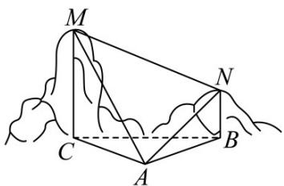

> [!faq]- 《第六章_平面向量及其应用_高效培优讲义_》官方解析
>
> > [!success]- **【答案】**  A. $500\mathrm{m}$ B. $250\sqrt{6}\mathrm{m}$ C. $500\sqrt{3}\mathrm{m}$ D. $500\sqrt{2}\mathrm{m}$
>
> > [!note]- **【分析】**
> > 根据已知条件先求出 $\triangle MNA$ 中的两边，再利用余弦定理求 MN 即可.
>
> > [!note]- **【解析】**
> > 由题意，可得 $\angle MAC = 60^{\circ},\angle NAB = 30^{\circ},MC = 500\sqrt{3}\mathrm{m},NB = 250\sqrt{2}\mathrm{m},\angle MAN = 45^{\circ}$
> >
> > 且 $\angle MCA = \angle NBA = 90^{\circ}$ ，在 Rt△ACM 中，可得 $AM = \frac{MC}{\sin 60^{\circ}} = 1000\mathrm{m}$
> >
> > 在 Rt△ABN 中，可得 $AN = \frac{NB}{\sin30^{\circ}} = 500\sqrt{2} \, m$ ，
> >
> > 在 $\triangle AMN$ 中，由余弦定理得：
> >
> > $$
> > M N ^ {2} = A M ^ {2} + A N ^ {2} - 2 A M \cdot A N \cos \angle M A N = 5 0 0 ^ {2} \left[ 2 ^ {2} + (\sqrt {2}) ^ {2} - 2 \times 2 \times \sqrt {2} \times \frac {\sqrt {2}}{2} \right] = 5 0 0 0 0 0
> > $$
> >
> > 所以 $MN = 500\sqrt{2}\mathrm{m}$
> >
> > 故选 **D**.
