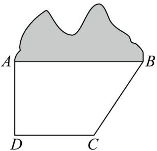
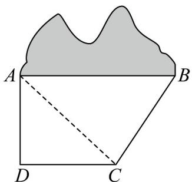

## 题型14 解三角形的实际应用

【典例1】如图，某施工队将从 $A$ 到 $B$ 修建一条隧道，为确定 $A$ 、 $B$ 之间的距离，测得了以下数据：

$AD = CD = 2\sqrt{2}$ ， $AD \perp CD$ ， $BC = 3$ ， $\angle BCD = 105^{\circ}$ ，则 $A$ 、 $B$ 间的距离为（）

A. 3 B. $2\sqrt{3}$ C. $\sqrt{13}$ D. $3\sqrt{2}$

【答案】C

【分析】连接 AC，求出 $\angle ACD$ ，AC，即可求出 $\angle ACB$ ，再由余弦定理计算可得

【详解】连接 $AC$ ，因为 $AD = CD = 2\sqrt{2}$ ， $AD \perp CD$ ，所以 $\triangle ADC$ 为等腰直角三角形，

$$
\angle A C D = 4 5 ^ {\circ}
$$

$$
A C = \sqrt {A D ^ {2} + C D ^ {2}} = 4
$$

又 $\angle BCD = 105^{\circ}$ ，所以 $\angle ACB = 60^{\circ}$

又 $BC = 3$ ，在 $\forall ABC$ 中由余弦定理 $AB^{2} = AC^{2} + BC^{2} - 2AC\cdot BC\cos \angle ACB$

即 $AB = \sqrt{4^{2} + 3^{2} - 2 \times 4 \times 3 \times \frac{1}{2}} = \sqrt{13}$ .

故选：C

【典例2】某勘测队在河岸的一侧隔河进行测绘工作，河岸一侧 $A,B$ 两地相距50米，河对岸有 $C,D$ 两地，测

得 AC = 70 米， $\angle DBA = \angle DBC, \cos \angle DBA = \frac{\sqrt{10}}{5}$ .

(1)求 $\sin \angle ACB$ 的值；

(2)若测量后发现 $DB = DC$ ，求 $A, D$ 两地的距离

【答案】(1) $\frac{2\sqrt{6}}{7}$

(2) $10\sqrt{15}$ 米

【分析】（1）先利用三角函数的二倍角公式求出 $\cos\angle ABC$ ，然后求出 $\sin\angle ABC$ ，进而根据正弦定理求出结

果即可·

(2) 先根据余弦定理求出 $BC = 40$ ，然后根据余弦定理求出 $DB = 10\sqrt{10}$ ，最后根据余弦定理求出结果

【详解】（1）因为 $\angle DBA = \angle DBC, \cos \angle DBA = \frac{\sqrt{10}}{5}$ ，所以

$$
\cos \angle A B C = \cos 2 \angle D B A = 2 \cos^ {2} \angle D B A - 1 = 2 \times \frac {2}{5} - 1 = - \frac {1}{5}.
$$

所以 $\frac{\pi}{2}<\angle DBA<\pi$ ，所以 $\sin\angle ABC=\sqrt{1-\cos^{2}\angle ABC}=\sqrt{\frac{24}{25}}=\frac{2\sqrt{6}}{5}$

在 $\triangle ABC$ 中，根据正弦定理， $\frac{AB}{\sin\angle ACB} = \frac{AC}{\sin\angle ABC}$ ，即 $\frac{50}{\sin\angle ACB} = \frac{70}{2\sqrt{6}}$ ，

解得 $\sin\angle ACB=\frac{50\times\frac{2\sqrt{6}}{5}}{70}=\frac{2\sqrt{6}}{7}$

(2) 在 $\triangle ABC$ 中，根据余弦定理， $AC^2 = AB^2 + BC^2 - 2AB \cdot BC \cdot \cos \angle ABC$

化简得 $BC^{2} + 20BC - 2400 = 0$ ，由于 BC > 0，所以解得 BC = 40 米。

因为 $DB = DC$ ，在 $\triangle DBC$ 中，根据余弦定理 $DC^2 = DB^2 + BC^2 - 2DB\cdot BC\cdot \cos \angle DBC$

化简得 $1600 - 16\sqrt{10} DB = 0$ ，解得 $DB = 10\sqrt{10}$ 米·

在 $\triangle ABD$ 中，根据余弦定理 $AD^{2} = AB^{2} + BD^{2} - 2AB\cdot BD\cdot \cos \angle DBA$

化简得 $AD^{2}=2500+1000-2\times50\times10\sqrt{10}\times\frac{\sqrt{10}}{5}=3500-2000=1500$ ，解得 $AD=10\sqrt{15}$ 米·

## 方法技巧

解三角形在实际中应用非常广泛，如测量、航海、几何、物理等方面都要用到解三角形的知识，解题时应认

真分析题意，并做到算法简练，算式工整，计算正确．其解题的一般步骤是：

（1）准确理解题意，尤其要理解应用题中的有关名词和术语；明确已知和所求，理清量与量之间的关系；

（2）根据题意画出示意图，并将已知条件在图形中标出，将实际问题抽象成解三角形模型；

（3）分析与所研究的问题有关的一个或几个三角形，正确运用正弦定理和余弦定理，有顺序的求解；

(4) 将三角形的解还原为实际问题，注意实际问题中的单位及近似计算要求，回答实际问题。

![[高中/课堂同步/题库/人教A版高中数学同步讲义(2026)/02_必修第二册/第六章 平面向量及其应用/讲义/第六章_平面向量及其应用_高效培优讲义_/题型14_解三角形的实际应用_sec_37/questions/Q00065766.md]]
![[高中/课堂同步/题库/人教A版高中数学同步讲义(2026)/02_必修第二册/第六章 平面向量及其应用/讲义/第六章_平面向量及其应用_高效培优讲义_/题型14_解三角形的实际应用_sec_37/questions/Q00065767.md]]
![[高中/课堂同步/题库/人教A版高中数学同步讲义(2026)/02_必修第二册/第六章 平面向量及其应用/讲义/第六章_平面向量及其应用_高效培优讲义_/题型14_解三角形的实际应用_sec_37/questions/Q00065768.md]]
