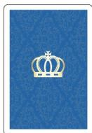
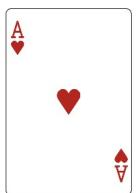
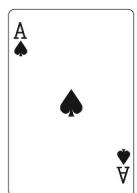
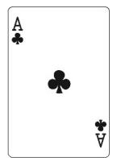
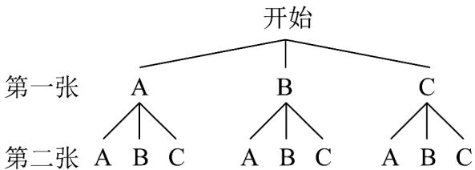

## 题型三：有放回与无放回问题

21．袋子中有5个大小质地完全相同的球，其中2个红球，3个黄球，从中不放回地依次随机摸出两个球，则两次都是黄球的概率是（）

【答案】
A. $\frac{3}{20}$ B. $\frac{9}{25}$ C. $\frac{3}{10}$ D. $\frac{3}{5}$

【答案】C

【分析】求出试验的样本空间和事件 A（“从中不放回地依次随机摸出两个球，则两次都是黄球”）的样本点个数，由古典概型计算即可.

【详解】记2个红球和3个黄球分别为a,b和1,2,3，记 $(x_{1},x_{2})$ 为随机试验的样本点， $x_{1},x_{2}$ 分别表示第一次和第二次摸到的球，则从中不放回地依次随机摸出两个球的试验的样本空间为 $\Omega=\{(a,b),(a,1),(a,2),(a,3),(b,a),(b,1),(b,2),(b,3),(1,a),(1,b),(1,2),(1,3),(2,a),(2,b),(2,1),(2,3),(3,a),(3,b),(3,1),(3,2)\}$ ，共20个样本点，

记事件A=“从中不放回地依次随机摸出两个球，则两次都是黄球”，

则 $A=\left\{(1,2),(1,3),(2,1),(2,3),(3,1),(3,2)\right\}$ 共6个样本点.

所以 $P(A)=\frac{6}{20}=\frac{3}{10}$ .

故选：C

22. 不透明的盒子里装有 3 个完全相同的小球，上面分别标有数字 1, 2, 3. 随机从中摸出一个小球不放回，再随机摸出另一个小球. 第一次摸出小球上的数字大于第二次摸出小球上的数字的概率是（）

【答案】
A. $\frac{1}{2}$ B. $\frac{1}{3}$ C. $\frac{2}{3}$ D. $\frac{4}{9}$

【答案】A

【分析】首先确定共有多少种情况，再确定第一次摸出小球上的数字大于第二次摸出小球上的数字的情况有几种，即可求得答案.

【详解】由题意知随机从中摸出一个小球不放回，再随机摸出另一个小球，
共有 $(1,2),(1,3),(2,1),(2,3),(3,1),(3,2)$ 等6种可能的情况；
其中第一次摸出小球上的数字大于第二次摸出小球上的数字的情况有 $(2,1),(3,1),(3,2)$ ，
故第一次摸出小球上的数字大于第二次摸出小球上的数字的概率是 $\frac{3}{6}=\frac{1}{2}$ ，

故选：A

23．我们规定把同一副扑克牌中的红桃 A，黑桃 A，梅花 A 三张牌背面朝上放在桌子上，将扑克牌洗匀后从中随机抽取一张，记下扑克牌的花色后放回，洗匀后再随机抽取一张，则两次抽取的扑克牌为同一张的概率为 \_\_\_\_.

【答案】

【答案】 $\frac{1}{3}$

【分析】将红桃 A，黑桃 A，梅花 A 分别记为 A、B、C，画出树状图，利用概率公式即可求出两次抽取的扑克牌为同一张的概率．

【详解】设红桃 A，黑桃 A，梅花 A 分别为 A，B，C，

两次抽取的扑克牌出现的结果如图所示：

第一张

由树状图可知共有 9 种情况，其中两次抽到同一张的情况有 3 种，

所以两次抽取的扑克牌为同一张的概率为 $P=\frac{3}{9}=\frac{1}{3}$

故答案为： $\frac{1}{3}$

![[高中/课堂同步/题库/人教A版高中数学同步讲义(2026)/02_必修第二册/第十章 概率/专项训练/专题01_古典概率的五大常考题型_高效培优专项训练_数学人教A版高一必/题型三_sec_04/questions/Q00065792.md]]
![[高中/课堂同步/题库/人教A版高中数学同步讲义(2026)/02_必修第二册/第十章 概率/专项训练/专题01_古典概率的五大常考题型_高效培优专项训练_数学人教A版高一必/题型三_sec_04/questions/Q00065793.md]]
![[高中/课堂同步/题库/人教A版高中数学同步讲义(2026)/02_必修第二册/第十章 概率/专项训练/专题01_古典概率的五大常考题型_高效培优专项训练_数学人教A版高一必/题型三_sec_04/questions/Q00065794.md]]
![[高中/课堂同步/题库/人教A版高中数学同步讲义(2026)/02_必修第二册/第十章 概率/专项训练/专题01_古典概率的五大常考题型_高效培优专项训练_数学人教A版高一必/题型三_sec_04/questions/Q00065795.md]]
![[高中/课堂同步/题库/人教A版高中数学同步讲义(2026)/02_必修第二册/第十章 概率/专项训练/专题01_古典概率的五大常考题型_高效培优专项训练_数学人教A版高一必/题型三_sec_04/questions/Q00065796.md]]
