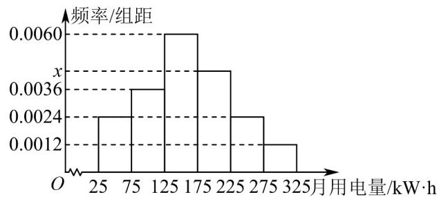

<!-- question-source:start -->
27．从某小区抽取100户居民用户进行月用电量调查，发现他们的用电量都在 $25\sim 325\mathrm{kW}\cdot \mathrm{h}$ 之间，进行适当分组后（每组为左闭右开的区间），画出如图所示频率分布直方图（同一组中的数据用该组区间的中点值作代表）.

(1)求 $x$ 的值；

(2)若新增加5户居民用户的月用电量，数据分别为74,112,174,221,119(kW·h);

(i) 估计 105 户居民用户月用电量落在 $[125, 225)$ 中的可能性；

(ii) 将原来的 100 户与新增的 5 户分成两组，估计 105 户居民用户月用电量的平均值.
<!-- question-source:end -->

![[高中/课堂同步/题库/人教A版高中数学同步讲义(2026)/02_必修第二册/第十章 概率/专项训练/专题03_事件相互独立性及频率与概率的四大常考题型_高效培优专项训练_/题型三_sec_03/questions/answers/Q00065870A1.md]]
