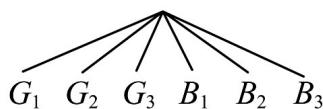

> [!faq]- 《专题03_事件相互独立性及频率与概率的四大常考题型_高效培优专项训练_》官方解析
>
> > [!success]- **【答案】** A．一个人打靶，打了10发子弹，有6发子弹中靶，因此这个人中靶的概率为0.6 B．某地发行福利彩票，其回报率为47%，有个人花了100元钱买彩票，一定会有47元回报 C．5张奖券中有一张有奖，甲先抽，乙后抽，则乙与甲中奖的可能性相同 D．大量试验后，可以用频率近似估计概率.
>
> > [!note]- **【分析】**
> > 由概率统计的基本概念逐一核对四个选项得答案．
>
> > [!note]- **【解析】**
> > 解：A、某人打靶，射击10次，击中6次，那么此人中靶的频率为0.6，故A错误；
> > B、买这种彩票是一个随机事件，中奖或者不中奖都有可能，但事先无法预料，故B错误；
> > C、根据古典概型的概率公式可知C正确；
> > D、大量试验后，可以用频率近似估计概率，故D正确.
> > 故选：CD．
> >
> > 36. 一天，甲拿出一个装有三张卡片的盒子（一张卡片的两面都是绿色，一张卡片的两面都是蓝色，还有一张卡片一面是绿色，另一面是蓝色），跟乙说玩一个游戏，规则是：甲将盒子里的卡片顺序打乱后，由乙随机抽出一张卡片放在桌子上，然后卡片朝下的面的颜色决定胜负，如果朝下的面的颜色与朝上的面的颜色一致，则甲赢，否则甲输·乙对游戏的公平性提出了质疑，但是甲说：“当然公平！你看，如果朝上的面的颜色为绿色，则这张卡片不可能两面都是蓝色，因此朝下的面要么是绿色，要么是蓝色，因此，你赢的概率为 $\frac{1}{2}$ ，我赢的概率也是 $\frac{1}{2}$ ，怎么不公平？”分析这个游戏是否公平。
> >
> > 【答案】见解析.
> >
> > 【分析】把卡片六个面的颜色记为 $G_{1}$ ， $G_{2}$ ， $G_{3}$ ， $B_{1}$ ， $B_{2}$ ， $B_{3}$ ，其中，G表示绿色，B表示蓝色； $G_{3}$ 和 $B_{3}$ 是两面颜色不一样的那张卡片的颜色，用树形图得到样本空间，计算出概率即可判断.
> >
> > 【详解】解：把卡片六个面的颜色记为 $G_{1}$ ， $G_{2}$ ， $G_{3}$ ， $B_{1}$ ， $B_{2}$ ， $B_{3}$
> >
> > 其中，G 表示绿色，B 表示蓝色； $G_{3}$ 和 $B_{3}$ 是两面颜色不一样的那张卡片的颜色。
> >
> > 游戏所有的结果可以用如图表示.
> >
> > 
> >
> > 朝上的面 $G_{1} G_{2} G_{3} B_{1} B_{2} B_{3}$
> >
> > 朝下的面 $G_{2} G_{1} B_{3} B_{2} B_{1} G_{3}$
> >
> > 不难看出，此时，样本空间中共有6个样本点，朝上的面与朝下的面颜色不一致的情况只有2种，因此乙赢的概率为 $\frac{2}{6}=\frac{1}{3}$ .
> >
> > 因此，这个游戏不公平.
