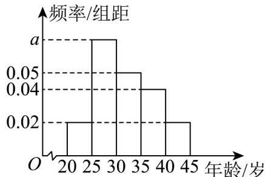

<!-- question-source:start -->
11．某调研机构为了了解人们对“奥运会”相关知识的认知程度，针对本市不同年龄和不同职业的人举办了一次“奥运会”知识竞赛，满分100分（95分及以上为认知程度高），结果认知程度高的有n人，按年龄分成5组，其中第一组 $[20,25)$ ，第二组 $[25,30)$ ，第三组 $[30,35)$ ，第四组 $[35,40)$ ，第五组 $[40,45]$ ，得到如图所示的频率分布直方图.

(1)求 $a$ 的值，并根据频率分布直方图，估计这 $n$ 人的平均年龄和中位数（同一组中的数据用该组区间的中点值为代表）；

(2)现从以上各组中用分层抽样的方法选取 20 人，担任本市的“奥运会”宣传使者。若有甲（年龄 36），乙（年龄 42）两人已确定入选，现计划从第四组和第五组被抽到的使者中，再随机抽取 2 名作为组长，求甲、乙两人至少有一人被选上的概率。
<!-- question-source:end -->

![[高中/课堂同步/题库/人教A版高中数学同步讲义(2026)/02_必修第二册/第十章 概率/专题01 古典概率的五大常考题型（高效培优专项训练）数学人教A版高一必修第二册/题型二_计算古典概率/questions/answers/Q00078645A1.md]]
