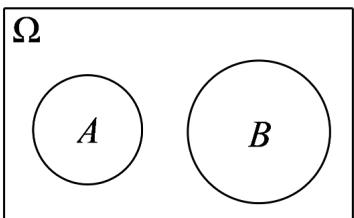

> [!faq]- 《专题01 古典概率的五大常考题型（高效培优专项训练）数学人教A版高一必修第二册》官方解析
>
> > [!success]- **【答案】** A．数据2、2、3、5、6、7、7、8、10、11的下四分位数为3 B．若A、B为互斥事件，则A的对立事件与B的对立事件一定互斥 C．设样本数据 $x_{1}$ 、 $x_{2}$ 、 $x_{3}$ 、L、 $x_{9}$ 、 $x_{10}$ 的平均数和方差分别为2和8，若 $y_{i}=2x_{i}+1(i=1,2,3,\cdots,10)$ ，则 $y_{1}$ 、 $y_{2}$ 、 $y_{3}$ 、L、 $y_{9}$ 、 $y_{10}$ 的平均数和方差分别为5和32 D．已知 $P(A)=0.5$ ， $P(B)=0.4$ ，且 $B\subseteq A$ ，则 $P(AB)=0.2$
>
> > [!note]- **【分析】**
> > 利用百分位数的定义可判断 A 选项；利用韦恩图法可判断 B 选项；利用平均数和方差的性质可判断 C 选项；利用事件的关系可判断 D 选项.
>
> > [!note]- **【解析】**
> > 对于 A 选项， $10 \times 0.25 = 2.5$ ，故数据 2、2、3、5、6、7、7、8、10、11 的下四分位数为 3，A 对；
> >
> > 对于B选项，若事件 $A$ 、 $B$ 互斥且不对立，如下图所示：
> >
> > 
> >
> > 则 $\overline{A} \cap \overline{B} \neq \varnothing$ ，即 A 的对立事件与 B 的对立事件不一定互斥，B 错；
> >
> > 对于 C 选项，设样本数据 $x_{1}$ 、 $x_{2}$ 、 $x_{3}$ 、L、 $x_{9}$ 、 $x_{10}$ 的平均数和方差分别为 2 和 8，
> >
> > 若 $y_{i}=2x_{i}+1(i=1,2,3,\cdots,10)$ ，则 $y_{1}$ 、 $y_{2}$ 、 $y_{3}$ 、L、 $y_{9}$ 、 $y_{10}$ 的平均数为 $2\times2+1=5$ ，方差为 $2^{2}\times8=32$ ，
> > C 对；
> > 对于 D 选项，若 $B \subseteq A$ ，则 AB = B，故 $P(AB) = P(B) = 0.4$ ，D 错.
> >
> > 故选 **AC**.
