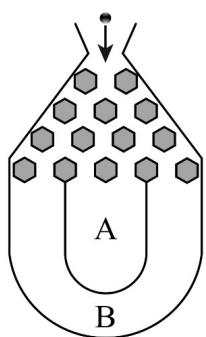

## 题型一：独立事件的乘法公式

1. 将一个半径适当的小球放入如图所示的容器最上方的入口处，小球将自由下落。小球在下落的过程中，将3次遇到黑色障碍物，最后落入 $A$ 袋或 $B$ 袋中。已知小球每次遇到黑色障碍物时，向左、右两边下落的概率都是 $\frac{1}{2}$ ，则小球落入 $A$ 袋中的概率为（）

【答案】

A. $\frac{1}{4}$ B. $\frac{1}{2}$ C. $\frac{3}{4}$ D. $\frac{7}{8}$

【答案】C

【分析】利用对立事件的概率求解，由于小球落入B袋情况简单易求，记小球落入B袋中的概率 $P(B)$ ，利用 $P(A)+P(B)=1$ 求出 $P(A)$ .

【详解】记小球落入 $B$ 袋中的概率 $P(B)$

记小球落入 $A$ 袋中的概率 $P(A)$

则 $P(A) + P(B) = 1$

∵ 小球每次遇到黑色障碍物时一直向左或者一直向右下落，小球将落入 B 袋，

$$
\therefore P (B) = \left(\frac {1}{2}\right) ^ {3} + \left(\frac {1}{2}\right) ^ {3} = \frac {1}{4}, \therefore P (A) = 1 - P (B) = 1 - \frac {1}{4} = \frac {3}{4}.
$$

故选：C.

2．随机从0，1，2，3，4五个数字中任取两个不同的数字组成一个两位数.

(1)请写出样本空间并求样本点个数；

(2)设事件 $A$ ：所得的两位数为奇数，事件 $B$ ：所得的两位数大于40，判断事件 $A$ 与 $B$ 是否相互独立.

【答案】(1)样本空间为 $\Omega=\left\{10,12,13,14,20,21,23,24,30,31,32,34,40,41,42,43\right\}$ ；16个样本点

(2)事件 A 与 B 不相互独立

【分析】（1）根据题意列举出符合要求的样本空间 $\Omega$ 及样本点的个数即可；

(2) 分别列举出事件 $A, B, A \cap B$ 所包含的样本点，并分别求出各个事件的概率，验证 $P(A)P(B) = P(AB)$ 是否成立，即可判断事件 $A$ 与 $B$ 是否相互独立.

【详解】（1）由题意可知，样本空间为 $\Omega=\left\{10,12,13,14,20,21,23,24,30,31,32,34,40,41,42,43\right\}$

共 16 个样本点；

(2) 由题意知事件 $A$ 包含 $\{13, 21, 23, 31, 41, 43\}$ 共 6 个样本点，所以 $P(A) = \frac{6}{16} = \frac{3}{8}$

事件 $_{B}$ 包含 $\left\{41,42,43\right\}$ 共3个样本点，所以 $P(B)=\frac{3}{16}$ ;

既是奇数又大于 40 的事件 $AB$ 包含 $\{41, 43\}$ 共 2 个样本点，所以 $P(AB) = \frac{2}{16} = \frac{1}{8}$ ，

因为 $\frac{3}{8} \times \frac{3}{16} = \frac{9}{128} \neq \frac{16}{128} = \frac{1}{8}$ ，即 $P(A)P(B) \neq P(AB)$ ，

所以事件 A 与 B 不相互独立.

![[高中/课堂同步/题库/人教A版高中数学同步讲义(2026)/02_必修第二册/第十章 概率/专题03 事件相互独立性及频率与概率的四大常考题型（高效培优专项训练）数学人教A版高一必修第二册/题型一_独立事件的乘法公式/questions/Q00078713.md]]
![[高中/课堂同步/题库/人教A版高中数学同步讲义(2026)/02_必修第二册/第十章 概率/专题03 事件相互独立性及频率与概率的四大常考题型（高效培优专项训练）数学人教A版高一必修第二册/题型一_独立事件的乘法公式/questions/Q00078714.md]]
![[高中/课堂同步/题库/人教A版高中数学同步讲义(2026)/02_必修第二册/第十章 概率/专题03 事件相互独立性及频率与概率的四大常考题型（高效培优专项训练）数学人教A版高一必修第二册/题型一_独立事件的乘法公式/questions/Q00078715.md]]
![[高中/课堂同步/题库/人教A版高中数学同步讲义(2026)/02_必修第二册/第十章 概率/专题03 事件相互独立性及频率与概率的四大常考题型（高效培优专项训练）数学人教A版高一必修第二册/题型一_独立事件的乘法公式/questions/Q00078716.md]]
![[高中/课堂同步/题库/人教A版高中数学同步讲义(2026)/02_必修第二册/第十章 概率/专题03 事件相互独立性及频率与概率的四大常考题型（高效培优专项训练）数学人教A版高一必修第二册/题型一_独立事件的乘法公式/questions/Q00078717.md]]
