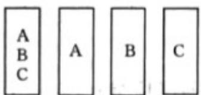

> [!faq]- 《专题03 事件相互独立性及频率与概率的四大常考题型（高效培优专项训练）数学人教A版高一必修第二册》官方解析
>
> > [!success]- **【答案】** A．若 $P(A\overline{B}) = 0.14$ ，则 $A$ 与 $B$ 相互独立 B．若 $A$ 与 $B$ 相互独立，则 $P(A + B) = 0.44$ C． $0.3 \leq P(A + B) \leq 0.5$ D．若 $A \subseteq B$ ，则 $P(\overline{AB}) = P(\overline{AB})$
>
> > [!note]- **【分析】**
> > 由条件证明 $P(AB) = P(A) \cdot P(B)$ ，结合独立事件的定义判断A；若 $A$ 与 $B$ 相互独立，由概率的加法公式 $P(A + B) = P(A) + P(B) - P(AB)$ 求结论判断B；当 $A \subseteq B$ 时， $P(A + B)$ 有最小值0.3，当 $A$ 与 $B$ 互斥时， $P(A+B)$ 有最大值0.5，故C正确；若 $A\subseteq B$ ，所以 $P(\overline{AB})=P(\overline{A})=0.8$ ； $P(\overline{AB})=P(\overline{B})=0.7$ ，所以 $P(\overline{AB})\neq P(\overline{AB})$ ，故D错误。
>
> > [!note]- **【解析】**
> > 对于A，因为 $P(A)=0.2, P(B)=0.3$ ，所以 $P(\overline{A})=0.8, P(\overline{B})=0.7$ 由 $P(A\overline{B})=P(A)-P(AB)$ ，得 $P(AB)=P(A)-P(A\overline{B})=0.2-0.14=0.06$ 因为 $P(A)P(B)=0.3\times0.2=0.06$ ，所以 $P(AB)=P(A)\cdot P(B)=0.06$ 所以A与B相互独立，故A正确；
> > 对于B，若A与B相互独立，则 $P(AB)=0.06$ ，由概率的加法公式 $P(A+B)=P(A)+P(B)-P(AB)=0.2+0.3-0.06=0.44$ ，故B正确；
> > 对于C，当 $A\subseteq B$ 时， $P(A+B)$ 有最小值 $P(A+B)=P(B)=0.3$ 当A与B互斥时， $P(A+B)$ 有最大值 $P(A+B)=P(A)+P(B)=0.2+0.3=0.5$ ；
> > 所以 $0.3\leq P(A+B)\leq0.5$ ，故C正确；
> > 对于D，若 $A\subseteq B$ ，则AB=A，所以 $P(\overline{AB})=P(\overline{A})=0.8$ ；
> > 又因为 $A+B=B$ 根据德摩根定律有 $\overline{AB}=\overline{A+B}$ ，又因为 $A\subseteq B$ ，所以 $A+B=B$ ，故 $\overline{AB}=\overline{B}$ 所以 $P(\overline{AB})=P(\overline{B})=0.7$ 所以 $P(\overline{AB})\neq P(\overline{AB})$ ，故D错误；
> >
> > 故选：ABC.
> >
> > 15．辽宁全省开展慈善文化进机关、进企业、进乡村、进社区、进家庭活动，通过讲座、公益市集、志愿服务等形式，重点帮扶特殊困难群体现有 A, B, C 共 3 场慈善知识竞赛和慰问活动需要安排志愿者，小林从图中四张同样大小的卡片中随机抽取一张，卡片上的字母代表小林参加的活动场次，例如抽到写有 A, B, C3 个字母的卡片代表小林参加 A, B, C3 场活动，则（）
> >
> > 【答案】
> >
> > 
> >
> > A. “小林参加 $A$ 场活动”与“小林参加 $B$ 场活动”互斥
> > B. “小林参加 $A$ 场活动”与“小林参加 $B$ 场活动”相互独立
> > C. “小林不参加 $A$ 场活动”与“小林不参加 $B$ 场活动”相互独立
> > D. “小林不参加 $A$ 场活动”与“小林参加 $B$ 场或 $C$ 场活动”相互独立
> >
> > 【答案】BC
> >
> > 【分析】由互斥事件的定义即可判断 A，由相互独立的定义若 $P(AB)=P(A)P(B)$ ，则事件 A, B 相互独立即可判断 B、C、D.
> >
> > 【详解】若选到第一张卡片，则小林同时参加3场活动，A错误.
> >
> > “小林参加 A 场活动”的概率为 $\frac{1}{2}$ ，“小林参加 B 场活动”的概率为 $\frac{1}{2}$ ，“小林同时参加 A 场和 B 场活动”的概率为 $\frac{1}{4}$ ， $\frac{1}{2} \times \frac{1}{2} = \frac{1}{4}$ ，B 正确.
> >
> > “小林不参加 A 场活动”的概率为 $\frac{1}{2}$ ，“小林不参加 B 场活动”的概率为 $\frac{1}{2}$ ，“小林同时不参加 A 场与 B 场活动”的概率为 $\frac{1}{4}$ ， $\frac{1}{2} \times \frac{1}{2} = \frac{1}{4}$ ，C 正确.
> >
> > “小林参加 B 场或 C 场活动”的概率为 $\frac{3}{4}$ ，“小林不参加 A 场活动，参加 B 场或 C 场活动”的概率为 $\frac{1}{2}$ ， $\frac{1}{2}\times\frac{3}{4}\neq\frac{1}{2}$ ，D错误.
> >
> > 故选：BC.
> >
> > 16. 掷红色和蓝色两枚均匀的骰子，观察朝上的面的点数
> >
> > (1)求两枚骰子点数相同的概率；
> >
> > (2)记事件 $A$ ：红骰子的点数为1；事件 $B$ ：两枚骰子的点数和为5；事件 $C$ ：两枚骰子的点数和为7
> >
> > (i) 判断事件 A 与 B 是否相互独立；
> >
> > (ii) 判断事件 $A$ 与 $C$ 是否相互独立.
> >
> > 【答案】(1) $\frac{1}{6}$
> >
> > (2) (i) 事件 $A$ 与 $B$ 不相互独立
> >
> > (ii) 事件 A 与 C 相互独立
> >
> > 【分析】（1）列出样本空间由古典概型公式计算即可；
> >
> > (2) 由相互独立的定义进行判断即可.
> >
> > 【详解】（1）用 $(x,y)$ 表示红色和蓝色两枚均匀的骰子朝上的面的点数，
> > 则样本空间 $\Omega=\left\{(x,y)\mid x\leq6,x\in\mathbb{N}^{*},y\leq6,y\in\mathbb{N}^{*}\right\}$
> >
> > 记事件 D 为两枚骰子点数相同，
> >
> > 则 $P(D)=\frac{6}{36}=\frac{1}{6}$ .
> >
> > (2) (i) $A=\left\{(1,y)\mid y\leq6,y\in\mathbb{N}^{*}\right\},B=\left\{(1,4),(2,3),(3,2),(4,1)\right\}$ $AB=\left\{(1,4)\right\}$ ,
> > 所以 $P(A)=\frac{6}{36}=\frac{1}{6},P(B)=\frac{4}{36}=\frac{1}{9}$
> >
> > 故事件 A 与 B 不相互独立，
> >
> > (ii) 因为 $C = \left\{(1,6), (2,5), (3,4), (4,3), (5,2), (6,1)\right\}$ , $AC=\left\{(1,6)\right\}$ ，所以 $P(C)=\frac{6}{36}=\frac{1}{6}$ $P(AC)=P(A)P(C)=\frac{1}{36}$ ,
> >
> > 故事件 A 与 C 相互独立.
> >
> > 17．先后两次掷一枚质地均匀的骰子，A 表示事件“两次掷出的点数之和是 4），B 表示事件“第二次掷出的点数是偶数”，C 表示事件“两次掷出的点数相同”，D 表示事件“至少出现一个奇数点”，则（）
> >
> > 【答案】
> > A. A 与 C 互斥
> > B. $P(D)=\frac{1}{4}$ C. B 与 D 对立
> > D. B 与 C 相互独立
> >
> > 【答案】D
> >
> > 【分析】根据互斥事件与对立事件的关系判断 A,C；根据对立事件概率计算 $P(D)$ 即可判断 B；根据结合古典概型求解概率 $P(B), P(C), P(BC)$ ，结合独立事件概率性质即可判断 D.
> >
> > 【详解】若两次掷出的点数之和是 4，由于每次掷出的点数都在 1 到 6 之间，
> >
> > 所以第一次掷出的点数一定小于 4，而“两次掷出的点数相同”中的“ $(2,2)$ ”的点数之和等于 4，
> >
> > 故 A 与 C 不互斥，故 A 错误；
> >
> > “至少出现一个奇数点”的对立事件是“两次掷出的点数都是偶数点”，
> >
> > 所以 $P(D)=1-\frac{3}{6}\times\frac{3}{6}=\frac{3}{4}$ ，故 B 错误；
> >
> > 由于“至少出现一个奇数点”的对立事件是“两次掷出的点数都是偶数点”。故 $B$ 与 $D$ 不是对立的，故 $\mathbf{C}$ 错误；先后两次掷一枚质地均匀的骰子，两次出现的点数组 $(x,y)$ 有 $6\times 6 = 36$ 种等可能的不同情况，第二次掷出的点数为偶数的情况有 $(x,2),(x,4),(x,6)(x = 1,2,3,4,5,6)$ 共18种不同情况，两次掷出的点数相同的情况有： $(1,1),(2,2),(3,3),(4,4),(5,5),(6,6)$ 共6种，
> >
> > 两次掷出的点数相同且第二次掷出的点数为偶数的情况有 $(2,2),(4,4),(6,6)$ 共3种情况，所以 $P(B) = \frac{18}{36} = \frac{1}{2}, P(C) = \frac{6}{36} = \frac{1}{6}, P(BC) = \frac{3}{36} = \frac{1}{12}$ ，所以 $P(B)P(C) = P(BC)$ ，所以 $B, C$ 独立，故D正确。
> >
> > 故选：D.
> >
> > 18. 抛掷一枚质地均匀的骰子，观察向上的面的点数，事件 $A$ 为“点数为偶数”，事件 $B$ 为“点数是1或4”，事件 $C$ 为“点数大于3”，下列说法正确的是（ ）A． $A$ 和 $B$ 是互斥事件 B． $B$ 和 $C$ 是相互独立事件C． $P(B + C) = \frac{5}{6}$ D． $P(AC) = \frac{1}{3}$
> >
> > 【答案】BD
> >
> > 【分析】求出样本空间 $\Omega$ ，利用互斥事件定义即可判断A，利用独立事件的定义即可判断B，利用古典概型公式即可判断CD.
> >
> > 【详解】样本空间 $\Omega=\left\{1,2,3,4,5,6,\right\}$ ， $A=\left\{2,4,6\right\}$ ， $B=\left\{1,4\right\}$ ， $C=\left\{4,5,6\right\}$
> >
> > 对于 A： $A \cap B = \{4\}$ ，所以 A 和 B 不是互斥事件，故 A 错误；
> >
> > 对于 B：由 $P(B)=\frac{1}{3}, P(C)=\frac{1}{2}, P(BC)=\frac{1}{6}=P(B)P(C)$ ，故 B 正确；
> >
> > 对于 C.：由 $P(B+C)=\frac{4}{6}=\frac{2}{3}$ ，故 C 错误；
> >
> > 对于 D：由 $P(AC)=\frac{2}{6}=\frac{1}{3}$ ，故 D 正确.
> >
> > 故选 **BD**.
