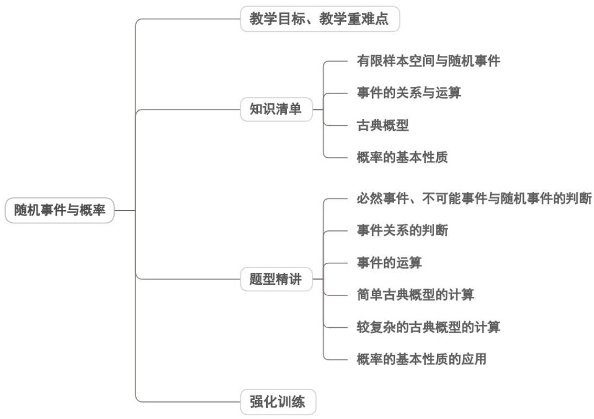
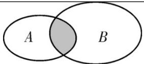
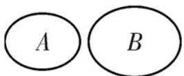
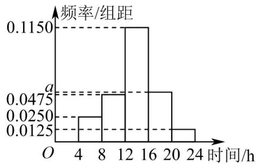

<!-- source-part:1 pages:1-50 -->

专题10.1 随机事件与概率

## 教学目标、教学重难点

<table><tr><td>教学目标</td><td>1.区分必然事件、不可能事件、随机事件,掌握随机事件概率的定义,明确概率取值范围(0≤P≤1)2.理解频率与概率的关系(频率是概率的近似值,概率是频率的稳定值),会用频率估计概率3.掌握随机事件概率的基本性质(互斥事件、对立事件的判定及概率公式),能解决简单实际问题</td></tr><tr><td>教学重难点</td><td>1.重点互斥事件、对立事件的概念辨析,及互斥事件的加法公式、对立事件的概率公式2.难点精准辨析互斥事件与对立事件(对立必互斥,互斥不一定对立),避免公式混用</td></tr></table>

## 知识清单

## 知识点 01 有限样本空间与随机事件

## 1、随机试验

我们把对随机现象的实现和对它的观察称为随机试验（randomexperiment），简称试验，常用字母 $E$ 表示.

## 2、随机试验的特点

(1) 试验可以在相同条件下重复进行；

(2) 试验的所有可能结果是明确可知的，并且不止一个；

(3) 每次试验总是恰好出现这些可能结果中的一个，但事先不能确定出现哪一个结果。

## 3、样本空间

我们把随机试验 $E$ 的每个可能的基本结果称为样本点，全体样本点的集合称为试验 $E$ 的样本空间

（samplespace）. 一般地，我们用 $\Omega$ 表示样本空间，用 $\omega$ 表示样本点．在本书中，我们只讨论 $\Omega$ 为有限集的

情况．如果一个随机试验有 n 个可能结果 $\omega_{1},\omega_{2},\ldots,\omega_{n}$ ，则称样本空间 $\Omega=\left\{\omega_{1},\omega_{2},\ldots,\omega_{n}\right\}$ 为有限样本空间．

## 4、随机事件

一般地，随机试验中的每个随机事件都可以用这个试验的样本空间的子集来表示。为了叙述方便，我们将样

本空间 $\Omega$ 的子集称为随机事件（randomevent），简称事件，并把只包含一个样本点的事件称为基本事件

( elementaryevent ) . 随机事件一般用大写字母 A , B , C , 表示 . 在每次试验中 , 当且仅当 A 中某个样本点

出现时，称为事件 $A$ 发生.

## 5、必然事件，不可能事件

在每次试验中总有一个样本点发生，所以 $\Omega$ 总会发生，我们称 $\Omega$ 为必然事件。而空集环包含任何样本点，在

每次试验中都不会发生，我们称∅不可能事件。

【即学即练】

1. 在一个不透明的袋子中装有形状、大小、质地完全相同的 $^{5}$ 个球，其中 $^{3}$ 个黑球、 $^{2}$ 个白球，从袋子中

一次摸出 $^{3}$ 个球，下列事件是必然事件的是（）

A．摸出的是 $^{3}$ 个白球

B．摸出的是 $^{3}$ 个黑球

C．摸出的球中至少有 $^{1}$ 个是黑球

D．摸出的是 $^{2}$ 个白球、 $^{1}$ 个黑球

【答案】C

【分析】根据白球只有 $^{2}$ 个不可能摸出 $^{3}$ 个即可进行解答.

【详解】A.摸出的是3个白球是不可能事件，不符合题意；

B. 摸出的是 3 个黑球有可能发生也有可能不发生，不符合题意；

C. 摸出的球中至少有 1 个是黑球是必然事件，符合题意；

D.摸出的是 $^{2}$ 个白球、 $^{1}$ 个黑球有可能发生也有可能不发生，不符合题意·故选：C.

2. 下列现象是必然现象的是（）

【答案】

A. 走到十字路口遇到红灯 B. 冰水混合物的温度是 $1^{\circ} \mathrm{C}$ C. 三角形的内角和为 $180^{\circ}$ D. 一个射击运动员每次射击都命中7环

【答案】C

【分析】根据必然现象和随机现象的定义依次判断即可·

【详解】选项 $^{A}$ ，十字路口遇到红灯，这个事件可能发生也可能不发生，为随机现象；

选项 $^{B}$ ，标准大气压下，冰水混合物的温度是 $0^{\circ}C$ ，事件冰水混合物的温度是 $1^{\circ}C$ 不是必然现象；

选项 $C$ ，三角形的内角和为 $180^{\circ}$ ，这个事件为必然现象；

选项 $^{D}$ ，一个射击运动员每次射击都命中 $^{7}$ 环，这个事件可能发生也可能不发生，为随机现象．故选：C.

知识点 02 事件的关系与运算

<table><tr><td></td><td></td><td>定义</td><td>表示法</td><td>图示</td></tr><tr><td rowspan="2">事件的运算</td><td>包含关系</td><td>一般地,对于事件A与事件B,如果事件A发生,则事件B一定发生,这时称事件B包含事件A(或称事件A包含于事件B)</td><td> $B \supseteq A$ (或 $A \subseteq B$ )</td><td rowspan="2"></td></tr><tr><td>并事件</td><td>若某事件发生当且仅当事件A发生或事件B发生,则称此事件为事件A与事件B的并事件(或和事件)</td><td> $A \cup B$ (或 $A+B$ )</td></tr><tr><td rowspan="3"></td><td>交事件</td><td>若某事件发生当且仅当事件A发生且事件B发生,则称此事件为事件A与事件B的交事件(或积事件)</td><td> $A \cap B$ (或AB)</td><td></td></tr><tr><td>互斥关系</td><td>若 $A \cap B$ 为不可能事件,则称事件A与事件B互斥</td><td>若 $A \cap B = \varnothing$ ,则A与B互斥</td><td></td></tr><tr><td>对立关系</td><td>若 $A \cap B$ 为不可能事件, $A \cup B$ 为必然事件,那么称事件A与事件B互为对立事件,可记为 $B = \overline{A}$ 或 $A = \overline{B}$ </td><td>若 $A \cap B = \varnothing$ , $A \cup B = U$ ,则A与B对立</td><td></td></tr></table>

## 【即学即练】

1. 给出关于满足 $A \square B$ 的非空集合 $A, B$ 的四个命题，其中正确的命题是（）

【答案】

A．若任取 $x \in A$ ，则 $x \in B$ 是必然事件

B．若任取 $x \notin A$ ，则 $x \in B$ 是不可能事件

C．若任取 $x \in B$ ，则 $x \in A$ 是随机事件

D．若任取 $x \notin B$ ，则 $x \notin A$ 是必然事件

【答案】ACD

【分析】根据必然事件、不可能事件、随机事件、子集的定义逐一判断即可·

【详解】对于 A：因为 $A^{\square} B$ ， $x \in A$ ，所以 $x \in B$ ，因此若任取 $x \in A$ ，则 $x \in B$ 是必然事件，真命题；

对于 B：因为 $A \square B$ ，显然存在一个元素在集合 B 中，不在集合 A 中，

因此若任取 $x \notin A$ ，则 $x \in B$ 是随机事件，假命题；

对于 C：因为 $A^{\square} B$ ，任取 $x \in B$ ， $x \in A$ 有可能成立，也可能不成立，

因此任取 $x \in B$ ，则 $x \in A$ 是随机事件，真命题；

对于 D：因为 $A^{\square}B$ ， $x\notin B$ ，所以一定有 $x\notin A$ ，显然任取 $x\notin B$ ，则 $x\notin A$ 是必然事件，真命题。

故选：ACD

2. 掷一枚骰子，设事件 $A = \{ \text{出现的点数不小于 } 5\} , B = \{ \text{出现的点数为偶数}\} ，$ 则事件 $A$ 与事件 $B$ 的关系是（ ）A. $A \subseteq B$ B. $A \cap B = \{ \text{出现的点数为 } 6\}$ C. 事件 $A$ 与 $B$ 互斥 D. 事件 $A$ 与 $B$ 是对立事件

【答案】B

【分析】利用两个事件的关系对各个选项进行判断即可.

【详解】 $A = \{$ 出现的点数不小于 $5\} = \{$ 出现的点数为 $5,6\}$ ， $B = \{$ 出现的点数为偶数 $\} = \{$ 出现的点数为 $2,4,6\}$ ，则 $A \cap B = \{$ 出现的点数为 $6\}$ ，故 ${}^{\mathrm{B}}$ 正确， ${}^{\mathrm{A}}$ 错误；

因为事件 A 与事件 B 可以同时发生，故事件 A 与 B 不是互斥事件，也不是对立事件，故 C，D 错误，

故选：B.

知识点 03 古典概型

## 1、古典概型

考察这些试验的共同特征，就是要看它们的样本点及样本空间有哪些共性．可以发现，它们具有如下共同特

征：

(1) 有限性：样本空间的样本点只有有限个；

(2) 等可能性：每个样本点发生的可能性相等.

我们将具有以上两个特征的试验称为古典概型试验，其数学模型称为古典概率模型

(classicalmodelsofprobability)，简称古典概型。

## 2、概率公式

一般地，设试验 $E$ 是古典概型，样本空间 $\Omega$ 包含 $n$ 个样本点，事件 $A$ 包含其中的 $k$ 个样本点，则定义事件 $A$

的概率

$$
P (A) = \frac {k}{n} = \frac {n (A)}{n (\Omega)}.
$$

其中， $n(A)$ 和 $n(\Omega)$ 分别表示事件 $A$ 和样本空间 $\Omega$ 包含的样本点个数.

## 【即学即练】

1. 某大学为了了解在校大学生参与志愿者活动的时间，随机抽取了 $200$ 名大学生，获得了他们在一个月内参

与志愿者活动的时间（单位：h），将得到的所有数据分为 $^{5}$ 组： $[4,8)$ ， $[8,12)$ ， $[12,16)$ ， $[16,20)$ ， $[20,24]$

(时间均在 $[4,24]$ 内)，绘制成频率分布直方图如图所示。

(1)求 a 的值，并估计这 $^{200}$ 名大学生在一个月内参与志愿者活动的时间的中位数（中位数精确到 0.01）；
(2)从 $\left[16,20\right)$ ， $\left[20,24\right]$ 两组中按分层随机抽样的方法抽取 $^{5}$ 人参加学校志愿者宣传活动，再从这 $^{5}$ 人中随机抽取 $^{2}$ 人作为主宣讲人，求这两人均落在区间 $\left[16,20\right)$ 内的概率.
【答案】(1)a=0.05，中位数为13.83
(2) $\frac{3}{5}$

【分析】（ $^{1}$ ）根据频率分布直方图的性质可求a的值，再根据频率直方图的中位数求法即可求出中位数；

(2) 先根据分层抽样得到 $^{5}$ 人中两组人分别为多少人，再直接列举即可求得结果.

【详解】（1）由频率分布直方图可知 $\left(0.0250+0.0475+0.1150+a+0.0125\right)\times4=1$

解得 $a = 0.05$

前两组频率和为 $(0.0250 + 0.0475)\times 4 = 0.29 < 0.5$

前三组频率和为 $0.29 + 0.1150 \times 4 = 0.75 > 0.5$ ，因此中位数在第 $^{3}$ 组 $[12,16)$ 内，

设中位数为 $x$ ，则 $0.29 + 0.1150(x - 12) = 0.5$

解得 $x \approx 13.83$

(2) $[16,20)$ 组的人数为 $0.05 \times 4 \times 200 = 40$

$[20,24]$ 组的人数为 $0.0125 \times 4 \times 200 = 10$ ，人数比为 $40:10 = 4:1$

分层抽样抽取 $^{5}$ 人，按比例抽取可得 $\left[16,20\right)$ 组人数为 $5\times\frac{4}{4+1}=4$ （人），

[20,24]组的人数为 $5 \times \frac{1}{4 + 1} = 1$ （人）

记 $\left[16,20\right)$ 组内的 $^4$ 人分别为 $a,b,c,d$ ， $[20,24]$ 组内的 $^1$ 人为 $A$ ，事件 $E$ 为“从这 $^5$ 人中随机抽取 $^2$ 人作为主宣

讲人，这两人均落在区间 $\left[16,20\right)$ 内”

从这 $^{5}$ 人中随机抽取 $^{2}$ 人的基本事件为 $(a,b),(a,c),(a,d),(a,A),(b,c),(b,d),(b,A),(c,d),(c,A),(d,A)$ ，共10

种，

其中 $^{2}$ 人均落在区间 $\left[16,20\right)$ 内有 $(a,b),(a,c),(a,d),(b,c),(b,d),(c,d)$ ，共 $^{6}$ 种，

由古典概型的概率计算公式得 $P(E)=\frac{6}{10}=\frac{3}{5}$

2. 某校为了解高一学生课后活动情况，随机抽取 $^{50}$ 名学生，统计了他们某天的课后活动时间（单位：分钟），并绘制频率分布直方图如图所示，其中分组区间为 $[40,50)$ ， $[50,60)$ ， $[60,70)$ ， $[70,80)$ ， $[80,90)$ ， $[90,100]$ .

(1)若从全校高一学生中随机抽取 $^{1}$ 名学生，估计该生这天课后活动时间位于 $[80,90)$ 的概率；

(2)若从样本中课后活动时间在 $[40,50)$ 和 $[90,100]$ 的学生中随机抽取 $^2$ 人，求这 $^2$ 人这天课后活动时间都在

$\left[40,50\right)$ 的概率；

(3)设全校高一学生这天课后活动时间的中位数、众数、平均数的估计值分别为 $a$ ， $b$ ， $c$ ，请直接写出这三个

数的大小关系·（样本中同组数据都用该组区间的中点值代替）

【答案】(1)0.28；

(2) $\frac{2}{5}$ ;

(3) $c < a < b$ .

【分析】（1）根据频率分布直方图频率和为 $^{1}$ 直接计算得到答案；

(2) 根据古典概型计算求解；

(3) 根据公式计算众数，平均数和中位数，再比较大小即可.

【详解】（1）课后活动时间位于 $\left[80,90\right)$ 的概率 $p = 1 - (0.008 + 0.024 + 0.016 + 0.020 + 0.004)\times 10 = 0.28$

(2) 课后活动时间在区间 $\left[40,50\right)$ 的学生有 $0.08 \times 50 = 4$ 人，设 $^4$ 人为 $a,b,c,d$

课后活动时间在区间 $[90,100]$ 的学生有 $0.04 \times 50 = 2$ 人，设 $^2$ 人为 $A, B$

从样本中课后活动时间在 $[40,50)$ 和 $[90,100]$ 的学生中随机抽取 $^2$ 人有

ab, ac, ad, bc, bd, cd, aA, aB, bA, bB, cA, cB, dA, dB, AB 15 种情况，这 $^{2}$ 人这天课后活动时间都在 $[40,50)$ 的有ab,ac,ad,bc,bd,cd,6种情况，

则这 $^{2}$ 人这天课后活动时间都在 $[40,50)$ 的概率为 $\frac{6}{15}=\frac{2}{5}$ ;

$$
(3) (0. 0 0 8 + 0. 0 2 4 + 0. 0 1 6) \times 1 0 = 0. 4 8 <   0. 5
$$

$$
(0. 0 0 8 + 0. 0 2 4 + 0. 0 1 6 + 0. 0 2 0) \times 1 0 = 0. 6 8 > 0. 5
$$

$$
\text {则} (a - 7 0) \times 0. 0 2 0 = 0. 5 - 0. 4 8 = 0. 0 2, a = 7 1;
$$

众数为：b=85；

$$
c = 4 5 \times 0. 0 8 + 5 5 \times 0. 2 4 + 6 5 \times 0. 1 6 + 7 5 \times 0. 2 + 8 5 \times 0. 2 8 + 9 5 \times 0. 0 4 = 6 9. 8
$$

故 $c < a < b$

## 知识点 04 概率的基本性质

一般地，概率有如下性质：

性质 1：对任意的事件 A，都有 $P(A)$ 0。

性质2：必然事件的概率为1，不可能事件的概率为0，即 $P(\Omega) = 1, P(\emptyset) = 0$

性质3：如果事件 $A$ 与事件 $B$ 互斥，那么 $P(A \cup B) = P(A) + P(B)$

性质4：如果事件 $A$ 与事件 $B$ 互为对立事件，那么 $P(B) = 1 - P(A)$ ， $P(A) = 1 - P(B)$

性质5：如果 $A \subseteq B$ ，那么 $P(A) \leq P(B)$

性质6：设 $A$ ， $B$ 是一个随机试验中的两个事件，我们有 $P(A\cup B) = P(A) + P(B) - P(A\cap B)$

【即学即练】

1．已知事件 A 与事件 B 互斥，它们都不发生的概率为 $\frac{3}{4}$ ，且 $P(A)=3P(B)$ ，则 $P(\overline{B})=$ \_\_\_\_。

【答案】 $\frac{15}{16} / 0.9375$

【分析】根据所给条件，利用互斥事件和对立事件的概率公式求解即可·

【详解】因为事件 $A$ 与事件 $B$ 互斥，且 $P(A) = 3P(B)$

所以 $P(A \cup B) = P(A) + P(B) = 4P(B)$

又因为事件 A 与事件 B 都不发生的概率为 $\frac{3}{4}$ ，

所以 $1 - P(A \cup B) = \frac{3}{4}$ ，解得 $P(B) = \frac{1}{16}$ ，

所以 $P\left(\overline{B}\right) = 1 - P(B) = \frac{15}{16}$

故答案为： $\frac{15}{16}$

2. 已知事件 $A, B, C$ 满足 $P(A) = 0.6$ ， $P(B) = 0.2$ ，则下列结论正确的是（）

【答案】
A．如果 $P(A \cup B \cup C) = 1$ ，那么 $P(C) = 0.2$ B．如果 $B \subseteq A$ ，那么 $P(A \cup B) = 0.2$ C．如果 $A$ 与 $B$ 互斥，那么 $P(A \cup B) = 0.8$ D．如果 $A$ 与 $B$ 相互独立，那么 $P(\overline{A}\overline{B}) = 0.32$

【答案】CD

【分析】由互斥事件的概率，相互独立事件的概率公式逐项判断即可·

【详解】对于选项 $^{A}$ ，设一个盒子里有标号为 1 到 10 的小球，从中摸出一个小球，记下球的编号，

记事件 A=“球的编号是偶数”，事件 B=“球的编号是 1，2，3”，事件 C=“球的编号是奇数”满足

$P(A \cup B \cup C) = 1$ ，但是 $P(C) = 0.5,$ 选项 A 错误；

对于选项 B，如果 $B \subseteq A$ ，那么 $P(A \cup B) = P(A) = 0.6$ ，选项 B 错误；

对于选项 C，如果 A 与 B 互斥，那么 $P(A \cup B) = P(A) + P(B) = 0.8$ ，所以选项 C 正确；

对于选项 $^{D}$ ，如果 A 与 B 相互独立，那么

$P(\overline{A} \cdot \overline{B}) = P(\overline{A})P(\overline{B}) = (1 - P(A))(1 - P(B)) = 0.4 \times 0.8 = 0.32$ ，所以选项 D 正确。

故选：CD

## 题型精讲

![[高中/课堂同步/题库/人教A版高中数学同步讲义(2026)/02_必修第二册/第十章 概率/专题10.1 随机事件与概率（高效培优讲义）数学人教A版高一必修第二册/题型01_必然事件_不可能事件与随机事件的判断/题型01_必然事件_不可能事件与随机事件的判断.md]]
![[高中/课堂同步/题库/人教A版高中数学同步讲义(2026)/02_必修第二册/第十章 概率/专题10.1 随机事件与概率（高效培优讲义）数学人教A版高一必修第二册/题型02_事件关系的判断/题型02_事件关系的判断.md]]
![[高中/课堂同步/题库/人教A版高中数学同步讲义(2026)/02_必修第二册/第十章 概率/专题10.1 随机事件与概率（高效培优讲义）数学人教A版高一必修第二册/题型03_事件的运算/题型03_事件的运算.md]]
![[高中/课堂同步/题库/人教A版高中数学同步讲义(2026)/02_必修第二册/第十章 概率/专题10.1 随机事件与概率（高效培优讲义）数学人教A版高一必修第二册/题型04_简单古典概型的计算/题型04_简单古典概型的计算.md]]
![[高中/课堂同步/题库/人教A版高中数学同步讲义(2026)/02_必修第二册/第十章 概率/专题10.1 随机事件与概率（高效培优讲义）数学人教A版高一必修第二册/题型06_概率的基本性质的应用/题型06_概率的基本性质的应用.md]]
![[高中/课堂同步/题库/人教A版高中数学同步讲义(2026)/02_必修第二册/第十章 概率/专题10.1 随机事件与概率（高效培优讲义）数学人教A版高一必修第二册/强化训练/强化训练.md]]
