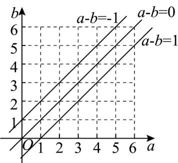
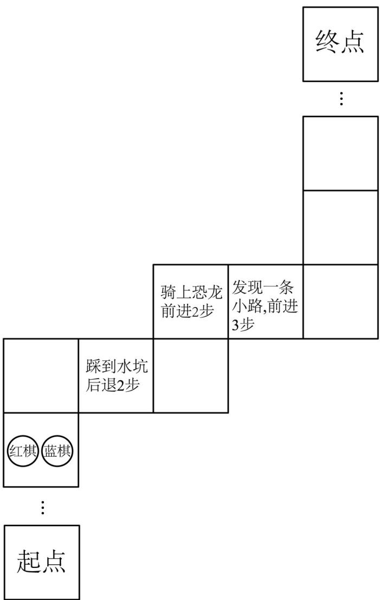

> [!faq]- 《专题10.1 随机事件与概率（高效培优讲义）数学人教A版高一必修第二册》官方解析
>
> > [!success]- **【答案】** A. “至少有一粒种子发芽”与“至多有一粒种子发芽” B. “恰有两粒种子发芽”与“至少有一粒种子发芽” C. “三粒种子都发芽”与“至少有一粒种子发芽” D. “至少有两粒种子发芽”与“三粒种子都不发芽”
>
> > [!note]- **【分析】**
> > 根据互斥事件和对立事件的定义逐个判断即可求解·
>
> > [!note]- **【解析】**
> > 样本空间为： $^{3}$ 粒种子发芽数为 0,1,2,3.
> >
> > “至少有一粒发芽”（1,2,3）与“至多有一粒发芽”（0,1）交集为“1粒发芽”，能同时发生不是互斥事件，故A
> >
> > 不对；
> >
> > “恰有两粒发芽” $^{2}$ 与“至少有一粒发芽” $^{1,2,3}$
> >
> > 交集为“ $^{2}$ 粒发芽”，能同时发生不是互斥事件，故 $^{B}$ 不对；
> >
> > “三粒都发芽”（3）与“至少有一粒发芽”（1,2,3）交集为“3粒发芽”，能同时发生不是互斥事件，故C不对；
> >
> > “至少有两粒发芽”（2,3）与“三粒都不发芽”（0）交集为空（不能同时发生）是互斥事件；并集为{0,2,3}，未包含“1粒发芽”的情况所以两件事不是对立事件，故 $^{D}$ 正确。
> > 故选 D.
> >
> > 2．一场数字游戏在两个非常聪明的学生甲、乙之间进行，老师在黑板上写出 $^{2}$ ， $^{3}$ ， $^{4}$ ，…，2026，共2025个正整数，然后裁判随意擦去一个数，接下来由乙、甲两人轮流擦去其中一个数（即乙先擦去其中一个数，然后甲再擦去一个数），如此下去．若最后剩下的两个数为互质数（公因数只有 $^{1}$ 的两个非零自然数叫作互质数，如 $^{2}$ 和 $^{3}$ 是互质数， $^{9}$ 和 $^{10}$ 是互质数），则判甲胜；否则判乙胜．按照这种游戏规则，甲获胜的概率是（）
> >
> > 【答案】
> > A. $\frac{1011}{2025}$ B. $\frac{1012}{2025}$ C. $\frac{1013}{2025}$ D. $\frac{1014}{2025}$
> >
> > 【答案】C
> >
> > 【分析】先根据裁判擦去的是奇数还是偶数分类考虑，分析得出若擦去的是奇数，则乙一定获胜；若擦去的
> > 是偶数，则甲一定获胜，由此根据古典概型概率公式计算即得。
> > 【详解】由于甲、乙都非常聪明，所以他们获胜的关键要看裁判擦去哪个数。
> > 注意 2, 3, 4, …, 2026 中有 1012 个奇数，1013 个偶数。
> >
> > 若裁判擦去的是奇数，则乙一定获胜．理由如下：
> >
> > 乙不管甲擦去什么数，只要还有奇数，就擦去奇数，这样最后剩下两个数一定都是偶数，
> >
> > 从而所剩两数不是互质数，故乙胜。
> >
> > 若裁判擦去的是偶数，则甲一定获胜．理由如下：
> >
> > 设裁判擦去的是 $^{2m}$ ，则将余下的数配成 $^{1012}$ 对，每对数由一奇一偶的相邻两数组成，
> > 如 $(2,3)$ ， $(4,5)$ ，…， $(2m-2,2m-1)$ ， $(2m+1,2m+2)$ ，…， $(2025,2026)$ ，
> >
> > 这样，不管乙擦去什么数，甲只要擦去所配对中的另一个数，最后剩下两个相邻的整数，它们为互质数，
> > 故甲必获胜．所以甲获胜的概率为裁判擦去的是偶数的概率，即为 $\frac{1013}{2025}$ ．故选：C
> >
> > $$
> > a, b
> > $$
> >
> > $$
> > a, b
> > $$
> >
> > $$
> > \{1, 2, 3, 4, 5, 6 \}
> > $$
> >
> > $$
> > a, b
> > $$
> >
> > $$
> > \left| a - b \right| \leq 1
> > $$
> >
> > 他们是“友好对”的概率为（ ）
> > A. $\frac{7}{18}$ B. $\frac{2}{9}$ C. $\frac{5}{18}$ D. $\frac{4}{9}$
> >
> > 【答案】D
> >
> > 【分析】根据古典概型问题概率的计算公式，求出相应的事件和样本空间所对应的样本点个数即可，而事件所对应的样本点个数可以用列举法和树形图来求解。
> >
> > 【详解】解法 $^{1}$ ：样本空间的样本点个数为 $^{36}$ ，满足要求的样本点分别为： $\left\{\begin{array}{l}(1,1),(1,2),(2,1),(2,2)\\,(2,3)\end{array}\right.$ $(3,2)$ ， $(3,3)$ ， $(3,4)$ ， $(4,3)$ ， $(4,4)$ ， $(4,5)$ ， $(5,4)$ ， $(5,5)$ ， $(5,6)$ ， $(6,5)$ ， $(6,6)$ ，共 $^{16}$ 个，
> >
> > $$
> > \frac {4}{9}
> > $$
> >
> > 解法 $^{2}$ ：样本空间的样本点个数为 $^{36}$ ，当a=1或a=6时，满足条件 $\left|a-b\right|\leq1$ 的b的取法各有 $^{2}$ 种；
> >
> > 当 $a = 2,3,4,5$ 时，满足条件 $\left|a - b\right|\leq 1$ 的 $b$ 的取法各有3种，
> >
> > 所以满足要求的样本点共有 $2 \times 2 + 4 \times 3 = 16$ 个，所以他们是“友好对”的概率为 $\frac{4}{9}$
> >
> > 解法 $^{3}$ ：将两人各写一个数字的事件对应到网格线的交点个数，即 $6 \times 6 = 36$
> >
> > 由 $\left|a-b\right|\leq1$ 可得 $-1\leq a-b\leq1$ ，因为 $a,b\in\{1,2,3,4,5,6\}$
> >
> > 所以由图可得落在直线 $a - b = 0$ 或 $a - b = \pm 1$ 上的点共有16个，所以他们是“友好对”的概率为 $\frac{4}{9}$
> >
> > 故选：D.
> >
> > 
> >
> > 4. 冰雹猜想又称考拉兹猜想、角谷猜想、 $^{3x+1}$ 猜想等，其描述为：任一正整数 x，如果是奇数就乘以 3 再加
> >
> > 1，如果是偶数就除以 2，反复计算，最终都将会得到数字 1．例如：给出正整数 5，则进行这种反复运算的
> >
> > 过程为 $5 \rightarrow 16 \rightarrow 8 \rightarrow 4 \rightarrow 2 \rightarrow 1$ ，即按照这种运算规律进行 5 次运算后得到 1．若从正整数 6，7，8，9，10 中任取
> >
> > $^{2}$ 个数按照上述运算规律进行运算，则运算次数均为偶数的概率为（）
> > A. $\frac{3}{10}$ B. $\frac{3}{5}$ C. $\frac{7}{10}$ D. $\frac{5}{6}$
> >
> > 【答案】A
> >
> > 【分析】根据题中定义，分别求出正整数 $^{6}$ ， $^{7}$ ， $^{8}$ ， $^{9}$ ， $^{10}$ 按照题中所给运算规律进行运算的次数，最后根据
> >
> > 古典概型的概率计算公式进行求解即可·
> >
> > 【详解】按照题中运算规律，正整数 $^{6}$ 的运算过程为 $6\rightarrow3\rightarrow10\rightarrow5\rightarrow16\rightarrow8\rightarrow4\rightarrow2\rightarrow1$ ，运算次数为8；
> >
> > 正整数 $^{7}$ 的部分运算过程为 $7 \rightarrow 22 \rightarrow 11 \rightarrow 34 \rightarrow 17 \rightarrow 52 \rightarrow 26 \rightarrow 13 \rightarrow 40 \rightarrow 20 \rightarrow 10$
> >
> > 当运算到 $^{10}$ 时，运算次数为 $^{10}$ ，由正整数 $^{6}$ 的运算过程可知，
> >
> > 正整数 $^{7}$ 总的运算次数为 $10+6=16$ ；
> >
> > 正整数 $^{8}$ 的运算次数为 $^{3}$ ；
> >
> > 正整数 $^{9}$ 的部分运算过程为 $9 \rightarrow 28 \rightarrow 14 \rightarrow 7$ ，当运算到 $^{7}$ 时，运算次数为 $^{3}$ ，
> >
> > 由正整数 $^{7}$ 的运算过程可知，正整数 $^{9}$ 总的运算次数为 $3+16=19$
> >
> > 正整数 $^{10}$ 的运算次数为 $^{6}$ ;
> >
> > 故正整数 $6, 7, 8, 9, 10$ 的运算次数分别为偶数、偶数、奇数、奇数、偶数，
> >
> > 从正整数 6, 7, 8, 9, 10 中任取 2 个数的方法总数为：
> >
> > $(6,7),(6,8),(6,9),(6,10),(7,8),(7,9),(7,10),(8,9),(8,10),(9,10)$ 共 $10$ 种
> >
> > 其中的运算次数均为奇数的方法总数为： $(6,7),(6,10),(7,10)$ ，共3种，
> >
> > 故运算次数均为奇数的概率为 $\frac{3}{10}$
> >
> > 故选：A.
> >
> > 5. 冒险棋是一种多人参与的休闲益智类棋类游戏，其核心玩法如下：玩家从起点出发，通过掷骰子决定棋子移动步数，并结合陷阱等特殊路径机制行进，先到达终点者获胜（掷到几点，棋子就前进几步，若棋子停止的格子上有冒险文字，则玩家需按照冒险文字指示完成相应操作）。如图，已知甲执红棋、乙执蓝棋来到了
> >
> > 同一个位置，甲先掷一次骰子，乙再掷一次骰子，则红棋比蓝棋更靠近终点的概率为（）
> >
> > 
> >
> > A. $\frac{13}{36}$ B. $\frac{4}{9}$ C. $\frac{5}{12}$ D. $\frac{7}{18}$
> >
> > 【答案】D
> >
> > 【分析】根据题意，红旗、蓝旗与终点的距离相等有点数相同以及点数为 $^{4}$ 或 $^{6}$ 两类情况，利用对立事件的
> >
> > 概率关系求解·
> >
> > 【详解】当甲、乙各自掷骰子得到的点数相同以及点数为 $^{4}$ 或 $^{6}$ 时，最后都会停留在同一个位置，
> >
> > 则红旗、蓝旗与终点的距离相等有 $6 + 2 = 8$ 种情况，故所求概率为 $\frac{1 - \frac{8}{36}}{2} = \frac{7}{18}$
> >
> > 故选 **D**.
