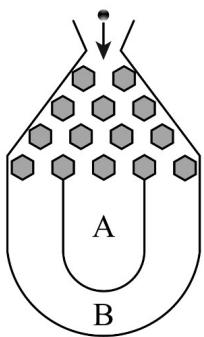

<!-- question-source:start -->
【典例1】将一个半径适当的小球放入如图所示的容器最上方的入口处，小球将自由下落。小球在下落的过

程中，将 $^{3}$ 次遇到黑色障碍物，最后落入A袋或B袋中．已知小球每次遇到黑色障碍物时，向左、右两边下

落的概率都是 $\frac{1}{2}$ ，则小球落入 $A$ 袋中的概率为（）

A. $\frac{1}{4}$ B. $\frac{1}{2}$ C. $\frac{3}{4}$ D. $\frac{7}{8}$
<!-- question-source:end -->

![[高中/课堂同步/题库/人教A版高中数学同步讲义(2026)/02_必修第二册/第十章 概率/专题10.2 事件的相互独立性（高效培优讲义）数学人教A版高一必修第二册/题型02_相互独立事件概率的计算/questions/answers/Q00078770A1.md]]
