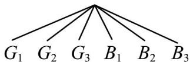
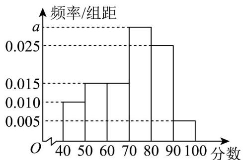

> [!faq]- 《专题10.3 频率与概率（高效培优讲义）数学人教A版高一必修第二册》官方解析
>
> > [!success]- **【答案】** （1）见解析；（2）不公平，理由见解析
>
> > [!note]- **【分析】**
> > （ $^{1}$ ）根据定义一一列举出即可；
> >
> > (2) 由 (1) 根据古典概型的概率计算公式分别计算概率即可判断.
>
> > [!note]- **【解析】**
> > 解：（1）由题意知，所有由 $^{1,2,3,4,5,6}$ 组成的“三位递增数共有 $^{20}$ 个.
> >
> > 分别是 123, 124, 125, 126, 134, 135, 136, 145, 146, 156, 234, 235, 236, 245, 246, 256, 345,
> >
> > 346 356 456.
> >
> > (2) 不公平由 (1) 知，所有由 1, 2, 3, 4, 5, 6 组成的“三位递增数”有 20 个，记“甲参加数学竞赛”为事件
> >
> > A，记“乙参加数学竞赛”为事件 B. 则事件 A 含有基本事件有：124，134，234，126，136，146，156，236，
> >
> > $$
> > 2 4 6, 2 5 6, 3 4 6, 3 5 6, 4 5 6 \text {   共   } 1 3 \text {   个   }.
> > $$
> >
> > 由古典概型计算公式，得
> >
> > $$
> > P (A) = \frac {\text {事件} A \text {含有的基本事件的个数}}{\text {试验所有基本事件的总数}} = \frac {1 3}{2 0}
> > $$
> >
> > 又 $A$ 与 $B$ 对立，所以
> >
> > $$
> > P (B) = 1 - P (A) = 1 - \frac {1 3}{2 0} = \frac {7}{2 0}
> > $$
> >
> > 所以 $P(A) > P(B)$ . 故选取规则对甲、乙两名学生不公平.
> >
> > 5. 一天，甲拿出一个装有三张卡片的盒子（一张卡片的两面都是绿色，一张卡片的两面都是蓝色，还有一张
> >
> > 卡片一面是绿色，另一面是蓝色），跟乙说玩一个游戏，规则是：甲将盒子里的卡片顺序打乱后，由乙随机
> >
> > 抽出一张卡片放在桌子上，然后卡片朝下的面的颜色决定胜负，如果朝下的面的颜色与朝上的面的颜色一致，
> >
> > 则甲赢，否则甲输·乙对游戏的公平性提出了质疑，但是甲说：“当然公平！你看，如果朝上的面的颜色为绿
> >
> > 色，则这张卡片不可能两面都是蓝色，因此朝下的面要么是绿色，要么是蓝色，因此，你赢的概率为 $\frac{1}{2}$ ，我
> >
> > 赢的概率也是 $\frac{1}{2}$ ，怎么不公平？”分析这个游戏是否公平。
> >
> > 【答案】见解析·
> >
> > 【分析】把卡片六个面的颜色记为 $G_{1}$ ， $G_{2}$ ， $G_{3}$ ， $B_{1}$ ， $B_{2}$ ， $B_{3}$ ，其中，G 表示绿色，B 表示蓝色； $G_{3}$ 和 $B_{3}$ 是
> >
> > 两面颜色不一样的那张卡片的颜色，用树形图得到样本空间，计算出概率即可判断·
> >
> > 【详解】解：把卡片六个面的颜色记为 $G_{1}$ ， $G_{2}$ ， $G_{3}$ ， $B_{1}$ ， $B_{2}$ ， $B_{3}$ ，
> >
> > 其中，G 表示绿色，B 表示蓝色； $G_{3}$ 和 $B_{3}$ 是两面颜色不一样的那张卡片的颜色。
> >
> > 游戏所有的结果可以用如图表示·
> >
> > 朝上的面 $G_{1} G_{2} G_{3} B_{1} B_{2} B_{3}$
> >
> > 
> >
> > 朝下的面 $G_{2} G_{1} B_{3} B_{2} B_{1} G_{3}$
> >
> > 不难看出，此时，样本空间中共有 $^{6}$ 个样本点，朝上的面与朝下的面颜色不一致的情况只有 $^{2}$ 种，因此乙赢
> >
> > 的概率为 $\frac{2}{6} = \frac{1}{3}$
> >
> > 因此，这个游戏不公平·
> >
> > 6. 阶梯挑战赛中的排名跃迁，某电竞比赛采用阶梯挑战赛制，共有 $^{5}$ 个阶梯（从低到高为 $^{1-5}$ 阶），初始时
> >
> > $^{10}$ 支队伍随机分布在各阶梯上，分布情况为： $^{1}$ 阶 $^{2}$ 队、 $^{2}$ 阶 $^{2}$ 队、 $^{3}$ 阶 $^{2}$ 队、 $^{4}$ 阶 $^{2}$ 队、 $^{5}$ 阶 $^{2}$ 队。
> >
> > 比赛规则：
> >
> > 1. 每轮比赛，各阶梯内随机配对进行比赛（若某阶梯队伍数为奇数，则有一队轮空）
> >
> > 2. 比赛胜者上升 $^{1}$ 阶，败者下降 $^{1}$ 阶（ $^{5}$ 阶胜者保持 $^{5}$ 阶， $^{1}$ 阶败者保持 $^{1}$ 阶）
> >
> > 3. 每轮结束后，重新按阶梯排序，进行下一轮比赛
> >
> > 4. 比赛共进行 $^{3}$ 轮
> >
> > 假设每支队伍实力相当，任意两队比赛获胜概率均为 $\frac{1}{2}$ ，且各场比赛结果相互独立。
> >
> > (1)求初始位于 $^{3}$ 阶的某支队伍在 $^{3}$ 轮比赛后仍位于 $^{3}$ 阶的概率；
> >
> > (2)求初始位于 $^{3}$ 阶的某支队伍在 $^{3}$ 轮比赛后升至 $^{5}$ 阶的概率；
> >
> > (3)若某支队伍希望最大化 $^{3}$ 轮后位于 $^{5}$ 阶的概率，应选择从哪一阶开始比赛？证明你的结论。
> >
> > 【答案】(1) $\frac{3}{4}$
> >
> > (2) $\frac{3}{8}$
> >
> > (3)3 轮后，证明见解析
> >
> > 【详解】（1）设 $X_{n}$ 表示该队第 $n$ 轮后所处的阶梯， $X_0 = 3$
> >
> > 要使 $X_{3} = 3$ ，需满足 $^{3}$ 轮中胜场数等于负场数，即 $^{1}$ 胜 $^{2}$ 负或 $^{2}$ 胜 $^{1}$ 负（因为 $^{3}$ 轮总比赛场次为 $^{3}$ ）
> >
> > 计算 $^{1}$ 胜 $^{2}$ 负的路径：—3→4→3→2→3（概率： $\frac{1}{2}\times\frac{1}{2}\times\frac{1}{2}=\frac{1}{8}$ ）—3→2→3→4→3（概率：
> >
> > $\frac{1}{2}\times\frac{1}{2}\times\frac{1}{2}=\frac{1}{8}$ —3→2→1→2→3（概率： $\frac{1}{2}\times\frac{1}{2}\times\frac{1}{2}=\frac{1}{8}$ ）—3→4→5→4→3（概率： $\frac{1}{2}\times\frac{1}{2}\times\frac{1}{2}=\frac{1}{8}$ ）
> >
> > 计算 $^{2}$ 胜 $^{1}$ 负的路径：— $3\rightarrow4\rightarrow5\rightarrow4\rightarrow3$ （已计算） $-3\rightarrow4\rightarrow3\rightarrow4\rightarrow3$ （概率： $\frac{1}{2}\times\frac{1}{2}\times\frac{1}{2}=\frac{1}{8}$ ）—
> >
> > $3\to 2\to 3\to 2\to 3$ （概率： $\frac{1}{2}\times \frac{1}{2}\times \frac{1}{2} = \frac{1}{8}$ ）一 $3\to 2\to 1\to 2\to 3$ （已计算）
> >
> > 注意：部分路径重复计算，实际不同路径为：—
> >
> > $$
> > 3 \rightarrow 4 \rightarrow 3 \rightarrow 2 \rightarrow 3 - 3 \rightarrow 2 \rightarrow 3 \rightarrow 4 \rightarrow 3 - 3 \rightarrow 2 \rightarrow 1 \rightarrow 2 \rightarrow 3 - 3 \rightarrow 4 \rightarrow 5 \rightarrow 4 \rightarrow 3
> > $$
> >
> > $$
> > 3 \rightarrow 4 \rightarrow 3 \rightarrow 4 \rightarrow 3 - 3 \rightarrow 2 \rightarrow 3 \rightarrow 2 \rightarrow 3
> > $$
> >
> > 每条路径概率均为 $\frac{1}{8}$ ，共有 $^6$ 条路径，因此：
> >
> > $$
> > P \left(X _ {3} = 3\right) = 6 \times \frac {1}{8} = \frac {3}{4}
> > $$
> >
> > (2) 要使 $X_{3}=5$ ，需满足 3 轮中至少 2 胜且路径不违反阶梯边界。
> >
> > 可能路径：— $3 \rightarrow 4 \rightarrow 5 \rightarrow 5 \rightarrow 5$ （ $^{3}$ 胜，但第 $^{3}$ 轮在 $^{5}$ 阶胜后仍为 $^{5}$ 阶）：概率 $\frac{1}{2} \times \frac{1}{2} \times \frac{1}{2} = \frac{1}{8}$
> >
> > $3 \rightarrow 4 \rightarrow 3 \rightarrow 4 \rightarrow 5$ （2胜1负）：概率 $\frac{1}{2} \times \frac{1}{2} \times \frac{1}{2} = \frac{1}{8}$ — $3 \rightarrow 2 \rightarrow 3 \rightarrow 4 \rightarrow 5$ （2胜1负）：概率 $\frac{1}{2} \times \frac{1}{2} \times \frac{1}{2} = \frac{1}{8}$
> >
> > 因此： $P(X_{3}=5)=\frac{1}{8}+\frac{1}{8}+\frac{1}{8}=\frac{3}{8}$
> >
> > (3) 设从 k 开始， $^{3}$ 轮后位于 5 阶的概率为 $P(k)$ .
> >
> > 对于 $k = 1$ ：一必须3连胜： $1\to 2\to 3\to 4\to 5$ ，概率 $\left(\frac{1}{2}\right)^3 = \frac{1}{8}$
> >
> > 对于 $k = 2$ ：一连胜： $2\to 3\to 4\to 5\to 5$ ，概率 $\frac{1}{8}$ 一胜1负（不影响最终到阶）： $2\rightarrow 3\rightarrow 2\rightarrow 3\rightarrow 4$ （无
> >
> > 法到 $^{5}$ 阶） $2 \rightarrow 1 \rightarrow 2 \rightarrow 3 \rightarrow 4$ （无法到 $^{5}$ 阶） $2 \rightarrow 3 \rightarrow 4 \rightarrow 3 \rightarrow 4$ （无法到 $^{5}$ 阶） $2 \rightarrow 3 \rightarrow 4 \rightarrow 5 \rightarrow 5$ （已计
> >
> > 入 $^{3}$ 连胜）因此， $P(2)=\frac{1}{8}$
> >
> > 对于 $k = 3$ ：—如（2）所计算， $P(3) = \frac{3}{8}$
> >
> > 对于 $k = 4$ ：一至少 ${ }^{1}$ 胜： $4\rightarrow 5\rightarrow 5\rightarrow 5\rightarrow 5$ （概率 $\frac{1}{2}$ ）一胜 ${ }^{2}$ 负： $4\rightarrow 5\rightarrow 4\rightarrow 5\rightarrow 5$ （概率 $\frac{1}{8}$ ）一胜 ${ }^{1}$ 负： $4\rightarrow 5\rightarrow 4\rightarrow 3\rightarrow 4$ （无法到 ${ }^{5}$ 阶） $4\rightarrow 3\rightarrow 4\rightarrow 5\rightarrow 5$ （概率 $\frac{1}{8}$ ） $4\rightarrow 5\rightarrow 4\rightarrow 5\rightarrow 5$ （已计入）因此，
> >
> > $P(4)=\frac{1}{2}+\frac{1}{8}+\frac{1}{8}=\frac{3}{4}$ ，对于k=5:—无需胜场： $5\rightarrow5\rightarrow5\rightarrow5\rightarrow5$ （概率1）
> >
> > 比较： $P(1)=\frac{1}{8},P(2)=\frac{1}{8},P(3)=\frac{3}{8},P(4)=\frac{3}{4},P(5)=1$
> >
> > 因此，从 $^{5}$ 阶开始比赛， $^{3}$ 轮后位于 $^{5}$ 阶的概率最大（为 $^{1}$ ）·这符合直观，因为高阶梯起点意味着离目标更近，
> >
> > 且 $^{5}$ 阶胜者保持 $^{5}$ 阶的规则使得从 $^{5}$ 阶开始的队伍不会下降。
> >
> > 7. “文明进步是城市永恒的追求，创建文明城市是城市更新发展、人民幸福感不断提升的过程，也是安顺实
> >
> > 现高质量发展的需要．"安顺市积极开展“创建文明城市”工作，为了解市民对“创建文明城市”各项工作的满意
> >
> > 程度，某社区组织市民问卷调查给各项工作打分（分数为正整数，满分 $100$ 分），按照市民的打分从高到低
> >
> > 划定 $A, B, C, D, E$ 共五个层次， $A$ 表示非常满意，分数区间是 $\lfloor 86, 100 \rfloor$ ； $B$ 表示比较满意，分数区间是
> >
> > $[71,85]$ ； $C$ 表示满意，分数区间是 $[56,70]$ ； $D$ 表示不满意，分数区间是 $[41,55]$ ； $E$ 表示非常不满意，分数区
> >
> > 间是[0,40].现从社区的市民中随机抽取 $1000$ 名市民进行问卷调查，其频率分布直方图如图所示.
> >
> > 
> >
> > (1)求图中 $a$ 的值，并根据频率分布直方图，估计该市市民打分的平均数（同一组中的数据用该组区间的中点
> >
> > 值作代表）；
> >
> > (2)若 $80\%$ 的市民达到 $C$ （即满意）及以上，则“创建文明城市”工作有效，否则工作就需要调整。用本次样本
> >
> > 的频率分布直方图估计总体，试判断该市“创建文明城市”工作是否需要调整；
> >
> > (3)市民参加问卷调查时会有一定的顾虑，该社区为了调查本社区市民对“创建文明城市”工作满意度的最真实
> >
> > 情况，对本社区市民进行了调查，调查中问了两个问题：
> > - **①**：你的手机尾号是不是奇数？（假设手机尾号为奇数的概率为 $\frac{1}{2}$ ）
> > - **②**：你是否满意安顺市“创建文明城市”工作？
> >
> > 调查者设计了一个随机化的装置，其中装有大小、形状和质量完全相同的 $^{50}$ 个白球和 $^{50}$ 个红球，每个被调
> >
> > 查者随机从装置中摸一个球（摸出的球再放回装置中），摸到白球的市民如实回答第一个问题，摸到红球的
> >
> > 市民如实回答第二个问题，回答“是”的人往一个盒子中放一个小石子，回答“否”的人什么都不做。由于问题的
> >
> > 答案只有“是”和“否”，而且回答的是哪个问题别人并不知道，因此被调查者可以毫无顾虑地给出符合实际情况
> >
> > 的答案．已知该社区 $^{1000}$ 名市民参加了调查，且有 $^{660}$ 名市民回答了“是”，请由此估计该社区市民对“创建文
> >
> > 明城市”工作满意的百分比．
> >
> > 【答案】(1) $a = 0.030$ ，71；
> >
> > (2)不需要调整，理由见解析；
> >
> > (3)82%
> >
> > 【分析】（1）根据频率之和为 $^{1}$ 得到方程，求出a=0.030，并根据平均数的定义进行求解；
> >
> > (2) 计算出 $[56,100]$ 区间内的频率，和 $0.8$ 比较后得到结论；
> >
> > (3) 约有 $500$ 人回答了第一个问题，这 $500$ 人中约有 $250$ 人回答了“是”，从而求出约有 $410$ 人在第二个问题
> >
> > 中回答了“是”，第二个问题被问到的人数也约为 $^{500}$ ，从而得到答案
> >
> > 【详解】（1）由题意得 $10(0.010 + 0.015 + 0.015 + a + 0.025 + 0.005) = 1$
> >
> > 解得 a = 0.030，
> >
> > $$
> > (4 5 \times 0. 0 1 + 5 5 \times 0. 0 1 5 + 6 5 \times 0. 0 1 5 + 7 5 \times 0. 0 3 + 8 5 \times 0. 0 2 5 + 9 5 \times 0. 0 0 5) \times 1 0 = 7 1
> > $$
> >
> > 估计该市市民打分的平均数为 71；
> >
> > (2) 该市“创建文明城市”工作不需要调整，理由如下：
> >
> > [56,100]区间内的频率为
> >
> > $$
> > (7 0 - 5 6) \times 0. 0 1 5 + 1 0 \times 0. 0 3 0 + 1 0 \times 0. 0 2 5 + 1 0 \times 0. 0 0 5 = 0. 8 1 > 0. 8
> > $$
> >
> > 所以该市“创建文明城市”工作不需要调整；
> >
> > (3) 两个问题被问的概率相等，故约有 $500$ 人回答了第一个问题，
> >
> > 由于手机尾号是奇数和偶数的概率相等，故这 $^{500}$ 人中约有 $^{250}$ 人回答了“是”，
> >
> > 所以约有 $660 - 250 = 410$ 人在第二个问题中回答了“是”，
> >
> > 第二个问题被问到的人数也约为 500，
> >
> > 故估计该社区市民对“创建文明城市”工作满意的百分比为 $\frac{410}{500}=82\%$ .
