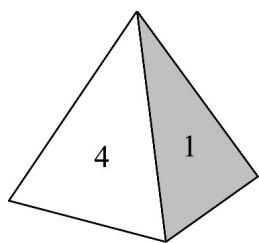

> [!faq]- 《第十章_概率_高效培优单元自测_强化卷_数学人教A版高一必修第二册》官方解析
>
> > [!success]- **【答案】** A．某个个体在第 $21$ 次被抽到的概率为 $\frac{1}{8}$ B．某个个体被抽到的概率为 $\frac{3}{10}$ C．某个个体在第 $30$ 次被抽到的概率为 $\frac{1}{71}$ D．某个个体在第二次被抽到的概率为 $\frac{1}{99}$
>
> > [!note]- **【分析】**
> > 由简单随机抽样的定义，每个个体被抽到的概率是一样的，结合容量，即可求得概率·
>
> > [!note]- **【解析】**
> > 由题意得，单次抽取时每个个体被抽到的概率为 $\frac{1}{100}$
> >
> > 以简单随机抽样方式从该总体中抽取一个容量为 $^{30}$ 的样本，
> >
> > 则指定的某个个体被抽到的概率为 $\frac{1}{100} \times 30 = \frac{3}{10}$ ，故 B 正确，A，C，D 错误。
> >
> > 故选：B.
> >
> > 6. 一枚质地均匀的正四面体的骰子如图所示，其四个面分别标有数字 $^{1}$ ， $^{2}$ ， $^{3}$ ， $^{4}$ 。现抛掷该骰子两次，并记录骰子着地一面的数字。设事件A表示“第一次记录的数字为偶数”，事件B表示“第一次记录的数字为奇数”，事件C表示“两次记录的数字之和为 $^{5}$ ”，事件D表示“两次记录的数字之和为 $^{6}$ ”，则（）
> >
> > 【答案】
> >
> > 
> >
> > A. $C$ 与 $D$ 是对立事件
> > B. $A$ 与 $D$ 是互斥事件
> > C. $B$ 与 $D$ 是相互独立事件
> > D. $A$ 与 $C$ 是相互独立事件
> >
> > 【答案】D
> >
> > 【分析】根据对立事件和独立事件的定义、公式进行逐项判断即可·
> >
> > 【详解】由题意知 $P(A)=\frac{1}{2}$ ， $P(B)=\frac{1}{2}$ ，
> >
> > 事件 $C$ 有 $(1,4),(2,3),(3,2),(4,1)$ ，共 $^4$ 个， $P(C) = \frac{4}{4\times 4} = \frac{1}{4}$
> >
> > 事件 $D$ 有 $(2,4),(3,3),(4,2)$ ，共3个， $P(D) = \frac{3}{4\times 4} = \frac{3}{16}$
> >
> > 易知 $C$ 与 $D$ 是互斥事件，但不是对立事件， $A$ 与 $D$ 可同时发生，不是互斥事件，
> >
> > $P(BD)=\frac{1}{16}\neq P(B)P(D)$ ， $_{B}$ 与 $D$ 不是相互独立事件，
> >
> > $P(AC)=\frac{2}{4\times4}=\frac{1}{8}=P(A)P(C)$ ，A与C是相互独立事件.
> >
> > 故选 **D**.
