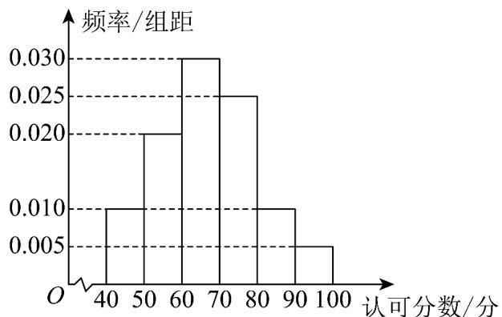

<!-- question-source:start -->
16.（15分）某校学生参与一项社会实践活动，受生产厂家委托采取随机抽样方法，调查我市市民对某新

开发品牌洗发水的满意度，同学们模仿电视问政的打分制，由被调查者在 $^{0}$ 分到 $^{100}$ 分的整数分中给出自己的认可分数，现将收集到的 $^{100}$ 位市民的认可分数分为 $^{6}$ 组：[40,50)，[50,60)，[60,70)，[70,80)，[80,90)，[90,100]，绘制出如图所示的频率分布直方图．

(1)求这 $100$ 位市民认可分数的中位数（精确到0.1），平均数（同一组中的数据用该组区间的中点值作代

表）；

(2)生产厂家根据同学们收集到的数据，若采用分层抽样的方法，在认可分数为 $^{80}$ 及以上的市民中一共选

出 $^{6}$ 名市民当产品宣传员，从这 $^{6}$ 名市民中选 $^{2}$ 名，求这 $^{2}$ 名宣传员都来自认可分数为 $[80,90)$ 的概率。
<!-- question-source:end -->

![[高中/课堂同步/题库/人教A版高中数学同步讲义(2026)/02_必修第二册/第十章 概率/单元测试/第十章_概率_高效培优单元自测_强化卷_数学人教A版高一必修第二册/四_解答题_sec_05/questions/answers/Q00065953A1.md]]
