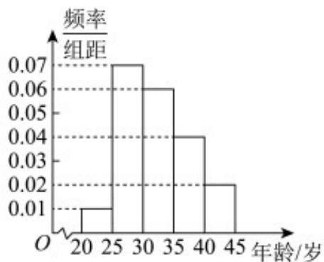

<!-- question-source:start -->
18.（17分）某地市电视台为了了解人们对“湘超足球联赛”的认知程度，对本市不同年龄和不同职业的人

进行专访，认知程度满分 $100$ 分， $95$ 分及以上为认知程度高，结果认知程度高的有 $m$ 人，将这 $m$ 人按年龄

分成 $^{5}$ 组，其中第一组： $\left[20,25\right)$ ，第二组： $\left[25,30\right)$ ，第三组： $\left[30,35\right)$ ，第四组： $\left[35,40\right)$ ，第五组：

$[40,45)$ ，得到如图所示的频率分布直方图，已知第一组 $^{10}$ 人。

(1)根据频率分布直方图，估计这 $m$ 人的年龄的第80百分位数；

(2)现从以上各组中用分层抽样的方法 $^{20}$ 人，担任本市的“湘超足球联赛”宣传使者，若有甲（年龄 $^{38}$ ），乙

(年龄 $^{41}$ ) 两人已确定入选宣传使者，现计划从第四组和第五组被抽到的宣传使者中，再随机抽取 $^{2}$ 名作

为组长，求甲、乙两人至少有一人被选上的概率。
<!-- question-source:end -->

![[高中/课堂同步/题库/人教A版高中数学同步讲义(2026)/02_必修第二册/第十章 概率/单元测试/第十章_概率_高效培优单元自测_强化卷_数学人教A版高一必修第二册/四_解答题_sec_05/questions/answers/Q00065955A1.md]]
