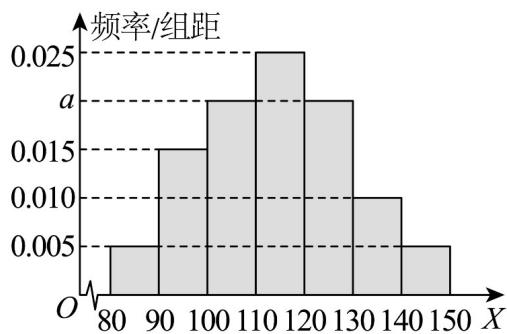

<!-- question-source:start -->
11. 已知苗圃中树苗的高度 $X(\mathrm{cm})$ 服从正态分布 $N(\mu, \sigma^2)$ ，现从苗圃中随机抽取了 $^{100}$ 棵树苗进行高度

统计，并绘制了如图所示的频率分布直方图，将样本频率当作概率，则下列结论正确的是（）

A. $a = 0.020$ $\mu = 114$

B．树苗高度的下四分位数的估计值为 105

C．若从高度位于第一组和第七组的样本树苗中随机抽取 $^{2}$ 棵，记他们的高度分别为x，y，则

$|x - y| \leq 10$ 的概率为 $\frac{4}{9}$

D．已知落在 $\left[80,90\right)$ 的平均高度是88，方差是8，落在 $\left[90,100\right)$ 的平均高度为96，方差是4，则两组树

苗合并后的方差为 $^{17}$
<!-- question-source:end -->

![[高中/课堂同步/题库/人教A版高中数学同步讲义(2026)/02_必修第二册/第十章 概率/第十章 概率（高效培优单元自测·强化卷）数学人教A版高一必修第二册/一_选择题/questions/answers/Q00078817A1.md]]
