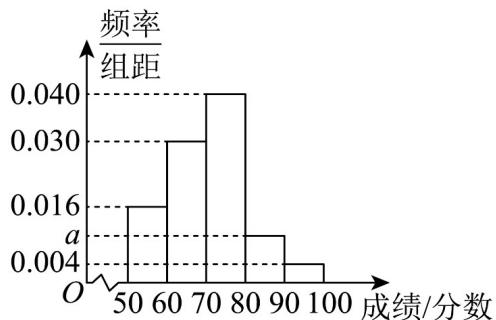

<!-- question-source:start -->
17．（15分）某校举办了校园诗词大赛，学生的比赛成绩均在[50,100]内（单位：分），随机抽取了100名学生的成绩，整理后按照[50,60), [60,70), [70,80), [80,90), [90,100]分成五组，并绘制成如图所示的频率

分布直方图.

(1)若规定成绩较高的前 $10\%$ 的学生获奖，请求出 $a$ 的值并估计获奖学生的最低分数线；

(2)现从样本成绩在 $\left[70,80\right)$ 与 $\left[80,90\right)$ 两个分数段内，按分层随机抽样的方法选取 $^5$ 人，再从这 $^5$ 人中随机选取 $^2$ 人，求这 $^2$ 人中恰有 $^1$ 人的成绩落在 $\left[70,80\right)$ 内的概率；

(3)已知样本数据落在 $\left[70,80\right)$ 的平均数是77，方差是6，落在 $\left[80,90\right)$ 的平均数是82，方差是3，求这两组数据合并后的平均数 $\bar{x}$ 和总方差 $s^{2}$ .
<!-- question-source:end -->

![[高中/课堂同步/题库/人教A版高中数学同步讲义(2026)/02_必修第二册/第十章 概率/第十章 概率（高效培优单元自测·提升卷）数学人教A版高一必修第二册/三_填空题/questions/answers/Q00078837A1.md]]
