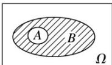
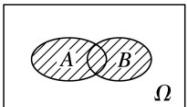
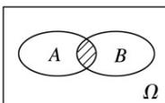
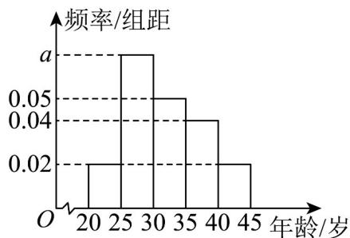
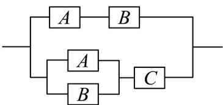

<!-- source-part:1 pages:1-50 -->

## 第十章 概率

## 教学目标、教学重难点

<table><tr><td>教学目标</td><td>1. 基础概念掌握:理解随机事件、必然事件、不可能事件的定义,能准确区分生活中的各类事件;掌握概率的本质内涵,明晰频率与概率的联系与区别(频率是概率的近似值,概率是频率的稳定值)。2. 核心公式与模型应用:熟练掌握古典概型(有限等可能)、几何概型(无限等可能)的判定条件与计算公式,能运用列举法(直接列举、树状图、列表法)不重不漏地列举基本事件;3.计算与表征能力:能根据事件特征选择恰当的计数方法(枚举法)计算基本事件数,准确代入公式求解概率;能通过统计图表(频率分布直方图、茎叶图)提取数据,用频率估计概率。</td></tr><tr><td>教学重难点</td><td>重点1.概率概念的深度理解:核心是让学生摆脱“概率是主观猜测”的误区,建立“概率是对随机事件发生可能性的客观刻画”的认知,明确概率的取值范围(0≤P(A)≤1)。2.基本模型的精准判定:能根据试验结果的“有限性/无限性”“等可能性”快速区分古典概型与几何概型;高中阶段需准确判定独立事件、互斥事件、对立事件的关系。3.规范的解题流程构建:掌握“判断事件类型→选择计数方法→计算基本事件数→代入公式求解→验证结果合理性”的标准化步骤,确保解题逻辑连贯、结果准确。4.列举法与计数工具的熟练运用:初中阶段重点掌握树状图、列表法解决两步及三步试验问题。难点1.抽象概念的具象化理解:难以把握“等可能性”的隐含条件(如不均匀硬币不满足古典概型),易混淆“频率”与“概率”(如认为“抛10次硬币5次正面”则概率为0.5)。2.复杂事件的拆解与转化:面对“至少有一个发生”“至多有一个发生”等复杂事件,难以转化为对立事件或互斥事件的组合,导致计算繁琐或错误。3.易混概念的辨析:初中阶段易混淆“有序”与“无序”对计数的影响。4.概率结果的实际意义解释:能计算概率但无法用通俗语言解释结果(如“降水概率80%”的含义),难以将概率结论应用于实际决策。</td></tr></table>

## 知识清单

## 知识点 01 随机试验

我们把对随机现象的实现和对它的观察称为随机试验，简称试验，常用字母 $E$ 表示.

我们感兴趣的是具有以下特点的随机试验：

(1) 试验可以在相同条件下重复进行；

（2）试验的所有可能结果是明确可知的，并且不止一个；

（3）每次试验总是恰好出现这些可能结果中的一个，但事先不能确定出现哪一个结果。

## 样本空间

我们把随机试验 E 的每个可能的基本结果称为样本点，全体样本点的集合称为试验 E 的样本空间，一般地，用．Ω．表示样本空间，用 $\omega$ 表示样本点，如果一个随机试验有 n 个可能结果 $\omega_{1}$ ， $\omega_{2}$ ，…， $\omega_{n}$ ，则称样本空间 $\Omega = \left\{\omega_{1}, \omega_{2}, \cdots, \omega_{n}\right\}$ 为有限样本空间．

## 随机事件、确定事件

（1）一般地，随机试验中的每个随机事件都可以用这个试验的样本空间的子集来表示，为了叙述方便，我们将样本空间 $\Omega$ 的子集称为随机事件，简称事件，并把只包含一个样本点的事件称为基本事件。当且仅当 $A$ 中某个样本点出现时，称为事件 $A$ 发生。

（2） $\Omega$ 作为自身的子集，包含了所有的样本点，在每次试验中总有一个样本点发生，所以 $\Omega$ 总会发生，我们称 $\Omega$ 为必然事件。

(3) 空集 $\varnothing$ 不包含任何样本点，在每次试验中都不会发生，我们称为 $\varnothing$ 为不可能事件。

(4) 确定事件：必然事件和不可能事件统称为相对随机事件的确定事件。

## 事件的关系与运算

①包含关系：一般地，对于事件 A 和事件 B，如果事件 A 发生，则事件 B 一定发生，这时称事件 B 包含事件 A（或者称事件 A 包含于事件 B），记作 $B \supseteq A$ 或者 $A \subseteq B$ ．与两个集合的包含关系类比，可用下图表示：

不可能事件记作∅，任何事件都包含不可能事件。

②相等关系：一般地，若 $B \supseteq A$ 且 $A \supseteq B$ ，称事件 $A$ 与事件 $B$ 相等．与两个集合的并集类比，可用下图表示： $\boxed{A(B)}\quad \Omega$

③并事件（和事件）：若某事件发生当且仅当事件 $A$ 发生或事件 $B$ 发生，则称此事件为事件 $A$ 与事件 $B$ 的并事件（或和事件），记作 $A \cup B$ （或 $A + B$ ）。与两个集合的并集类比，可用下图表示：

④交事件（积事件）：若某事件发生当且仅当事件 A 发生且事件 B 发生，则称此事件为事件 A 与事件 B 的交事件（或积事件），记作 $A \cap B$ （或 AB）。与两个集合的交集类比，可用下图表示：

## 【即学即练】

1. 下列说法错误的是（）

【答案】
A．如果一事件发生的概率为 0，说明此事件不可能发生
B．如果一事件不是不可能事件，说明此事件是必然事件
C．概率的大小与不确定事件有关
D．如果一事件发生的概率为 99.999%，说明此事件必然发生

【答案】ABD

【详解】对于 $A$ 当样本空间是区间 $[0,1]$ 时，质点落在 $x = 0$ 处的概率为 $0$ ，但不意味着这个事件是不可能发生

的，因为随机变量取值是连续的，所以几乎任何地方都有极小的可能发生，故 $^{A}$ 错误；对于 $^{B}$ ， $^{C}$ ，如果一事件不是不可能事件，说明此事件是必然事件或随机事件，所以 $^{B}$ 错误， $^{C}$ 正确；对于 $^{D}$ ，如果一事件发生的概率为 99.999%，不能说明此事件必然发生，因为它不是必然事件，所以 $^{D}$ 错误。

2. 下列各项中，属于随机事件的是（）

【答案】
A．若正方形边长为a，则正方形的面积为 $a^{2}$ B．在没有任何辅助情况下，人在真空中也可以生存
C．在一个标准大气压下，温度达到 $80^{\circ}C$ 时水会沸腾
D．抛掷一枚硬币，反面向上

【答案】D

【分析】根据必然事件、随机事件和不可能事件的定义即可一一判断·
【详解】对于 $^{A}$ ，若正方形边长为a，由面积公式可知其面积为 $a^{2}$ ，这是必然事件，故 $^{A}$ 不合题意；
对于 $^{B}$ ，真空中没有空气，在没有任何辅助情况下，人不能在真空中生存，这是不可能事件，故 $^{B}$ 不合题意；
对于 $^{C}$ ，在一个标准大气压下，只有温度达到 $100^{\circ}C$ ，水才会沸腾，当温度是 $80^{\circ}C$ 时，水不会沸腾，这是不
可能事件，故 $^{C}$ 不合题意；

对于 $^{D}$ ，拖掷一枚硬币时，结果可能是正面向上，也可能反面向上，这是随机事件·故 $^{D}$ 符合题意·

故选：D.

## 知识点 02 互斥事件与对立事件

（1）互斥事件：在一次试验中，事件 A 和事件 B 不能同时发生，即 $A \cap B = \varnothing$ ，则称事件 A 与事件 B 互斥，可用下图表示：

如果 $A_{1}$ ， $A_{2}$ ，…， $A_{n}$ 中任何两个都不可能同时发生，那么就说事件 $A_{1}$ ，． $A_{2}$ ．，…， $A_{n}$ 彼此互斥.

（2）对立事件：若事件 $A$ 和事件 $B$ 在任何一次实验中有且只有一个发生，即 $A \cup B = \Omega$ 不发生， $A \cap B = \emptyset$ 则称事件 $A$ 和事件 $B$ 互为对立事件，事件 $A$ 的对立事件记为 $\overline{A}$ 。

(3) 互斥事件与对立事件的关系

①互斥事件是不可能同时发生的两个事件，而对立事件除要求这两个事件不同时发生外，还要求二者之一必须有一个发生。

②对立事件是互斥事件的特殊情况，而互斥事件未必是对立事件，即“互斥”是“对立”的必要不充分条件，而“对立”则是“互斥”的充分不必要条件。

## 【即学即练】

1. 在一次随机试验中，彼此互斥的事件 $A, B, C, D$ 发生的概率分别是 0.2, 0.2, 0.3, 0.3，则下列说法错

误的是（）

A． $A+B$ 与 C 是互斥事件，也是对立事件 B． $B+C$ 与 D 是互斥事件，也是对立事件

C. $A + C$ 与 $B + D$ 是互斥事件，但不是对立事件 D. $A$ 与 $B + C + D$ 是互斥事件，也是对立事件

【答案】ABC

【详解】因为事件 A, B, C, D 彼此互斥，所以 $A + B$ 与 C 也互斥，但是

$P(A+B)+P(C)=P(A)+P(B)+P(C)=0.2+0.2+0.3=0.7\neq1$ ，所以不是对立事件，故 $^{A}$ 错误；因为事件A，

$B, C, D$ 彼此互斥，所以 $B + C$ 与 $D$ 也互斥，但是

$$
P (B + C) + P (D) = P (B) + P (C) + P (D) = 0. 2 + 0. 3 + 0. 3 = 0. 8 \neq 1
$$

，所以不是对立事件，故 $^{B}$ 错误；因为事件A，

B, C, D 彼此互斥，所以 $A + C$ 与 $B + D$ 也互斥，又因为

$$
P (A + C) + P (B + D) = P (A) + P (C) + P (B) + P (D) = 0. 2 + 0. 3 + 0. 2 + 0. 3 = 1
$$

，所以是对立事件，故 $^{C}$ 错误；因为

事件 A, B, C, D 彼此互斥，所以 A 与 $B + C + D$ 也互斥，又因为

$$
P (A) + P (B + C + D) = P (A) + P (B) + P (C) + P (D) = 0. 2 + 0. 2 + 0. 3 + 0. 3 = 1
$$

，所以也是对立事件，故 $^{D}$ 正确。

2. 给出以下三个命题：(1) 将一枚硬币抛掷两次，记事件 $A$ ：“二次都出现正面”，事件 $B$ ：“二次都出现反

面”，则事件 $A$ 与事件 $B$ 是对立事件；（2）在命题（1）中，事件 $A$ 与事件 $B$ 是互斥事件；（3）在10件产品

中有 $^{3}$ 件是次品，从中任取 $^{3}$ 件，记事件A：“所取 $^{3}$ 件中最多有 $^{2}$ 件是次品”，事件B：“所取 $^{3}$ 件中至少有 $^{2}$

件是次品”，则事件 A 与事件 B 是互斥事件，其中真命题的个数是 \_\_\_\_。

【答案】 $^{1}$

【分析】根据题意结合互斥与对立事件的定义，分析每个命题的真假判断即可·

【详解】对于（1）（2），因为抛掷两次硬币，除事件 $A$ ， $B$ 外，

还有“第一次出现正面，第二次出现反面”和“第一次出现反面，第二次出现正面”两个事件，

所以事件 A 和事件 B 不是对立事件，但它们不会同时发生，所以是互斥事件；

对于（3），若所取的3件产品中恰有2件次品，则事件A和事件B同时发生，

所以事件 $A$ 和事件 $B$ 不是互斥事件.

故命题（1）是假命题，命题（2）是真命题，命题（3）是假命题。

故答案为：1

## 知识点 03 概率与频率

(1) 频率：在 $n$ 次重复试验中，事件 $A$ 发生的次数 $k$ 称为事件 $A$ 发生的频数，频数 $k$ 与总次数 $n$ 的比值 $\frac{k}{n}$ ，叫做事件 $A$ 发生的频率。

(2) 概率：在大量重复尽心同一试验时，事件 $A$ 发生的频率 $\frac{k}{n}$ 总是接近于某个常数，并且在它附近摆动，这时，就把这个常数叫做事件 $A$ 的概率，记作 $P(A)$ 。

(3) 概率与频率的关系：对于给定的随机事件 $A$ ，由于事件 $A$ 发生的频率 $\frac{k}{n}$ 随着试验次数的增加稳定于概率 $P(A)$ ，因此可以用频率 $\frac{k}{n}$ 来估计概率 $P(A)$ 。

## 【即学即练】

1. 小明将一枚质地均匀的正方体骰子连续抛掷了 $^{5}$ 次，每次朝上的点数都是 $^{2}$ ，则下列说法正确的是（）

【答案】

A. 朝上的点数是 $^{2}$ 的概率和频率均为 $^{1}$ B. 若抛掷 $^{30000}$ 次，则朝上的点数是 $^{2}$ 的概率为 $^{1}$ C. 抛掷第 $^{6}$ 次，朝上的点数一定不是 $^{2}$ D. 抛掷 $^{60000}$ 次，朝上的点数为 $^{2}$ 的次数大约为 $^{10000}$ 次

【答案】D

【分析】根据频率与概率的概念判断 $^{A}$ ，由频率与概率的关系判断 $^{BD}$ ，由概率的概念判断 $^{C}$ .

【详解】A：由题意知朝上的点数是 $^{2}$ 的频率为 $^{1}$ ，概率为 $\frac{1}{6}$ ，故A错误；

$$
\frac {1}{6}
$$

B：当抛掷次数很多时，朝上的点数是 $^{2}$ 的频率在 $^{6}$ 附近摆动，故 $^{B}$ 错误；

C：抛掷第6次，朝上的点数可能是2，也可能不是2，故C错误；

D：每次抛掷朝上的点数是 $^{2}$ 的概率为 $\frac{1}{6}$ ，所以抛掷 $^{60000}$ 次朝上的点数为 $^{2}$ 的次数大约为 $^{10000}$ ，理论和实

际会有一定的出入，故 $^{D}$ 正确。

故选：D.

2. 根据统计，某篮球运动员在 $5000$ 次投篮中，命中的次数为 $2348$ 次。

(1)求这名运动员的投篮命中率；

(2)若这名运动员要想投篮命中 $10000$ 次，则大概需要投篮多少次？（结果精确到 $100$ ）

(3)根据提供的信息，判断“该篮球运动员投篮 $^{3}$ 次，至少能命中 $^{1}$ 次”这一说法是否正确。

【答案】(1)0.4696

(2) 21300

(3)不正确

【分析】（ $^{1}$ ）根据命中率计算方法即可得到答案；

(2) 根据命中率反推出投篮次数即可；

(3) 根据概率的含义即可判断·

【详解】（1）根据题意，某篮球运动员在 $5000$ 次投篮中，命中的次数为 $2348$ 次，

则这名运动员的投篮命中率 $P = \frac{2348}{5000} = 0.4696$

(2) 若这名运动员要想投篮命中 $10000$ 次，则有 $10000 \div \frac{2348}{5000} \approx 21300$

$P=\frac{2348}{5000}>\frac{1}{3}$ ，但由概率的定义，“该篮球运动员投篮 $^{3}$ 次，至少能命中 $^{1}$ ”

次”说法不正确·

## 知识点 04 古典概型

(1) 定义

一般地，若试验 $E$ 具有以下特征：

①有限性：样本空间的样本点只有有限个；

②等可能性：每个样本点发生的可能性相等.

称试验 E 为古典概型试验，其数学模型称为古典概率模型，简称古典概型.

(2) 古典概型的概率公式

一般地，设试验 $E$ 是古典概型，样本空间 $\Omega$ 包含 $n$ 个样本点，事件 $A$ 包含其中的 $k$ 个样本点，则定义事件 $A$ 的概率 $P(A) = \frac{k}{n} = \frac{n(A)}{n(\Omega)}$ .

## 【即学即练】

1. 某调研机构为了了解人们对“奥运会”相关知识的认知程度，针对本市不同年龄和不同职业的人举办了一次

“奥运会”知识竞赛，满分 $100$ 分（ $95$ 分及以上为认知程度高），结果认知程度高的有 $n$ 人，按年龄分成 $5$ 组，

其中第一组 $[20,25)$ ，第二组 $[25,30)$ ，第三组 $[30,35)$ ，第四组 $[35,40)$ ，第五组 $[40,45]$ ，得到如图所示的频

率分布直方图·

(1)求 $a$ 的值，并根据频率分布直方图，估计这 $n$ 人的平均年龄和中位数（同一组中的数据用该组区间的中点

值为代表）；

(2)现从以上各组中用分层抽样的方法选取 $^{20}$ 人，担任本市的“奥运会”宣传使者·若有甲（年龄 $^{36}$ ），乙（年

龄 $^{42}$ ）两人已确定入选，现计划从第四组和第五组被抽到的使者中，再随机抽取 $^{2}$ 名作为组长，求甲、乙两

人至少有一人被选上的概率·

【答案】(1) a = 0.07，平均年龄为 31.75；中位数为 31

(2) $\frac{3}{5}$

【分析】（ $^{1}$ ）根据频率分布直方图频率的性质即可求出，再利用平均数和中位数的公式即可求解；

(2) 列举出所有的情况，再根据古典概型公式可得·

【详解】（1）由题意有： $0.02 \times 5 + a \times 5 + 0.05 \times 5 + 0.04 \times 5 + 0.02 \times 5 = 1$ ，解得 $a = 0.07$

设这 n 人的平均年龄为 $\overline{x}$ ，

$$
\text {则} \bar {x} = 2 2. 5 \times 0. 0 2 \times 5 + 2 7. 5 \times 0. 0 7 \times 5 + 3 2. 5 \times 0. 0 5 \times 5 + 3 7. 5 \times 0. 0 4 \times 5 + 4 2. 5 \times 0. 0 2 \times 5 = 3 1. 7 5
$$

由于前 $^{2}$ 组的频率为 $0.02 \times 5 + 0.07 \times 5 = 0.45$ ，

前 $^{3}$ 组的频率为 $0.02 \times 5 + 0.07 \times 5 + 0.05 \times 5 = 0.7$ ，

则中位数在 $[30,35)$ ，设中位数为 $x$ ，

则 $0.45 + (x - 30) \times 0.05 = 0.5$ ，解得 $x = 31$ ，则中位数为 31.

(2) 由题意得，按照分层抽样第四组应抽取 $0.04 \times 5 \times 20 = 4$ 人，记为 $A$ （甲）， $B$ ， $C$ ， $D$ ，

第五组抽取 $0.02 \times 5 \times 20 = 2$ 人，记为 $E$ （乙）， $F$

对应的样本空间的样本点为：

$$
\Omega = \left\{\big (A, B \big), \big (A, C \big), \big (A, D \big), \big (A, E \big), \big (A, F \big), \big (B, C \big), \big (B, D \big), \big (B, E \big), \big (B, F \big), \right.
$$

$\big(C, D\big), \big(C, E\big), \big(C, F\big), \big(D, E\big), \big(D, F\big), \big(E, F\big)\Big\}$ ，共包含 $^{15}$ 个等可能的样本点，

设事件 M 为“甲、乙两人至少一人被选上”，

则 $M = \left\{\big(A,B\big),\big(A,C\big),\big(A,D\big),\big(A,E\big),\big(A,F\big),\big(B,E\big),\big(C,E\big),\big(D,E\big),\big(E,F\big)\right\}$ ，共包含9个等可能的样本点，

所以 $P(M)=\frac{n(M)}{n(\Omega)}=\frac{9}{15}=\frac{3}{5}$

即甲、乙两人至少有一人被选上的概率为 $\frac{3}{5}$

2．湖北恩施被誉为“世界硒都”，又被称为祖国的后花园．恩施有大峡谷、腾龙洞、神农溪这3个5A级景区，

已知腾龙洞景区有金牌讲解员 $^{2}$ 人，大峡谷景区有金牌讲解员 $^{3}$ 人，若从这 $^{5}$ 人中随机抽取 $^{2}$ 人，则抽取的

这两人来自不同景区的概率为\_\_\_\_。

【答案】 $\frac{3}{5}/0.6$

【分析】由古典概型的概率公式代入计算，即可得到结果·

【详解】大峡谷景区 $^{3}$ 人，腾龙洞景区 $^{2}$ 人，设大峡谷景区的 $^{3}$ 人分别为 $a_{1}$ ， $a_{2}$ ， $a_{3}$ ，腾龙洞景区 $^{2}$ 人分别为 $b_{1}, b_{2}$ ，则在其中任取 $^{2}$ 人的基本事件总数 N=10

分别为： $a_1b_1,a_1b_2;a_2b_1,a_2b_2;a_3b_1,a_3b_2;a_1a_2,a_1a_3,a_2a_3,b_1b_2$

则抽取的这两人来自不同景区的情况分别为： $a_1b_1, a_1b_2; a_2b_1, a_2b_2; a_3b_1, a_3b_2$

故抽取的这两人来自不同景区的概率为 $\frac{6}{10} = \frac{3}{5}$

故答案为： $\frac{3}{5}$

## 知识点 05 概率的基本性质

(1) 对于任意事件 $A$ 都有： $0 \leq P(A) \leq 1$ 。

(2) 必然事件的概率为 1，即 $P(\Omega)=1$ ；不可能事概率为 0，即 $P(\varnothing)=0$ 。

(3) 概率的加法公式：若事件 $A$ 与事件 $B$ 互斥，则 $P(A \cup B) = P(A) + P(B)$

推广：一般地，若事件 $A_{1}$ ， $A_{2}$ ，…， $A_{n}$ 彼此互斥，则事件发生（即 $A_{1}$ ， $A_{2}$ ，…， $A_{n}$ 中有一个发生）的概率等于这 $n$ 个事件分别发生的概率之和，即： $P(A_{1} + A_{2} + \ldots + A_{n}) = P(A_{1}) + P(A_{2}) + \ldots + P(A_{n})$ 。

(4) 对立事件的概率：若事件 $A$ 与事件 $B$ 互为对立事件，则 $P(A) = 1 - P(B)$ ， $P(B) = 1 - P(A)$ ，且 $P(A \cup B) = P(A) + P(B) = 1$

(5) 概率的单调性：若 $A \subseteq B$ ，则 $P(A) \leq P(B)$

(6) 若 $A$ ， $B$ 是一次随机实验中的两个事件，则 $P(A \cup B) = P(A) + P(B) - P(A \cap B)$

方法技巧与总结：

1、解决古典概型的问题的关键是：分清基本事件个数 $n$ 与事件 $A$ 中所包含的基本事件数。

因此要注意清楚以下三个方面：

(1)本试验是否具有等可能性；

(2)本试验的基本事件有多少个；

(3)事件 $A$ 是什么.

2、解题实现步骤：

(1)仔细阅读题目，弄清题目的背景材料，加深理解题意；

(2)判断本试验的结果是否为等可能事件，设出所求事件 $A$ ；

(3)分别求出基本事件的个数 $n$ 与所求事件 $A$ 中所包含的基本事件个数 $m$ ；

(4)利用公式 $P(A) = \frac{A\text{包含的基本事件的个数}}{\text{基本事件的总数}}$ 求出事件 $_A$ 的概率.

3、解题方法技巧：

(1)利用对立事件、加法公式求古典概型的概率

(2)利用分析法求解古典概型.

①任一随机事件的概率都等于构成它的每一个基本事件概率的和.

②求试验的基本事件数及事件A包含的基本事件数的方法有列举法、列表法和树状图法.

## 【即学即练】

1. 某篮球运动员在最近几次参加的比赛中的投篮情况如下表：

<table><tr><td>投篮次数</td><td>投中两分球的次数</td><td>投中三分球的次数</td></tr><tr><td>100</td><td>55</td><td>18</td></tr></table>

记该篮球运动员在一次投篮中，投中两分球为事件 $A$ ，投中三分球为事件 $B$ ，没投中为事件 $C$ ，用频率估计概

率的方法，得到的下述结论中，正确的是（ ）A. $P(A) = 0.55$ B. $P(B) = 0.18$ C. $P(C) = 0.27$ D. $P(B + C) = 0.55$

【答案】ABC

【分析】求出事件 A, B 的频率即得对应概率，再用互斥事件的加法公式计算，然后逐一判断得解·

【详解】依题意， $P(A)=\frac{55}{100}=0.55$ ， $P(B)=\frac{18}{100}=0.18$ ，

显然事件 A，B 互斥， $P(C)=1-P(A+B)=1-P(A)-P(B)=0.27$

事件 $B$ ， $C$ 互斥，则 $P(B + C) = P(B) + P(C) = 0.45$

于是得选项 A，B，C 都正确，选项 D 不正确。

故选：ABC.

2. 某班级有 $45\%$ 的学生喜欢打羽毛球， $80\%$ 学生喜欢打乒乓球；两种运动都喜欢的学生有 $30\%$ 现从该班随机

抽取一名学生，求以下事件的概率：

(1) 只喜欢打羽毛球；

(2)至少喜欢以上一种运动；

(3) 只喜欢以上一种运动；

(4)以上两种运动都不喜欢·

【答案】(1)0.15

(2)0.95

(3)0.65

(4)0.05

【分析】（1）首先表示出 $A =$ “喜欢打羽毛球”， $B =$ “喜欢打乒乓球”，然后根据题意求得

$$
P (A) = 0. 4 5 \quad P (B) = 0. 8 \quad P (A B) = 0. 3
$$

，从而即可求解·

(2) 根据和事件的计算公式即可求解·

(3) 根据上一问求得 $P(A+B)$ ，再利用事件的关系即可求解.

(4) 利用对立事件的公式即可求解.

【详解】（1）设：A=“喜欢打羽毛球”，B=“喜欢打乒乓球”

$$
P (A) = 0. 4 5 \quad P (B) = 0. 8 \quad P (A B) = 0. 3
$$

只喜欢打羽毛球：

$$
P (A) - P (A B) = 0. 4 5 - 0. 3 = 0. 1 5
$$

(2) 至少喜欢以上一种运动：

$$
P (A + B) = P (A) + P (B) - P (A B) = 0. 4 5 + 0. 8 - 0. 3 \quad = 0. 9 5
$$

(3) 只喜欢以上一种运动：

$$
P (A + B) - P (A B) = 0. 4 5 + 0. 8 - 0. 3 - 0. 3 = 0. 6 5
$$

(4) 以上两种运动都不喜欢：

$$
P (\overline {{A + B}}) = 1 - P (A + B) \quad 1 - (0. 4 5 + 0. 8 - 0. 3) = 0. 0 5
$$

## 知识点 06 事件的相互独立性

相互独立事件的概念

对任意两个事件 $A$ 与 $B$ ，如果 $P(AB) = P(A)P(B)$ 成立，则称事件 $A$ 与事件 $B$ 相互独立，简称为独立。

相互独立事件的性质

(1) 事件 $A$ 与 $B$ 是相互独立的，那么 $A$ 与 $\overline{B}$ ， $\overline{A}$ 与 $B$ ， $\overline{A}$ 与 $\overline{B}$ 也是否相互独立。

(2) 相互独立事件同时发生的概率： $P(AB)=P(A)P(B)$

【即学即练】

1. 已知事件 $A, B$ ，且 $P(A) = 0.4, P(B) = 0.2$ ，则下列结论正确的是（）

【答案】

A．如果 $B \subseteq A$ ，那么 $P(A \cup B) = 0.4, P(AB) = 0.2$ B．如果 $A$ 与 $B$ 互斥，那么 $P(A \cup B) = 0.6, P(AB) = 0$ C．如果 $A$ 与 $B$ 相互独立，那么 $P(\overline{AB}) = 0.92$ D．如果 $A$ 与 $B$ 相互独立，那么 $P(AB) = 0.08, P(A \cup B) = 0.52$

【答案】ABD

【分析】对 $^{A}$ 根据包含事件的定义可得，对 $^{B}$ 根据互斥事件的定义及概率的加法公式可得，对 $^{C}$ 、 $^{D}$ 则根据相

互独立事件的定义及公式可得·

【详解】对 A 选项：由 $B \subseteq A$ ，所以 $A \cup B = A$ ，AB = A，

因此 $P(A \cup B) = P(A) = 0.4$ ， $P(AB) = P(B) = 0.2$ ，故 A 正确；

对 $^{B}$ 选项：若 A 与 B 互斥，因此 AB 是不可能事件，所以 $P(AB)=0$

再由概率的加法公式 $P(A \cup B) = P(A) + P(B) = 0.6$ ，故 B 正确；

对 C 选项：若 A 与 B 相互独立，则 $\overline{A}$ 与 $\overline{B}$ 也相互独立， $P(AB)=P(A)P(B)=0.4\times0.2=0.08$

因 $\overline{A}\overline{B}$ 表示“A 不发生且 B 不发生”，即 $\overline{A} \cap \overline{B}$ ，且 $\overline{A}$ 与 $\overline{B}$ 也相互独立，

所以 $P(\overline{AB}) = P(\overline{A})P(\overline{B}) = (1 - 0.4)(1 - 0.2) = 0.6 \times 0.8 = 0.48$ ，故 C 错误；

对 D 选项：因 A 与 B 相互独立，所以 $P(AB) = P(A)P(B) = 0.4 \times 0.2 = 0.08$

再由概率的加法公式 $P(A \cup B) = P(A) + P(B) - P(AB) = 0.4 + 0.2 - 0.08 = 0.52$ ，故D正确·

故选：ABD.

2. 如图，某电子元件由 $A$ ， $B$ ， $C$ 三种部件组成，现将该电子元件应用到某研发设备中，经过反复测试， $A$ ， $B$ ， $C$ 三种部件不能正常工作的概率分别为 $\frac{1}{4}$ ， $\frac{1}{3}$ ， $\frac{1}{5}$ ，各个部件是否正常工作相互独立，则该电子元件能正常工作的概率是（）

【答案】

A. $\frac{18}{25}$ B. $\frac{13}{15}$ C. $\frac{64}{75}$ D. $\frac{11}{75}$

【答案】B

【详解】设上半部分正常工作为事件 $M$ ，下半部分正常工作为事件 $N$ ，该电子元件能正常工作为事件 $A$ ，根据相互独立事件的概率公式求出 $P(M)$ 、 $P(N)$ ，即可求出 $P(\bar{M})$ 、 $P(\bar{N})$ ，再根据对立事件及独立事件的概率公式计算可得：

【分析】设上半部分正常工作为事件 $M$ ，下半部分正常工作为事件 $N$ ，该电子元件能正常工作为事件 $A$ ，则 $P(M) = \left(1 - \frac{1}{4}\right)\times \left(1 - \frac{1}{3}\right) = \frac{1}{2}, P(\bar{M}) = 1 - P(M) = 1 - \frac{1}{2} = \frac{1}{2}$ ， $P(N) = \left(1 - \frac{1}{3}\times \frac{1}{4}\right)\times \left(1 - \frac{1}{5}\right) = \frac{11}{15}$ ，所以 $P(\bar{N}) = 1 - P(N) = 1 - \frac{11}{15} = \frac{4}{15}$ ，

所以 $P(A)=1-P(\bar{M})P(\bar{N})=1-\frac{1}{2}\times\frac{4}{15}=\frac{13}{15}$

即该电子元件能正常工作的概率是 $\frac{13}{15}$ .

故选：B

## 题型精讲

![[高中/课堂同步/题库/人教A版高中数学同步讲义(2026)/02_必修第二册/第十章 概率/第十章 概率（高效培优讲义）数学人教A版高一必修第二册/题型01_随机事件的关系与运算/题型01_随机事件的关系与运算.md]]
![[高中/课堂同步/题库/人教A版高中数学同步讲义(2026)/02_必修第二册/第十章 概率/第十章 概率（高效培优讲义）数学人教A版高一必修第二册/题型02_频率与概率/题型02_频率与概率.md]]
![[高中/课堂同步/题库/人教A版高中数学同步讲义(2026)/02_必修第二册/第十章 概率/第十章 概率（高效培优讲义）数学人教A版高一必修第二册/题型03_互斥事件与对立事件/题型03_互斥事件与对立事件.md]]
![[高中/课堂同步/题库/人教A版高中数学同步讲义(2026)/02_必修第二册/第十章 概率/第十章 概率（高效培优讲义）数学人教A版高一必修第二册/题型04_简单的古典概型问题/题型04_简单的古典概型问题.md]]
![[高中/课堂同步/题库/人教A版高中数学同步讲义(2026)/02_必修第二册/第十章 概率/第十章 概率（高效培优讲义）数学人教A版高一必修第二册/题型05_有放回与无放回问题的概率/题型05_有放回与无放回问题的概率.md]]
![[高中/课堂同步/题库/人教A版高中数学同步讲义(2026)/02_必修第二册/第十章 概率/第十章 概率（高效培优讲义）数学人教A版高一必修第二册/题型06_概率的基本性质/题型06_概率的基本性质.md]]
![[高中/课堂同步/题库/人教A版高中数学同步讲义(2026)/02_必修第二册/第十章 概率/第十章 概率（高效培优讲义）数学人教A版高一必修第二册/题型07_事件独立性的判断/题型07_事件独立性的判断.md]]
![[高中/课堂同步/题库/人教A版高中数学同步讲义(2026)/02_必修第二册/第十章 概率/第十章 概率（高效培优讲义）数学人教A版高一必修第二册/题型08_相互独立事件概率的计算/题型08_相互独立事件概率的计算.md]]
![[高中/课堂同步/题库/人教A版高中数学同步讲义(2026)/02_必修第二册/第十章 概率/第十章 概率（高效培优讲义）数学人教A版高一必修第二册/强化训练/强化训练.md]]
