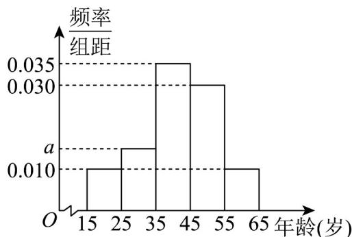

<!-- question-source:start -->
【变式1】某网站推出了关于生态文明建设进展情况的调查，调查数据表明，环境治理和保护问题仍是百姓

最为关心的热点．现从参与关注生态文明建设的人群中随机选出 $^{200}$ 人，并将这 $^{200}$ 人按年龄分组：第 $^{1}$ 组

$[15,25)$ ，第 $^{2}$ 组 $[25,35)$ ，第 $^{3}$ 组 $[35,45)$ ，第 $^{4}$ 组 $[45,55)$ ，第 $^{5}$ 组 $[55,65)$ ，得到的频率分布直方图如图所示。

(1)求 a 的值；

(2)现在要从年龄较小的第 $^{1}$ ， $^{2}$ 组中用分层随机抽样的方法抽取 $^{5}$ 人，再从这 $^{5}$ 人中随机抽取 $^{3}$ 人进行问卷调查，求第 $^{2}$ 组恰好抽到 $^{2}$ 人的概率。
<!-- question-source:end -->

![[高中/课堂同步/题库/人教A版高中数学同步讲义(2026)/02_必修第二册/第十章 概率/第十章 概率（高效培优讲义）数学人教A版高一必修第二册/题型04_简单的古典概型问题/questions/answers/Q00078857A1.md]]
