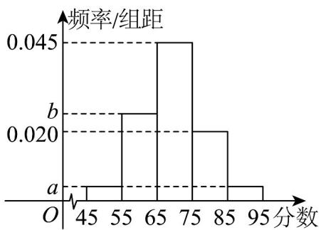

<!-- question-source:start -->
【变式2】某高校承办了奥运会的志愿者选拔面试工作，现随机抽取了 $100$ 名候选者的面试成绩并分成五组：

第一组 $[45,55)$ ，第二组 $[55,65)$ ，第三组 $[65,75)$ ，第四组 $[75.85)$ ，第五组 $[85,95]$ ，绘制成如图所示的频率分

布直方图，已知第三、四、五组的频率之和为 $0.7$ ，第一组和第五组的频率相同·

(1)求 $a, b$ 的值；

(2)估计这 100 名候选者面试成绩的平均数和 50% 分位数（精确到 0.1）；

(3)在第四、五两组志愿者中，按比例分层抽样抽取 $^{5}$ 人，然后再从这 $^{5}$ 人中选出 $^{2}$ 人，求选出的两人来自同一

组的概率·
<!-- question-source:end -->

![[高中/课堂同步/题库/人教A版高中数学同步讲义(2026)/02_必修第二册/第十章 概率/第十章 概率（高效培优讲义）数学人教A版高一必修第二册/题型04_简单的古典概型问题/questions/answers/Q00078858A1.md]]
