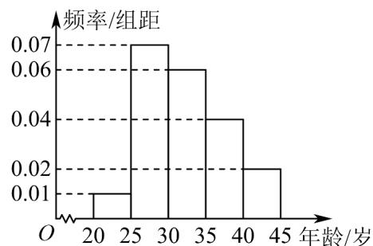

<!-- question-source:start -->
【变式3】某市为了了解人们对“中国梦”的伟大构想的认知程度，针对本市不同年龄和不同职业的人举办了

一次“一带一路”知识竞赛，满分 $100$ 分（ $95$ 分及以上为认知程度高），结果认知程度高的有 $m$ 人．按年龄分

成 $^{5}$ 组，其中第一组： $\left[20,25\right)$ ，第二组： $\left[25,30\right)$ ，第三组： $\left[30,35\right)$ ，第四组： $\left[35,40\right)$ ，第五组： $\left[40,45\right]$ ，

得到如图所示的频率分布直方图.

(1)根据频率分布直方图，估计这 $m$ 人的平均年龄和第80百分位数；

(2)现从以上各组中用按比例分配的分层随机抽样的方法抽取 $^{20}$ 人，担任本市的“中国梦”宣传使者。

(i) 若有甲（年龄 $^{38}$ ），乙（年龄 $^{40}$ ）两人已确定入选宣传使者，现计划从第四组和第五组被抽到的宣传

使者中，再随机抽取 $^{2}$ 名作为组长，求甲、乙两人至少有一人被选上的概率；

(ii) 若第四组宣传使者的年龄的平均数与方差分别为 $^{37}$ 和 $^{2}$ ，第五组宣传使者的年龄的平均数与方差分别

$$
\frac {5}{2}
$$

为 $^{43}$ 和 $^{1}$ ，据此估计这 $m$ 人中 $35 \sim 45$ 岁所有人的年龄的方差。
<!-- question-source:end -->

![[高中/课堂同步/题库/人教A版高中数学同步讲义(2026)/02_必修第二册/第十章 概率/第十章 概率（高效培优讲义）数学人教A版高一必修第二册/题型04_简单的古典概型问题/questions/answers/Q00078859A1.md]]
