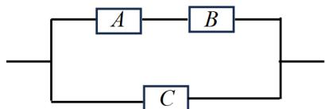

<!-- question-source:start -->
【变式2】如图，某电子元件由 $A, B, C$ 三种部件组成，现将该电子元件应用到某研发设备中，经过反复测试，

$A, B, C$ 三种部件不能正常工作的概率分别为 $\frac{1}{4}, \frac{1}{3}, \frac{1}{2}$ ，各个部件是否正常工作相互独立， $A, B$ 同时正常工作或

C 正常工作则该电子元件能正常工作，那么该电子元件能正常工作的概率是\_\_\_\_。

<!-- question-source:end -->

![[高中/课堂同步/题库/人教A版高中数学同步讲义(2026)/02_必修第二册/第十章 概率/第十章 概率（高效培优讲义）数学人教A版高一必修第二册/题型07_事件独立性的判断/questions/answers/Q00078873A1.md]]
