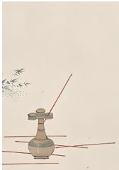
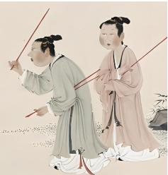

<!-- question-source:start -->
【变式3】投壶是从先秦延续至清末的汉民族传统礼仪和宴饮游戏，在春秋战国时期较为盛行·如图为一幅唐

朝的投壶图，甲、乙、丙是唐朝的三位投壶游戏参与者，假设甲、乙、丙每次投壶时，投中的概率均为0.6

且投壶结果互不影响·若甲、乙、丙各投壶 $^{1}$ 次，则这 $^{3}$ 人中至少有 $^{2}$ 人投中的概率为（）

A. 0.648 B. 0.432 C. 0.36 D. 0.312
<!-- question-source:end -->

![[高中/课堂同步/题库/人教A版高中数学同步讲义(2026)/02_必修第二册/第十章 概率/第十章 概率（高效培优讲义）数学人教A版高一必修第二册/题型08_相互独立事件概率的计算/questions/answers/Q00078879A1.md]]
