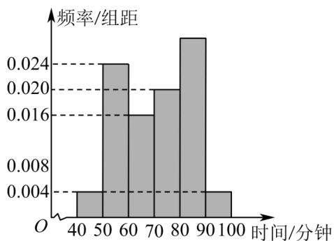

<!-- question-source:start -->
2. 某校为了解高一学生课后活动情况，随机抽取 $^{50}$ 名学生，统计了他们某天的课后活动时间（单位：分钟），并绘制频率分布直方图如图所示，其中分组区间为 $[40,50)$ ， $[50,60)$ ， $[60,70)$ ， $[70,80)$ ， $[80,90)$ ， $[90,100]$ .

(1)若从全校高一学生中随机抽取 $^{1}$ 名学生，估计该生这天课后活动时间位于 $[80,90)$ 的概率；

(2)若从样本中课后活动时间在 $[40,50)$ 和 $[90,100]$ 的学生中随机抽取 $^2$ 人，求这 $^2$ 人这天课后活动时间都在

$\left[40,50\right)$ 的概率；

(3)设全校高一学生这天课后活动时间的中位数、众数、平均数的估计值分别为 $a$ ， $b$ ， $c$ ，请直接写出这三个

数的大小关系·（样本中同组数据都用该组区间的中点值代替）
<!-- question-source:end -->

![[高中/课堂同步/题库/人教A版高中数学同步讲义(2026)/02_必修第二册/第十章 概率/讲义/专题10_1_随机事件与概率_高效培优讲义_数学人教A版高一必修第二册/即学即练_sec_04/questions/answers/Q00065881A1.md]]
