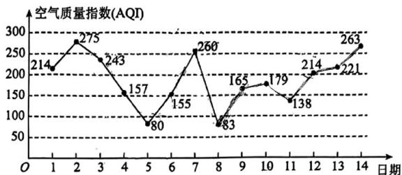

<!-- question-source:start -->
8. 下图是某市 $^{11}$ 月 $^{1}$ 日至 $^{14}$ 日的空气质量指数趋势图，空气质量指数（AQI）小于 $^{100}$ 表示空气质量优良，

空气质量指数大于 $^{200}$ 表示空气重度污染，某人随机选择 $^{11}$ 月 $^{1}$ 日至 $^{11}$ 月 $^{12}$ 日中的某一天到达该市，并停

留 $^{3}$ 天.

(1)求此人到达当日空气重度污染的概率；

(2)求此人停留期间空气重度污染恰有 $^{1}$ 天的概率；

(3)从——日开始连续 $^{3}$ 天的空气质量指数方差最大（直接写出答案）·
<!-- question-source:end -->

![[高中/课堂同步/题库/人教A版高中数学同步讲义(2026)/02_必修第二册/第十章 概率/讲义/专题10_1_随机事件与概率_高效培优讲义_数学人教A版高一必修第二册/强化训练_sec_13/questions/answers/Q00065902A1.md]]
