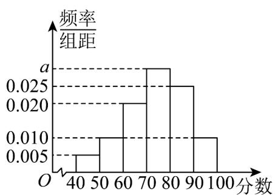

> [!faq]- 《专题10_1_随机事件与概率_高效培优讲义_数学人教A版高一必修第二册》官方解析
>
> > [!success]- **【答案】** (1) $\frac{5}{12}$ (2) $\frac{5}{12}$ (3)5
>
> > [!note]- **【分析】**
> > （1）由图查出 $^{11}$ 月 $^{1}$ 日至 $^{11}$ 月 $^{12}$ 日中空气重度污染的天数，直接利用古典概型概率计算公式得
> >
> > 到答案；
> >
> > (2) 用列举法写出此人在该市停留三天的空气质量指数的所有情况，查出仅有一天是重度污染的情况，然后
> >
> > 直接利用古典概型概率计算公式得到答案.
> >
> > (3) 计算出连续 $^{3}$ 天的空气质量指数的极差，即可判断
>
> > [!note]- **【解析】**
> > （1）某人随机选择 $^{11}$ 月 $^{1}$ 日至 $^{11}$ 月 $^{12}$ 日中的某一天到达该市，
> >
> > 其到达日期的所有可能结果有 $^{1}$ 日， $^{2}$ 日， $^{3}$ 日，…， $^{12}$ 日，共 $^{12}$ 种，
> >
> > 其中此人到达当日空气重度污染的有 $^{1}$ 日， $^{2}$ 日， $^{3}$ 日， $^{7}$ 日， $^{12}$ 日，共 $^{5}$ 种，
> >
> > :此人到达当日空气重度污染的概率为 $\frac{5}{12}$ .
> >
> > (2) 此人停留 3 天的所有可能结果有 $(1,2,3)$ ， $(2,3,4)$ ， $(3,4,5)$ ， $(4,5,6)$ ，
> >
> > (5,6,7), (6,7,8), (7,8,9), (8,9,10), (9,10,11), (10,11,12), (11,12,13), (12,13,14), 共 $^{12}$ 种，
> >
> > 其中恰有 $^{1}$ 天重度污染的有 $(3,4,5)$ ， $(5,6,7)$ ， $(6,7,8)$ ， $(7,8,9)$ ， $(10,11,12)$ 共5种，
> >
> > ∴此人停留期间空气重度污染恰有 $^{1}$ 天的概率为 $\frac{5}{12}$ ·
> >
> > (3) 因为 $(1,2,3)$ 三天空气质量指数的极差为 275 - 214 = 61，
> >
> > (2,3,4) 三天空气质量指数的极差为 $275 - 157 = 118$
> >
> > (3,4,5) 三天空气质量指数的极差为 $243 - 80 = 163$
> >
> > (4,5,6) 三天空气质量指数的极差为 157 - 80 = 77
> >
> > $$
> > (5, 6, 7) _ {\text {三天空气质量指数的极差为}} 2 6 0 - 8 0 = 1 8 0,
> > $$
> >
> > $$
> > (6, 7, 8) _ {\text {三天空气质量指数的极差为}} 2 6 0 - 8 3 = 1 7 7,
> > $$
> >
> > $$
> > (7, 8, 9) _ {\text {三天空气质量指数的极差为}} 2 6 0 - 8 3 = 1 7 7,
> > $$
> >
> > (8,9,10) 三天空气质量指数的极差为 $179 - 83 = 96$
> >
> > $$
> > (9, 1 0, 1 1) _ {\text {三天空气质量指数的极差为}} 1 7 9 - 1 3 8 = 4 1,
> > $$
> >
> > $$
> > (1 0, 1 1, 1 2) _ {\text {三天空气质量指数的极差为}} 2 1 4 - 1 3 8 = 7 6,
> > $$
> >
> > $$
> > (1 1, 1 2, 1 3) _ {\text {三天空气质量指数的极差为}} 2 2 1 - 1 3 8 = 8 3,
> > $$
> >
> > $$
> > (1 2, 1 3, 1 4) _ {\text {三天空气质量指数的极差为}} 2 6 3 - 2 1 4 = 4 9,
> > $$
> >
> > 所以从 $^{5}$ 日开始连续 $^{3}$ 天的空气质量指数方差最大·
> >
> > 9. 文明城市是反映城市整体文明水平的综合性荣誉称号，作为普通市民，既是文明城市的最大受益者，更是
> >
> > 【答案】
> >
> > 文明城市的主要创造者，我市为提高市民对文明城市建设的认识，举办了“创建文明城市”知识竞赛，从所有
> >
> > 答卷中随机抽取 $^{100}$ 份作为样本（满分 $^{100}$ 分，成绩均为不低于 $^{40}$ 分的整数）分成六段： $[^{40}, 50)$ ， $[^{50}]$ ，
> >
> > 60），…，[90，100]，得到如图所示的频率分布直方图。
> >
> > 
> >
> > (1)求频率分布直方图中 $a$ 的值；
> >
> > (2)若从成绩位于区间[80，90）和[90，100]的答卷中，采用分层随机抽样，抽取7份，再从这7份中随机抽取
> >
> > 两份，求这两份答卷的成绩都落在[80，90）的概率；
> >
> > (3)已知落在 $[50,60)$ 的平均成绩是 $56$ ，方差是 $7$ ，落在 $[60,70)$ 的平均成绩为 $65$ ，方差是 $4$ ，求两组成绩的总平
> >
> > 均数 $\overline{z}$ 和总方差 $s^2$
> >
> > 【答案】(1)0.030 (2) $\frac{10}{21}$ (3) $\overline{z}=62$ , $s^{2}=23$
> >
> > 【分析】（1）根据频率之和为 $^{1}$ 求a的值·
> >
> > (2) 根据分层抽样的概念，古典概型概率公式求解即可·
> >
> > (3) 根据加权平均数与方差公式计算即可.
> >
> > 【详解】（1）由题意 $10(0.005+0.010\times2+0.020+0.025+a)=1$ ，解得：a=0.030。
> >
> > (2) 由题可知，成绩在区间 $\left[80,90\right)$ 的频数为： $100 \times 0.025 \times 10 = 25$ ；
> >
> > 成绩在区间 $\left[90,100\right]$ 的频数为： $100\times0.010\times10=10\cdot$
> >
> > 利用分层抽样，从中抽取 $^{7}$ 份，成绩在 $\left[80,90\right)$ 的频数为 $25\times\frac{7}{25+10}=5$ ，成绩在 $\left[90,100\right]$ 的频数为
> >
> > $10 \times \frac{7}{25 + 10} = 2$
> >
> > 再从这 $^{7}$ 份答卷中随机抽取两份，这两份答卷的成绩都落在 $[80,90)$ 的概率为： $\frac{C_{5}^{2}}{C_{7}^{2}}=\frac{10}{21}$
> >
> > (3) 因为落在 $[50,60)$ 与 $[60,70)$ 的频率比为 0.01:0.02=1:2，
> >
> > 所以 $\overline{z}=56\times\frac{1}{3}+65\times\frac{2}{3}=62,\quad s^{2}=\left[7+\left(56-62\right)^{2}\right]\times\frac{1}{3}+\left[4+\left(65-62\right)^{2}\right]\times\frac{2}{3}=23$
