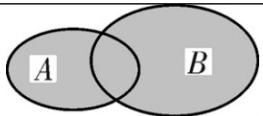
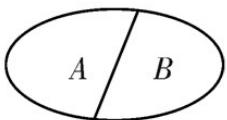

## 知识点 01 有限样本空间与随机事件

## 1、随机试验

我们把对随机现象的实现和对它的观察称为随机试验（randomexperiment），简称试验，常用字母 $E$ 表示.

## 2、随机试验的特点

(1) 试验可以在相同条件下重复进行；

(2) 试验的所有可能结果是明确可知的，并且不止一个；

(3) 每次试验总是恰好出现这些可能结果中的一个，但事先不能确定出现哪一个结果。

## 3、样本空间

我们把随机试验 $E$ 的每个可能的基本结果称为样本点，全体样本点的集合称为试验 $E$ 的样本空间

（samplespace）. 一般地，我们用 $\Omega$ 表示样本空间，用 $\omega$ 表示样本点．在本书中，我们只讨论 $\Omega$ 为有限集的

情况．如果一个随机试验有 n 个可能结果 $\omega_{1},\omega_{2},\ldots,\omega_{n}$ ，则称样本空间 $\Omega=\left\{\omega_{1},\omega_{2},\ldots,\omega_{n}\right\}$ 为有限样本空间．

## 4、随机事件

一般地，随机试验中的每个随机事件都可以用这个试验的样本空间的子集来表示。为了叙述方便，我们将样

本空间 $\Omega$ 的子集称为随机事件（randomevent），简称事件，并把只包含一个样本点的事件称为基本事件

( elementaryevent ) . 随机事件一般用大写字母 A , B , C , 表示 . 在每次试验中 , 当且仅当 A 中某个样本点

出现时，称为事件 $A$ 发生.

## 5、必然事件，不可能事件

在每次试验中总有一个样本点发生，所以 $\Omega$ 总会发生，我们称 $\Omega$ 为必然事件。而空集环包含任何样本点，在

每次试验中都不会发生，我们称∅不可能事件。

【即学即练】

1. 在一个不透明的袋子中装有形状、大小、质地完全相同的 $^{5}$ 个球，其中 $^{3}$ 个黑球、 $^{2}$ 个白球，从袋子中

一次摸出 $^{3}$ 个球，下列事件是必然事件的是（）

A．摸出的是 $^{3}$ 个白球

B．摸出的是 $^{3}$ 个黑球

C．摸出的球中至少有 $^{1}$ 个是黑球

D．摸出的是 $^{2}$ 个白球、 $^{1}$ 个黑球

【答案】C

【分析】根据白球只有 $^{2}$ 个不可能摸出 $^{3}$ 个即可进行解答.

【详解】A.摸出的是3个白球是不可能事件，不符合题意；

B. 摸出的是 3 个黑球有可能发生也有可能不发生，不符合题意；

C. 摸出的球中至少有 1 个是黑球是必然事件，符合题意；

D.摸出的是 $^{2}$ 个白球、 $^{1}$ 个黑球有可能发生也有可能不发生，不符合题意·故选：C.

2. 下列现象是必然现象的是（）

【答案】

A. 走到十字路口遇到红灯 B. 冰水混合物的温度是 $1^{\circ} \mathrm{C}$ C. 三角形的内角和为 $180^{\circ}$ D. 一个射击运动员每次射击都命中7环

【答案】C

【分析】根据必然现象和随机现象的定义依次判断即可·

【详解】选项 $^{A}$ ，十字路口遇到红灯，这个事件可能发生也可能不发生，为随机现象；

选项 $^{B}$ ，标准大气压下，冰水混合物的温度是 $0^{\circ}C$ ，事件冰水混合物的温度是 $1^{\circ}C$ 不是必然现象；

选项 $C$ ，三角形的内角和为 $180^{\circ}$ ，这个事件为必然现象；

选项 $^{D}$ ，一个射击运动员每次射击都命中 $^{7}$ 环，这个事件可能发生也可能不发生，为随机现象．故选：C.

知识点 02 事件的关系与运算

<table><tr><td></td><td></td><td>定义</td><td>表示法</td><td>图示</td></tr><tr><td rowspan="2">事件的运算</td><td>包含关系</td><td>一般地,对于事件A与事件B,如果事件A发生,则事件B一定发生,这时称事件B包含事件A(或称事件A包含于事件B)</td><td> $B \supseteq A$ (或 $A \subseteq B$ )</td><td rowspan="2"></td></tr><tr><td>并事件</td><td>若某事件发生当且仅当事件A发生或事件B发生,则称此事件为事件A与事件B的并事件(或和事件)</td><td> $A \cup B$ (或 $A+B$ )</td></tr><tr><td rowspan="3"></td><td>交事件</td><td>若某事件发生当且仅当事件A发生且事件B发生,则称此事件为事件A与事件B的交事件(或积事件)</td><td> $A \cap B$ (或AB)</td><td></td></tr><tr><td>互斥关系</td><td>若 $A \cap B$ 为不可能事件,则称事件A与事件B互斥</td><td>若 $A \cap B = \varnothing$ ,则A与B互斥</td><td></td></tr><tr><td>对立关系</td><td>若 $A \cap B$ 为不可能事件, $A \cup B$ 为必然事件,那么称事件A与事件B互为对立事件,可记为 $B = \overline{A}$ 或 $A = \overline{B}$ </td><td>若 $A \cap B = \varnothing$ , $A \cup B = U$ ,则A与B对立</td><td></td></tr></table>
