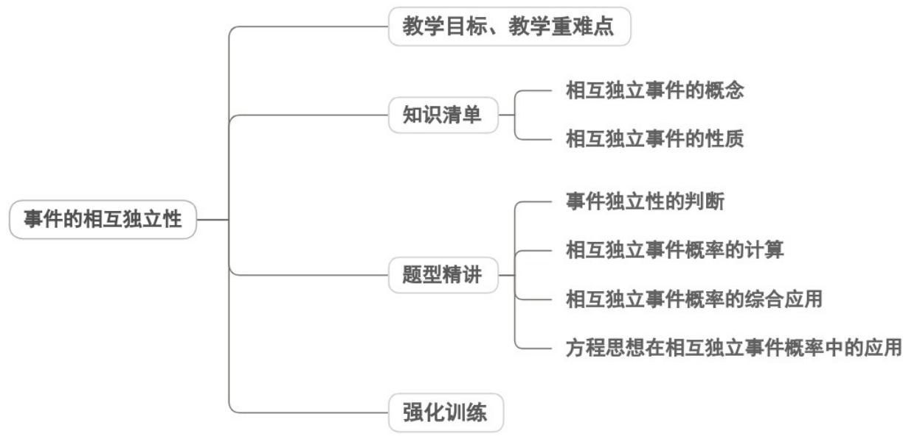

## 专题10.2 事件的相互独立性

## 教学目标、教学重难点

<table><tr><td>教学目标</td><td>1.理解事件相互独立性的定义,能准确判定两个及两个以上随机事件是否独立2.掌握相互独立事件的概率乘法公式(P(AB)=P(A)P(B)),会用公式解决简单计算问题3.区分互斥事件与相互独立事件,明确两类事件的本质差异,避免公式混用4.结合古典概型、频率估计概率,综合运用独立性知识解决实际随机问题</td></tr><tr><td>教学重难点</td><td>1.重点相互独立事件概率乘法公式的推导与熟练运用(含两事件、多独立事件)2.难点结合古典概型、频率估计概率,综合独立事件、互斥事件知识解决综合型实际问题</td></tr></table>
