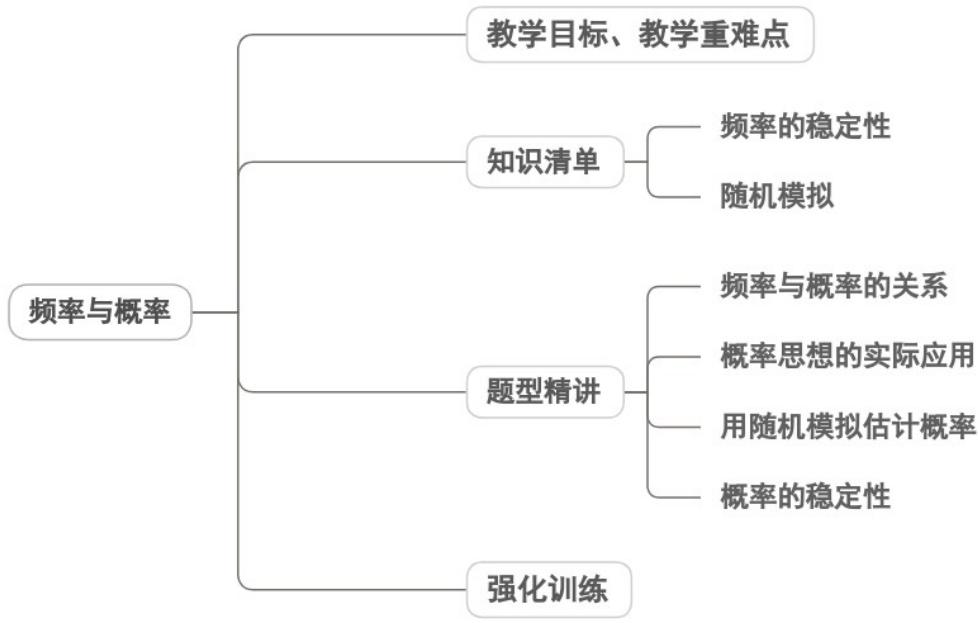

## 专题10.3 频率与概率

教学目标、教学重难点

<table><tr><td>教学目标</td><td>1.结合具体实例,理解频率的定义(事件发生次数与试验总次数的比值),掌握频率的计算方法,能根据试验数据绘制频率分布表或折线图。2.明晰概率的本质含义(随机事件发生可能性大小的客观度量),理解概率的统计定义与基本性质(如取值范围、必然事件与不可能事件的概率特征)。3.核心掌握频率与概率的辩证关系:频率具有随机性(随试验次数变化),概率具有确定性(客观常数),当试验次数足够大时,频率会稳定于概率附近,从而明确“用频率估计概率”的合理性与适用场景。4.结合古典概型实例,巩固简单随机事件的概率计算,为频率与概率的关联提供理论支撑。</td></tr><tr><td>教学重难点</td><td>1.重点频率的稳定性规律:理解“随着试验次数增大,频率偏离概率的幅度逐渐缩小”的核心结论,掌握通过大量重复试验观察频率稳定性的方法。2.难点频率与概率的本质区别辨析:难以区分“随机变量(频率)”与“客观常数(概率)”,易将频率直接等同于概率,需通过典型反例强化认知。</td></tr></table>
