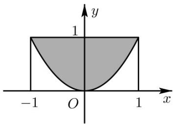

## 知识点 02 随机模拟

我们知道，利用计算器或计算机软件可以产生随机数。实际上，我们也可以根据不同的随机试验构建相应的

随机数模拟实验，这样就可以快速地进行大量重复试验了，这么随机模拟方式叫做随机模拟。

我们称利用随机模拟解决问题地方法为蒙特卡洛方法.

【即学即练】

1. 利用随机模拟方法计算 $y = x^2$ 与 $y = 4$ 围成的面积时, 利用计算器产生两组 $0 \sim 1$ 之间的均匀随机数

$a_{l} = \text{RAND}, b_{l} = \text{RAND}$ , 然后进行平移与伸缩变换, $a = 4a_{l} - 2, b = 4b_{l}$ , 试验进行 100 次, 前 98 次中落在所求面积区域内的

样本点数为 $65$ ，已知最后两次试验的随机数 $a_{l} = 0.3, b_{l} = 0.8$ 及 $a_{l} = 0.4, b_{l} = 0.3$ ，那么本次模拟得出的面积的近似值

为\_\_\_\_.

【答案】10.72

【分析】由题意知本题是模拟方法估计概率，只须计算出总共 $^{100}$ 次试验，一共有多少次落在所求面积区域

内，结合几何概型的计算公式即可求得。

【详解】由 $a_1 = 0.3$ ， $b_{1} = 0.8$ 得 $a = -0.8$ ， $b = 3.2$ ， $(-0.8,3.2)$ 落在 $y = x^2$ 与 $y = 4$ 围成的区域内，

由 $a_1 = 0.4$ ， $b_{1} = 0.3$ 得 $a = -0.4$ ， $b = 1.2$ ， $(-0.4,1.2)$ 落在 $y = x^2$ 与 $y = 4$ 围成的区域内，

本次模拟得出的面积的近似值为 $16 \times \frac{67}{100} = 10.72$

故答案为：10.72。

2. 已知某运动员每次投篮命中的概率为 0.5，现采用随机模拟的方法估计该运动员三次投篮恰有两次命中的

概率：用计算机产生 $0 \sim 999$ 之间的随机整数，以每个随机整数（不足三位的整数，其百位或十位用 $0$ 补齐）

为一组，代表三次投篮的结果，指定数字0，1，2，3，4表示命中，数字5，6，7，8，9表示未命中·如图，

在 R 软件的控制台，输入“sample（0:999, 20, replace=F）”，按回车键，得到 0\~999 范围内的 20 个不重复

的整数随机数，据此估计，该运动员三次投篮恰有两次命中的概率为（）

<table><tr><td colspan="11">&gt; sample (0:999,20,replace=F)</td></tr><tr><td>[1]</td><td>848</td><td>633</td><td>761</td><td>728</td><td>309</td><td>16</td><td>807</td><td>55</td><td>606</td><td>543</td></tr><tr><td>[11]</td><td>247</td><td>23</td><td>538</td><td>440</td><td>898</td><td>557</td><td>140</td><td>213</td><td>458</td><td>62</td></tr></table>

A. $\frac{3}{10}$ B. $\frac{1}{4}$ C. $\frac{1}{5}$ D. $\frac{1}{3}$

【答案】A

【分析】求出基本事件的个数以及符合条件的事件的个数，进而结合古典概型概率公式即可求出结果·
【详解】在 20 个不重复的数中，表示该运动员三次投篮恰有两次命中的有 633, 309, 016, 543, 247, 062 共 6 个，

所以据此估计，该运动员三次投篮恰有两次命中的概率为 $\frac{6}{20} = \frac{3}{10}$

故选：A
