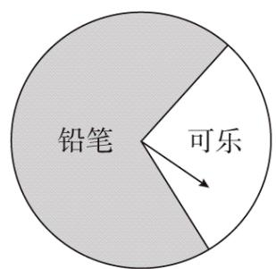

<!-- question-source:start -->
【变式3】某商场设立了一个可以自由转动的转盘（如图所示），并规定：顾客购物 $^{10}$ 元以上就能获得一次

转动转盘的机会，当转盘停止时，指针落在哪一区域（不考虑指针落在分界线上的情况）就可以获得相应的

奖品，下表是活动进行中的一组统计数据。

<table><tr><td>转动转盘的次数n</td><td>100</td><td>150</td><td>200</td><td>500</td><td>800</td><td>1000</td></tr><tr><td>落在“铅笔”区域的次数m</td><td>68</td><td>111</td><td>136</td><td>345</td><td>564</td><td>701</td></tr><tr><td>落在“铅笔”区域的频率 $\frac{m}{n}$ </td><td></td><td></td><td></td><td></td><td></td><td></td></tr></table>

(1)计算并完成表格；

(2)请估计，当 $n$ 很大时，落在“铅笔”区域的频率将会接近多少？

(3)假如你去转动该转盘一次，你获得铅笔的概率约是多少？
<!-- question-source:end -->

![[高中/课堂同步/题库/人教A版高中数学同步讲义(2026)/02_必修第二册/第十章 概率/讲义/专题10_3_频率与概率_高效培优讲义_数学人教A版高一必修第二册/题型04_概率的稳定性_sec_10/questions/answers/Q00065934A1.md]]
