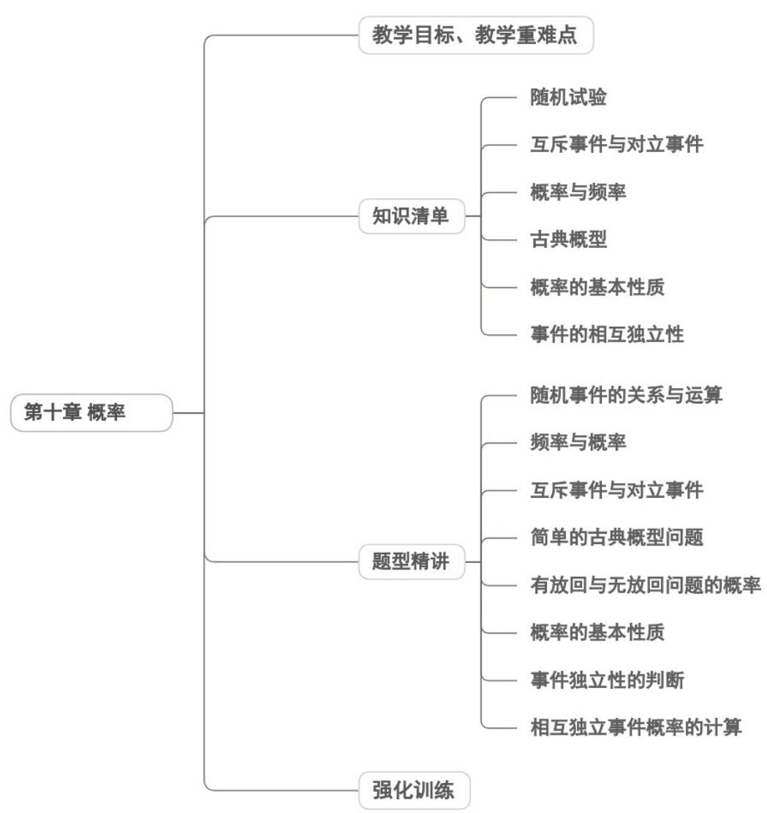

<!-- source-part:1 pages:1-50 -->

## 第十章 概率

## 教学目标、教学重难点

<table><tr><td>教学目标</td><td>1. 基础概念掌握:理解随机事件、必然事件、不可能事件的定义,能准确区分生活中的各类事件;掌握概率的本质内涵,明晰频率与概率的联系与区别(频率是概率的近似值,概率是频率的稳定值)。2. 核心公式与模型应用:熟练掌握古典概型(有限等可能)、几何概型(无限等可能)的判定条件与计算公式,能运用列举法(直接列举、树状图、列表法)不重不漏地列举基本事件;3.计算与表征能力:能根据事件特征选择恰当的计数方法(枚举法)计算基本事件数,准确代入公式求解概率;能通过统计图表(频率分布直方图、茎叶图)提取数据,用频率估计概率。</td></tr><tr><td>教学重难点</td><td>重点1.概率概念的深度理解:核心是让学生摆脱“概率是主观猜测”的误区,建立“概率是对随机事件发生可能性的客观刻画”的认知,明确概率的取值范围(0≤P(A)≤1)。2.基本模型的精准判定:能根据试验结果的“有限性/无限性”“等可能性”快速区分古典概型与几何概型;高中阶段需准确判定独立事件、互斥事件、对立事件的关系。3.规范的解题流程构建:掌握“判断事件类型→选择计数方法→计算基本事件数→代入公式求解→验证结果合理性”的标准化步骤,确保解题逻辑连贯、结果准确。4.列举法与计数工具的熟练运用:初中阶段重点掌握树状图、列表法解决两步及三步试验问题。难点1.抽象概念的具象化理解:难以把握“等可能性”的隐含条件(如不均匀硬币不满足古典概型),易混淆“频率”与“概率”(如认为“抛10次硬币5次正面”则概率为0.5)。2.复杂事件的拆解与转化:面对“至少有一个发生”“至多有一个发生”等复杂事件,难以转化为对立事件或互斥事件的组合,导致计算繁琐或错误。3.易混概念的辨析:初中阶段易混淆“有序”与“无序”对计数的影响。4.概率结果的实际意义解释:能计算概率但无法用通俗语言解释结果(如“降水概率80%”的含义),难以将概率结论应用于实际决策。</td></tr></table>

![[高中/课堂同步/题库/人教A版高中数学同步讲义(2026)/02_必修第二册/第十章 概率/讲义/第十章_概率_高效培优讲义_数学人教A版高一必修第二册/知识清单_sec_01/知识清单_sec_01.md]]
![[高中/课堂同步/题库/人教A版高中数学同步讲义(2026)/02_必修第二册/第十章 概率/讲义/第十章_概率_高效培优讲义_数学人教A版高一必修第二册/知识点_01_随机试验_sec_02/知识点_01_随机试验_sec_02.md]]
![[高中/课堂同步/题库/人教A版高中数学同步讲义(2026)/02_必修第二册/第十章 概率/讲义/第十章_概率_高效培优讲义_数学人教A版高一必修第二册/即学即练_sec_03/即学即练_sec_03.md]]
![[高中/课堂同步/题库/人教A版高中数学同步讲义(2026)/02_必修第二册/第十章 概率/讲义/第十章_概率_高效培优讲义_数学人教A版高一必修第二册/知识点_02_互斥事件与对立事件_sec_04/知识点_02_互斥事件与对立事件_sec_04.md]]
![[高中/课堂同步/题库/人教A版高中数学同步讲义(2026)/02_必修第二册/第十章 概率/讲义/第十章_概率_高效培优讲义_数学人教A版高一必修第二册/即学即练_sec_05/即学即练_sec_05.md]]
![[高中/课堂同步/题库/人教A版高中数学同步讲义(2026)/02_必修第二册/第十章 概率/讲义/第十章_概率_高效培优讲义_数学人教A版高一必修第二册/知识点_03_概率与频率_sec_06/知识点_03_概率与频率_sec_06.md]]
![[高中/课堂同步/题库/人教A版高中数学同步讲义(2026)/02_必修第二册/第十章 概率/讲义/第十章_概率_高效培优讲义_数学人教A版高一必修第二册/即学即练_sec_07/即学即练_sec_07.md]]
![[高中/课堂同步/题库/人教A版高中数学同步讲义(2026)/02_必修第二册/第十章 概率/讲义/第十章_概率_高效培优讲义_数学人教A版高一必修第二册/知识点_04_古典概型_sec_08/知识点_04_古典概型_sec_08.md]]
![[高中/课堂同步/题库/人教A版高中数学同步讲义(2026)/02_必修第二册/第十章 概率/讲义/第十章_概率_高效培优讲义_数学人教A版高一必修第二册/即学即练_sec_09/即学即练_sec_09.md]]
![[高中/课堂同步/题库/人教A版高中数学同步讲义(2026)/02_必修第二册/第十章 概率/讲义/第十章_概率_高效培优讲义_数学人教A版高一必修第二册/知识点_05_概率的基本性质_sec_10/知识点_05_概率的基本性质_sec_10.md]]
![[高中/课堂同步/题库/人教A版高中数学同步讲义(2026)/02_必修第二册/第十章 概率/讲义/第十章_概率_高效培优讲义_数学人教A版高一必修第二册/即学即练_sec_11/即学即练_sec_11.md]]
![[高中/课堂同步/题库/人教A版高中数学同步讲义(2026)/02_必修第二册/第十章 概率/讲义/第十章_概率_高效培优讲义_数学人教A版高一必修第二册/知识点_06_事件的相互独立性_sec_12/知识点_06_事件的相互独立性_sec_12.md]]
![[高中/课堂同步/题库/人教A版高中数学同步讲义(2026)/02_必修第二册/第十章 概率/讲义/第十章_概率_高效培优讲义_数学人教A版高一必修第二册/题型精讲_sec_13/题型精讲_sec_13.md]]
![[高中/课堂同步/题库/人教A版高中数学同步讲义(2026)/02_必修第二册/第十章 概率/讲义/第十章_概率_高效培优讲义_数学人教A版高一必修第二册/题型01_随机事件的关系与运算_sec_14/题型01_随机事件的关系与运算_sec_14.md]]
![[高中/课堂同步/题库/人教A版高中数学同步讲义(2026)/02_必修第二册/第十章 概率/讲义/第十章_概率_高效培优讲义_数学人教A版高一必修第二册/题型_02_频率与概率_sec_15/题型_02_频率与概率_sec_15.md]]
![[高中/课堂同步/题库/人教A版高中数学同步讲义(2026)/02_必修第二册/第十章 概率/讲义/第十章_概率_高效培优讲义_数学人教A版高一必修第二册/题型03_互斥事件与对立事件_sec_16/题型03_互斥事件与对立事件_sec_16.md]]
![[高中/课堂同步/题库/人教A版高中数学同步讲义(2026)/02_必修第二册/第十章 概率/讲义/第十章_概率_高效培优讲义_数学人教A版高一必修第二册/题型04_简单的古典概型问题_sec_17/题型04_简单的古典概型问题_sec_17.md]]
![[高中/课堂同步/题库/人教A版高中数学同步讲义(2026)/02_必修第二册/第十章 概率/讲义/第十章_概率_高效培优讲义_数学人教A版高一必修第二册/题型_05_有放回与无放回问题的概率_sec_18/题型_05_有放回与无放回问题的概率_sec_18.md]]
![[高中/课堂同步/题库/人教A版高中数学同步讲义(2026)/02_必修第二册/第十章 概率/讲义/第十章_概率_高效培优讲义_数学人教A版高一必修第二册/题型06_概率的基本性质_sec_19/题型06_概率的基本性质_sec_19.md]]
![[高中/课堂同步/题库/人教A版高中数学同步讲义(2026)/02_必修第二册/第十章 概率/讲义/第十章_概率_高效培优讲义_数学人教A版高一必修第二册/题型07_事件独立性的判断_sec_20/题型07_事件独立性的判断_sec_20.md]]
![[高中/课堂同步/题库/人教A版高中数学同步讲义(2026)/02_必修第二册/第十章 概率/讲义/第十章_概率_高效培优讲义_数学人教A版高一必修第二册/题型08_相互独立事件概率的计算_sec_21/题型08_相互独立事件概率的计算_sec_21.md]]
![[高中/课堂同步/题库/人教A版高中数学同步讲义(2026)/02_必修第二册/第十章 概率/讲义/第十章_概率_高效培优讲义_数学人教A版高一必修第二册/强化训练_sec_22/强化训练_sec_22.md]]
