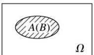

## 知识点 01 随机试验

我们把对随机现象的实现和对它的观察称为随机试验，简称试验，常用字母 $E$ 表示.

我们感兴趣的是具有以下特点的随机试验：

(1) 试验可以在相同条件下重复进行；

（2）试验的所有可能结果是明确可知的，并且不止一个；

（3）每次试验总是恰好出现这些可能结果中的一个，但事先不能确定出现哪一个结果。

## 样本空间

我们把随机试验 E 的每个可能的基本结果称为样本点，全体样本点的集合称为试验 E 的样本空间，一般地，用．Ω．表示样本空间，用 $\omega$ 表示样本点，如果一个随机试验有 n 个可能结果 $\omega_{1}$ ， $\omega_{2}$ ，…， $\omega_{n}$ ，则称样本空间 $\Omega = \left\{\omega_{1}, \omega_{2}, \cdots, \omega_{n}\right\}$ 为有限样本空间．

## 随机事件、确定事件

（1）一般地，随机试验中的每个随机事件都可以用这个试验的样本空间的子集来表示，为了叙述方便，我们将样本空间 $\Omega$ 的子集称为随机事件，简称事件，并把只包含一个样本点的事件称为基本事件。当且仅当 $A$ 中某个样本点出现时，称为事件 $A$ 发生。

（2） $\Omega$ 作为自身的子集，包含了所有的样本点，在每次试验中总有一个样本点发生，所以 $\Omega$ 总会发生，我们称 $\Omega$ 为必然事件。

(3) 空集 $\varnothing$ 不包含任何样本点，在每次试验中都不会发生，我们称为 $\varnothing$ 为不可能事件。

(4) 确定事件：必然事件和不可能事件统称为相对随机事件的确定事件。

## 事件的关系与运算

①包含关系：一般地，对于事件 A 和事件 B，如果事件 A 发生，则事件 B 一定发生，这时称事件 B 包含事件 A（或者称事件 A 包含于事件 B），记作 $B \supseteq A$ 或者 $A \subseteq B$ ．与两个集合的包含关系类比，可用下图表示：

不可能事件记作∅，任何事件都包含不可能事件。

②相等关系：一般地，若 $B \supseteq A$ 且 $A \supseteq B$ ，称事件 $A$ 与事件 $B$ 相等．与两个集合的并集类比，可用下图表示： $\boxed{A(B)}\quad \Omega$

③并事件（和事件）：若某事件发生当且仅当事件 $A$ 发生或事件 $B$ 发生，则称此事件为事件 $A$ 与事件 $B$ 的并事件（或和事件），记作 $A \cup B$ （或 $A + B$ ）。与两个集合的并集类比，可用下图表示：

④交事件（积事件）：若某事件发生当且仅当事件 A 发生且事件 B 发生，则称此事件为事件 A 与事件 B 的交事件（或积事件），记作 $A \cap B$ （或 AB）。与两个集合的交集类比，可用下图表示：

