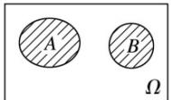
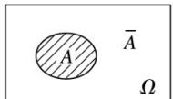

## 知识点 02 互斥事件与对立事件

（1）互斥事件：在一次试验中，事件 A 和事件 B 不能同时发生，即 $A \cap B = \varnothing$ ，则称事件 A 与事件 B 互斥，可用下图表示：

如果 $A_{1}$ ， $A_{2}$ ，…， $A_{n}$ 中任何两个都不可能同时发生，那么就说事件 $A_{1}$ ，． $A_{2}$ ．，…， $A_{n}$ 彼此互斥.

（2）对立事件：若事件 $A$ 和事件 $B$ 在任何一次实验中有且只有一个发生，即 $A \cup B = \Omega$ 不发生， $A \cap B = \emptyset$ 则称事件 $A$ 和事件 $B$ 互为对立事件，事件 $A$ 的对立事件记为 $\overline{A}$ 。

(3) 互斥事件与对立事件的关系

①互斥事件是不可能同时发生的两个事件，而对立事件除要求这两个事件不同时发生外，还要求二者之一必须有一个发生。

②对立事件是互斥事件的特殊情况，而互斥事件未必是对立事件，即“互斥”是“对立”的必要不充分条件，而“对立”则是“互斥”的充分不必要条件。
