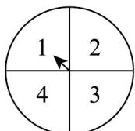
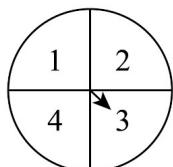

## 题型04 简单的古典概型问题

【典例1】同时转动如图的两个转盘，记转盘（1）得到的数为 $x$ ，转盘（2）得到的数为 $y$ ，结果为 $(x,y)$

(1)

(2)

(1)写出这个试验的样本空间；

(2)求这个试验的样本点个数；

(3)“ $x + y = 5$ ”这一事件包含哪几个样本点？“ $x < 3$ 且 $y > 1$ ”呢？

(4)用集合 A 表示事件：xy = 4；用集合 B 表示事件：x = y。

【答案】(1) $\left\{(1,1),(1,2),(1,3),(1,4),(2,1),(2,2),(2,3),(2,4),(3,1),(3,2),(3,3),(3,4),(4,1),(4,2),(4,3),(4,4)\right\}$

(2)16

(3)答案见解析

(4) $A = \{(1,4),(2,2),(4,1)\}$ $B = \{(1,1),(2,2),(3,3),(4,4)\}$

【分析】（1）利用列举法可得样本空间；

(2) 根据样本空间即可得样本点个数；

(3) 根据样本空间可得答案；

(4) 根据样本空间可得答案·

【详解】（1）这个试验的样本空间为 $\Omega =$

$\left\{(1,1),(1,2),(1,3),(1,4),(2,1),(2,2),(2,3),(2,4),(3,1),(3,2),(3,3),(3,4),(4,1),(4,2),(4,3),(4,4)\right\}$

(2) 由 (1) 可知，这个试验的样本点的个数为 16；

(3) “ $x+y=5$ ”包含的样本点为 $\begin{pmatrix}1,4\end{pmatrix}$ , $\begin{pmatrix}2,3\end{pmatrix}$ , $\begin{pmatrix}3,2\end{pmatrix}$ , $\begin{pmatrix}4,1\end{pmatrix}$ .

“ $x < 3$ 且 $y > 1$ ”包含的样本点为 $(1,2)$ ， $(1,3)$ ， $(1,4)$ ， $(2,2)$ ， $(2,3)$ ， $(2,4)$ ；

(4) 由 (1) 可知 $A = \{(1,4), (2,2), (4,1)\}$ ， $B = \{(1,1), (2,2), (3,3), (4,4)\}$ .

【典例2】下列关于古典概率模型的说法中正确的是（）

①试验中所有可能出现的样本点只有有限个；②每个事件出现的可能性相等；③每个样本点出现的可能性相

等；④样本点的总数为 n，随机事件 A 若包含 k 个样本点，则 $P(A)=\frac{k}{n}$ .
A. ②④ B. ③④ C. ①④ D. ①③④

【答案】D

【分析】利用古典概型概念及的概率计算公式直接求解.

【详解】在①中，由古典概型的概念可知：试验中所有可能出现的基本事件只有有限个，故①正确；

在②中，由古典概型的概念可知：每个基本事件出现的可能性相等，故②错误；

在③中，由古典概型的概念可知：每个样本点出现的可能性相等，故③正确；

在④中，样本点的总数为 $n$ ，随机事件 $A$ 若包含 $k$ 个样本点，则由古典概型及其概率计算公式知

$$
P (A) = \frac {k}{n}
$$

故④正确.

故选：D.

## 方法技巧

解题实现步骤：

(1)仔细阅读题目，弄清题目的背景材料，加深理解题意；

(2)判断本试验的结果是否为等可能事件，设出所求事件 $A$ ；

(3)分别求出基本事件的个数 $n$ 与所求事件 $A$ 中所包含的基本事件个数 $m$ ；

(4)利用公式 $P(A) = \frac{A\text{包含的基本事件的个数}}{\text{基本事件的总数}}$ 求出事件 $A$ 的概率.

![[高中/课堂同步/题库/人教A版高中数学同步讲义(2026)/02_必修第二册/第十章 概率/讲义/第十章_概率_高效培优讲义_数学人教A版高一必修第二册/题型04_简单的古典概型问题_sec_17/questions/Q00065988.md]]
![[高中/课堂同步/题库/人教A版高中数学同步讲义(2026)/02_必修第二册/第十章 概率/讲义/第十章_概率_高效培优讲义_数学人教A版高一必修第二册/题型04_简单的古典概型问题_sec_17/questions/Q00065989.md]]
![[高中/课堂同步/题库/人教A版高中数学同步讲义(2026)/02_必修第二册/第十章 概率/讲义/第十章_概率_高效培优讲义_数学人教A版高一必修第二册/题型04_简单的古典概型问题_sec_17/questions/Q00065990.md]]
