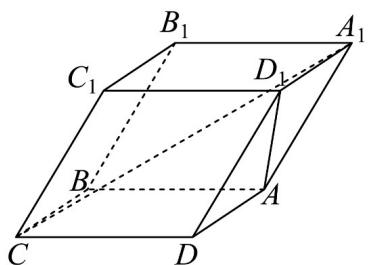

<!-- question-source:start -->
1．如图，一块矿石晶体的形状为四棱柱 $ABCD-A_{1}B_{1}C_{1}D_{1}$ ，其中底面 ABCD 是正方形， $CC_{1}=CD=4$ ， $\angle C_{1}CB = \angle C_{1}CD = 60^{\circ}$ ，则直线 $A_{1}C$ 与 $AD_{1}$ 所成角的余弦值为（）

A. $\frac{\sqrt{5}}{10}$ B. $\frac{\sqrt{10}}{10}$ C. $\frac{\sqrt{5}}{5}$ D. $\frac{\sqrt{2}}{2}$
<!-- question-source:end -->

![[高中/课堂同步/题库/人教A版高中数学同步讲义(2026)/03_选择性必修第一册/月考/阶段测试/高二数学上学期第一次月考_人教A版2019选择性必修第一册第1_1_第/一_选择题_sec_02/questions/answers/Q00062073A1.md]]
