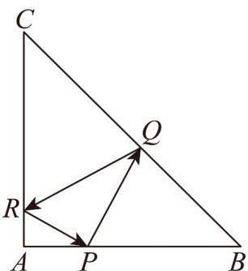

<!-- question-source:start -->
8．在等腰直角VABC中，AB=AC=3，点P是边AB上异于端点的一点，光线从点P出发经BC，CA边

反射后又回到点 $P$ ，若光线 $QR$ 经过VABC的重心，则 $\triangle PQR$ 的周长等于（）

A. $2\sqrt{5}$ B. $2\sqrt{7}$ C. $3\sqrt{2}$ D. $4\sqrt{2}$
<!-- question-source:end -->

![[高中/课堂同步/题库/人教A版高中数学同步讲义(2026)/03_选择性必修第一册/月考/阶段测试/高二数学上学期第一次月考_人教A版2019选择性必修第一册第1_1_第/一_选择题_sec_02/questions/answers/Q00062079A1.md]]
