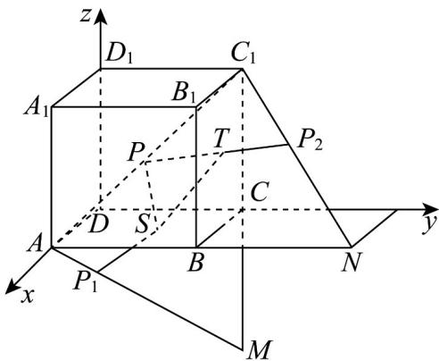

> [!faq]- 《高二数学上学期第一次月考_人教A版2019选择性必修第一册第1_1_第》官方解析
>
> > [!success]- **【答案】** C
>
> > [!note]- **【解析】**
> > 根据题意，分别作 $AC_{1}$ 关于面ABCD和面 $BCC_{1}B_{1}$ 对称的直线 $AM, AN$
> >
> > 点 $P$ 对称后为 $P_{1}, P_{2}$ ，以 $D$ 为原点建立空间直角坐标系，
> >
> > 
> >
> > $$
> > \therefore P S + P T + S T = P _ {1} S + S T + P _ {2} T \quad P _ {1} P _ {2}
> > $$
> >
> > 又 $P_{1}, P_{2}$ 是异面直线 $AM, C_{1}N$ 上的点，
> >
> > 所以 $PS + PT + ST$ 的最小值为异面直线 $AM, C_{1}N$ 的距离，
> >
> > $$
> > A (1, 0, 0), M (0, 1, - 1), C _ {1} (0, 1, 1), N (1, 2, 0)
> > $$
> >
> > $$
> > \stackrel {{\sqcup \sqcup \sqcup}} {{A M}} = (- 1, 1, - 1), \stackrel {{\sqcup \sqcup \sqcup}} {{C _ {1} N}} = (1, 1, - 1), \stackrel {{\sqcup \sqcup \sqcup}} {{A C _ {1}}} = (- 1, 1, 1)
> > $$
> >
> > 设与直线 $AM, C_1N$ 都垂直的一个向量 $n = (x, y, z)$
> >
> > 则 $\left\{ \begin{array}{l} n \cdot AM = -x + y - z = 0 \\ n \cdot C_1N = x + y - z = 0 \end{array} \right.$ ，不妨取 $y = 1$ ， $n = (0,1,1)$ ，
> >
> > 所以异面直线 $AM, C_1N$ 的距离 $d = \frac{\left|AC_1 \cdot n\right|}{|n|} = \frac{2}{\sqrt{2}} = \sqrt{2}$ .
> >
> > 故选 **C**.
