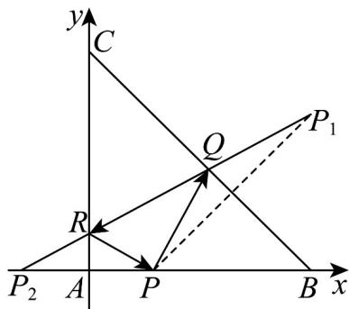

> [!faq]- 《高二数学上学期第一次月考_人教A版2019选择性必修第一册第1_1_第》官方解析
>
> > [!success]- **【答案】** A
>
> > [!note]- **【解析】**
> > 
> >
> > 建立如图所求的直角坐标系，得 $B(3,0)$ ， $C(0,3)$
> >
> > 则直线 $BC$ 方程为 $x + y = 3$
> >
> > 且VABC的重心为 $G\left(\frac{0 + 0 + 3}{3},\frac{0 + 0 + 3}{3}\right)$ ，即 $G(1,1)$
> >
> > 设 $P(a,0)$ ，P 关于直线 BC 的对称点为 $P_{1}(x,y)$ ，
> >
> > 则 $\left\{ \begin{array}{l} \frac{a + x}{2} + \frac{y + 0}{2} = 3 \\ \frac{y - 0}{x - a} \cdot (-1) = -1 \end{array} \right.$ ，解得 $\left\{ \begin{array}{ll} x = 3 & ,\text{则}\\ y = 3 - a & P_1(3,3 - a) \end{array} \right.$
> >
> > 易知 P 关于 y 轴的对称点为 $P_{2}(-a,0)$ ,
> >
> > 根据光线反射原理知 $P_{1}, Q, R, P_{2}$ 四点共线，且 $\left|PQ\right| = \left|P_{1}Q\right|$ ， $\left|PR\right| = \left|P_{2}R\right|$
> >
> > 所以直线 $QR$ 的方程为 $y = \frac{3 - a - 0}{3 - (-a)} [x - (-a)]$ ，即 $y = \frac{3 - a}{3 + a} (x + a)$
> >
> > 又直线 $QR$ 过 $G(1,1)$
> >
> > 所以 $1=\frac{3-a}{3+a}(1+a)$ ，解得 a=1 或 a=0（舍去），
> >
> > 所以 $P(1,0)$ ， $P_{1}(3,2)$ ， $P_{2}(-1,0)$ ，
> >
> > 所以 $\left|P_{1}P_{2}\right| = \sqrt{(3 + 1)^{2} + (2 - 0)^{2}} = 2\sqrt{5}$
> >
> > 所以 $\triangle PQR$ 的周长为 $\left|PQ\right|+\left|QR\right|+\left|RP\right|=\left|P_{1}Q\right|+\left|QR\right|+\left|RP_{2}\right|=\left|P_{1}P_{2}\right|=2\sqrt{5}$
> >
> > 故选：A.
> >
> > ## 二、选择题：本题共3小题，每小题6分，共18分．在每小题给出的选项中，有多项符合题目要求．全部选对的得6分，部分选对的得部分分，有选错的得0分.
