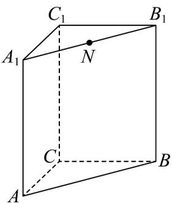

<!-- question-source:start -->
16. (15 分)

如图，直三棱柱 $ABC - A_{1}B_{1}C_{1}$ ，底面 $\triangle ABC$ 中， $CA = CB = 1$ ， $\angle BCA = 90^{\circ}$ . $AA_{1} = 2$ ， $N$ 是 $A_{1}B_{1}$ 的中点.

(1)求证： $A_{1}B \perp C_{1}N$ ；

(2) $F$ 为 $AB$ 上动点（含端点），则是否存在 $F$ 使得 $AB \perp$ 面 $CC_{1}F$ ，若存在，请求出 $\frac{AF}{FB}$ 的值，若不存在，

请说明理由；

(3)若 $M$ 为 $AB$ 中点， $G$ 为 $\triangle AMC$ 的重心， $H$ 为 $C_1G$ 上一点，且 $C_1H:HG = 3:1$ ，过 $H$ 作任一平面分别交

$C_1A$ 、 $C_1C$ 、 $C_1M$ 于 $_P$ 、 $Q$ 、 $_R$ ，若 $\overline{C_1P} = m\overline{C_1A}$ ， $\overline{C_1Q} = n\overline{C_1C}$ ， $\overline{C_1R} = t\overline{C_1M}$ ，求证 $\frac{1}{m} +\frac{1}{n} +\frac{1}{t}$ 为定值，并求

该定值.
<!-- question-source:end -->

![[高中/课堂同步/题库/人教A版高中数学同步讲义(2026)/03_选择性必修第一册/月考/阶段测试/高二数学上学期第一次月考_人教A版2019选择性必修第一册第1_1_第/四_解答题_sec_05/questions/answers/Q00062085A1.md]]
