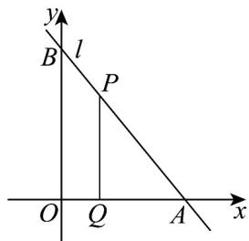

<!-- question-source:start -->
18. (17 分)

如图，已知直线 $l$ 过点 $(3,4)$ ，且与直线 $3x - 4y + 2 = 0$ 垂直，与 $x$ 轴、 $y$ 轴的正半轴分别交于 $A,B$ 两点，点 $P$ 为线段 $AB$ 上一动点，且 $PQ//OB$ ， $PQ$ , 交于点 $Q$ 。

(1)求线段 $AB$ 的垂直平分线方程；

(2)若 $\triangle APQ$ 的面积 $S_{\triangle APQ}$ 与四边形 $OBPQ$ 的面积 $S_{OQPB}$ 满足 $S_{\triangle APQ} = \frac{1}{3} S_{OQPB}$ ，请你确定点 $P$ 在 $AB$ 上的位置，

并求出线段 $PQ$ 的长；

(3)判断在 $y$ 轴上是否存在点 $M$ ，使 $\triangle MPQ$ 为等腰直角三角形，若存在，求出点 $M$ 的坐标；若不存在，请

说明理由.
<!-- question-source:end -->

![[高中/课堂同步/题库/人教A版高中数学同步讲义(2026)/03_选择性必修第一册/月考/阶段测试/高二数学上学期第一次月考_人教A版2019选择性必修第一册第1_1_第/四_解答题_sec_05/questions/answers/Q00062087A1.md]]
