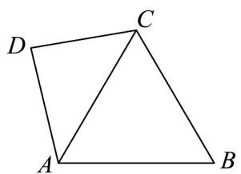
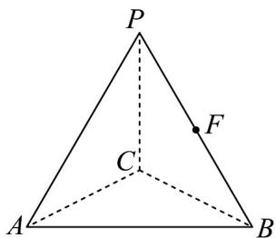

<!-- question-source:start -->
19. (17 分)

如图1，VABC是底边为2的等腰三角形，且 $BA = BC = \sqrt{3}$ ， $\triangle DAC$ 为等腰直角三角形， $\angle CDA = 90^{\circ}$

将 $\triangle DAC$ 沿 $AC$ 翻折到 $\triangle PAC$ 的位置，且点 $P$ 不在平面 $ABC$ 内（如图2），点 $F$ 为线段 $PB$ 的中点.

(图1)

(图2)

(1)证明： $AC\perp PB$

(2)当平面 $PAC \perp$ 平面 $ACB$ 时，求直线 $PB$ 与平面 $ACF$ 所成角的余弦值；

$$
\frac {\sqrt {6}}{4}
$$

(3)若直线 $PC$ 与 $AB$ 所成角的余弦值为4时，设平面 $PAC$ 与平面 $ABC$ 的夹角为 $\alpha$ ，求 $\cos \alpha$ 的值.
<!-- question-source:end -->

![[高中/课堂同步/题库/人教A版高中数学同步讲义(2026)/03_选择性必修第一册/月考/阶段测试/高二数学上学期第一次月考_人教A版2019选择性必修第一册第1_1_第/四_解答题_sec_05/questions/answers/Q00062088A1.md]]
