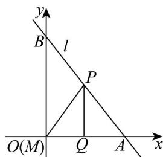
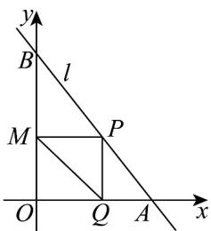
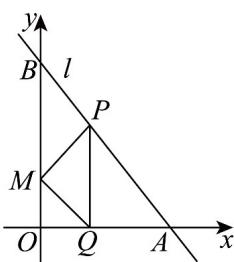

> [!faq]- 《高二数学上学期第一次月考_人教A版2019选择性必修第一册第1_1_第》官方解析
>
> > [!success]- **【答案】** (1) $3x - 4y + 7 = 0$ (2)点 $P$ 为线段 $AB$ 的中点， $PQ = 4$ (3)存在， $M(0,0)$ 或 $M\left(0,\frac{24}{7}\right)$ 或 $M\left(0,\frac{12}{5}\right)$
>
> > [!note]- **【解析】**
> > （1）因为直线 l 与直线 $3x - 4y + 2 = 0$ 垂直，
> >
> > 所以直线 l 的斜率 $k = -\frac{4}{3}$
> >
> > 又直线 $l$ 过点 $(3,4)$
> >
> > 所以直线 $l$ 的方程为 $y - 4 = -\frac{4}{3} (x - 3)$
> >
> > 即 $4x + 3y - 24 = 0$
> >
> > 令 y=0 ，得 x=6 ，即 $A(6,0)$ ；
> >
> > 令 x=0 ，得 y=8 ，即 $B(0,8)$
> >
> > 则线段 AB 的中点坐标为 $(3,4)$
> >
> > 又直线 l 的斜率 $k = -\frac{4}{3}$ ，
> >
> > 所以线段 AB 的垂直平分线方程为 $y-4=\frac{3}{4}(x-3)$ ,
> >
> > 即 $3x - 4y + 7 = 0$
> >
> > (2) 由 (1) 知直线 $l$ 的方程为 $4x + 3y - 24 = 0$ ， $B(0,8)$
> >
> > 因为 $S_{\triangle APQ} = \frac{1}{3} S_{OQPB}$ ，
> >
> > 所以 $S_{\triangle APQ} = \frac{1}{4} S_{\triangle ABO}$ ，
> >
> > 又 $PQ // OB$
> >
> > 则 $^{\triangle}APQ$ 与 $\triangle ABO$ 相似，
> >
> > 于是有 $\frac{PQ^2}{BO^2} = \frac{S_{\triangle APQ}}{S_{\triangle ABO}} = \frac{1}{4}$
> >
> > 即 $\frac{PQ}{BO} = \frac{PQ}{8} = \frac{1}{2}$ ，得 $PQ = 4$ ，
> >
> > 此时点 P 为线段 AB 的中点，
> >
> > 所以 $S_{\triangle APQ} = \frac{1}{3} S_{OQPB}$ 时，点 $P$ 为线段 $AB$ 的中点，且 $PQ = 4$
> >
> > (3) 假定在 $y$ 轴上存在点 $M$ ，使 $\triangle MPQ$ 为等腰直角三角形，
> >
> > 由（1）知直线 $l$ 的方程为 $4x + 3y - 24 = 0$
> >
> > 
> > 图1
> >
> > 
> > 图2
> >
> > 
> > 图3
> >
> > 如图1，当 $\angle PQM = 90^{\circ}$ 时，而点 $M$ 在 $y$ 轴上，点 $Q$ 在 $x$ 轴的正半轴上，则点 $M$ 必与原点 $O$ 重合，设 $Q(t,0)$ ，因为 $MQ = PQ$
> >
> > 所以 $P(t,t)$
> >
> > 于是有 $4t + 3t - 24 = 0$ ，
> >
> > 解得 $t=\frac{24}{7}<6$ ，此时 $M(0,0)$ 满足题意；
> >
> > 如图 2，当 $\angle MPQ = 90^{\circ}$ 时，
> >
> > 由 $PQ / / OB$ ， $MP = PQ$
> >
> > 知四边形 OMPQ 为正方形，
> >
> > 设 $Q(t_{1},0)$
> >
> > 则 $P\left(t_{1},t_{1}\right)$ ， $M\left(0,t_1\right)$
> >
> > 于是有 $4t_{1} + 3t_{1} - 24 = 0$
> >
> > 解得 $t_{1}=\frac{24}{7}<6$ ，此时 $M\left(0,\frac{24}{7}\right)$ 满足题意；
> >
> > 如图 3，当 $\angle PMQ = 90^{\circ}$ 时，
> >
> > 由 $PQ //OB$ ，MQ = MP，
> >
> > 得 $\angle OQM = \angle PQM = 45^{\circ}$ ，即 $OM = OQ$
> >
> > 设 $Q(t_{2},0)$
> >
> > 则 $M(0,t_2)$ ， $P\left(t_{2},8 - \frac{4}{3} t_{2}\right)$
> >
> > 显然直线 QM 斜率为 -1，则直线 PM 斜率必为 1，
> >
> > 即 $\frac{8-\frac{4}{3}t_{2}-t_{2}}{t_{2}-0}=1$ ，
> >
> > 解得 $t_{2}=\frac{12}{5}<6$ ，此时 $M\left(0,\frac{12}{5}\right)$ 满足题意．
> >
> > 综上，y轴上存在点 $M(0,0)$ 或 $M\left(0,\frac{24}{7}\right)$ 或 $M\left(0,\frac{12}{5}\right)$ ，使 $\triangle MPQ$ 为等腰直角三角形.
