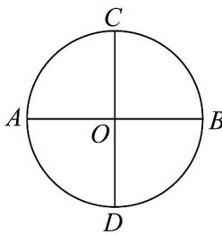
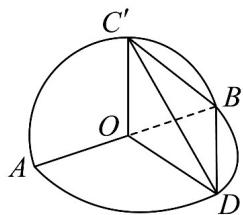

<!-- question-source:start -->
5．如图，已知 AB 和 CD 是圆 O 的两条互相垂直的直径，将平面 ABC 沿 AB 翻折至平面 $ABC'$ ，使得平面 $ABC' \perp$ 平面 ABD，此时直线 AB 与平面 $C'BD$ 所成角的余弦值为（）

A. $\frac{\sqrt{6}}{3}$ B. $\frac{\sqrt{3}}{3}$ C. $\frac{\sqrt{2}}{2}$ D. $\frac{\sqrt{3}}{2}$
<!-- question-source:end -->

![[高中/课堂同步/题库/人教A版高中数学同步讲义(2026)/03_选择性必修第一册/月考/阶段测试/高二数学上学期第一次月考_人教A版2019选择性必修第一册第一章_第二/一_选择题_sec_02/questions/answers/Q00062093A1.md]]
