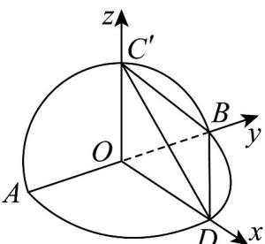

> [!faq]- 《高二数学上学期第一次月考_人教A版2019选择性必修第一册第一章_第二》官方解析
>
> > [!success]- **【答案】** A
>
> > [!note]- **【解析】**
> > 依题意， $OC'\perp AB$ ， $OD\perp AB$ ，而平面 $ABC'\perp$ 平面ABD，
> >
> > 平面 $ABC' \cap$ 平面 ABD = AB ，又 $OC' \subset$ 平面 $ABC'$ ， $OD \subset$ 平面 ABD ，
> >
> > 则 $OC^{\prime} \perp$ 平面 $ABD$ ， $OD \subset$ 平面 $ABD$ ， $OD \perp OC^{\prime}$ ，因此直线 $OD, OB, OC^{\prime}$ 两两垂直．
> >
> > 如图，以点 O 为原点，直线 $OD, OB, OC'$ 分别为 x, y, z 轴建立空间直角坐标系，
> >
> > 令 $OD = 1$ ，则 $O(0,0,0)$ ， $D(1,0,0)$ ， $B(0,1,0)$ ， $C'(0,0,1)$ ， $\overline{OB} = (0,1,0)$
> >
> > $\overline{BC'} = (0, -1, 1)$ ， $\overline{BD} = (1, -1, 0)$ ，设平面 $C'BD$ 的法向量 $n = (x, y, z)$
> >
> > 则 $\left\{ \begin{array}{l} n \cdot BC' = -y + z = 0 \\ n \cdot BD = x - y = 0 \end{array} \right.$ ，令 $y = 1$ ，得 $n = (1,1,1)$ 。
> >
> > 设直线 $AB$ 与平面 $C^{\prime}BD$ 所成的角为 $\theta$ ，则 $\sin \theta = \left|\cos n, OB\right| = \frac{\left|n \cdot OB\right|}{\left|n\right|\left|OB\right|} = \frac{1}{1 \times \sqrt{3}} = \frac{\sqrt{3}}{3}$ ，所以直线 $AB$ 与平面 $C^{\prime}BD$ 所成角的正弦值为 $\frac{\sqrt{3}}{3}$ ，则直线 $AB$ 与平面 $C^{\prime}BD$ 所成角的余弦值为 $\sqrt{1 - \left(\frac{\sqrt{3}}{3}\right)^2} = \frac{\sqrt{6}}{3}$ 。
> >
> > 
