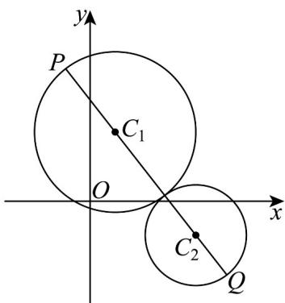

> [!faq]- 《高二数学上学期第一次月考_人教A版2019选择性必修第一册第一章_第二》官方解析
>
> > [!success]- **【答案】** ABD
>
> > [!note]- **【解析】**
> > 对于 A，由圆 $C_{1}:(x-1)^{2}+(y-2a)^{2}=9$ ， $C_{2}:x^{2}+y^{2}-8x+2ay+a^{2}+12=0,a\in\mathbf{R}$
> >
> > 可知 $C_1(1,2a), C_2(4,-a)$ ，故直线 $C_1C_2$ 的方程为 $y + a = -a(x - 4)$
> >
> > 即 $y = -a(x - 3)$ ，即得直线 $C_{1}C_{2}$ 恒过定点 $(3,0)$ ，A 正确；
> >
> > 对于B， $C_2:x^2 +y^2 -8x + 2ay + a^2 +12 = 0,a\in \mathbf{R}$ 即 $C_2:(x - 4)^2 +(y + a)^2 = 4,a\in \mathbf{R}$
> >
> > 当圆 $C_1$ 和圆 $C_2$ 有三条公切线时，圆 $C_1$ 和圆 $C_2$ 外切，则 $\sqrt{(1 - 4)^2 + (2a + a)^2} = 3 + 2$
> >
> > 解得 $a = \pm \frac{4}{3}$ ，
> >
> > 当 $a = \frac{4}{3}$ 时，如图示，当 $P, C_1, C_2, Q$ 共线时， $\left|PQ\right|_{\max} = \left|C_1C_2\right| + 3 + 2 = \sqrt{\left(1 - 4\right)^2 + \left(\frac{8}{3} + \frac{4}{3}\right)^2} + 5 = 10$ ；
> >
> > 
> >
> > 同理求得当 $a = -\frac{4}{3}$ 时， $|PQ|_{\max} = 10$ ，B 正确；
> >
> > 对于 C，若圆 $C_{1}$ 和圆 $C_{2}$ 共有 2 条公切线，则两圆相交，
> >
> > 则 $3 - 2 < \left|C_{1}C_{2}\right| < 3 + 2$ ，即 $1 < \sqrt{(1 - 4)^{2} + (2a + a)^{2}} < 5$ ，解得 $-\frac{4}{3} < a < \frac{4}{3}$ ，C错误
> >
> > 对于D，当 $a = \frac{1}{3}$ 时，两圆相交，
> >
> > $$
> > C _ {1}: (x - 1) ^ {2} + \left(y - \frac {2}{3}\right) ^ {2} = 9, C _ {2}: (x - 4) ^ {2} + \left(y + \frac {1}{3}\right) ^ {2} = 4
> > $$
> >
> > 将两方程相减可得公共弦方程 $6x - 2y - \frac{59}{3} = 0$ ，
> >
> > 则 $C_1\left(1,\frac{2}{3}\right)$ 到 $6x - 2y - \frac{59}{3} = 0$ 的距离为 $\frac{\left|6 - \frac{4}{3} - \frac{59}{3}\right|}{\sqrt{6^2 + 2^2}} = \frac{3\sqrt{10}}{4}$
> >
> > 则圆 $C_1$ 与圆 $C_2$ 相交弦的弦长为 $2\sqrt{9 - \left(\frac{3\sqrt{10}}{4}\right)^2} = \frac{3\sqrt{6}}{2}$ ，D正确，
> >
> > 故选 **ABD**.
